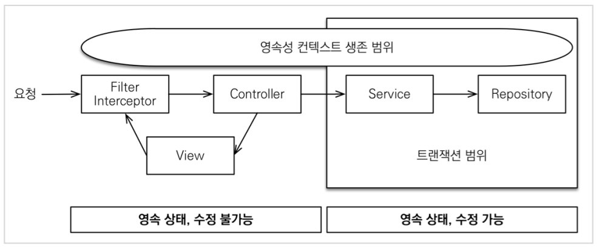
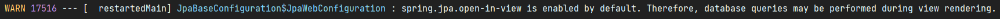
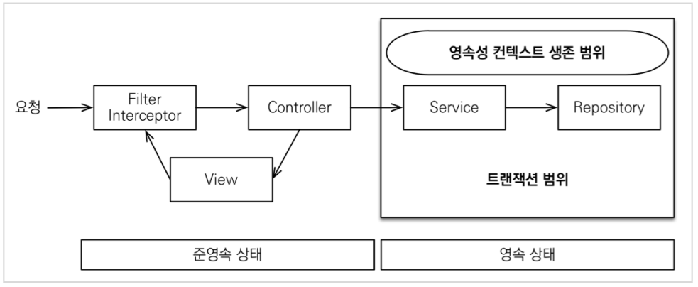

# Open Session In View (OSIV)

## OSIV란?

  

Open Session In View란 말 그대로 영속성 컨텍스트와 데이터 베이스 커넥션을, API 응답 시점까지 유지시키는 것을 말한다.  
  
OSIV 전략은 영속성 컨텍스트를 끝까지 유지시켜서, 지연 로딩이 가능하게 하는 큰 장점을 갖고 있다.  
이 덕분에 엔티티를 적극 활용해서 코드 중복을 줄일 수 있고, 유지 보수성을 높이는 데에 도움이 된다.  
 
하지만 이 때문에 데이터베이스 커넥션 리소스를 오랜시간 사용하게 되고, 실시간 트래픽이 많은 API에서는 커넥션이 모자라 장애로 이어질수 있다.

  

`spring.jpa.open-in-view`의 기본 값은 true이며 애플리케이션 시작 시점에 warn 로그를 남긴다.  

---

## OSIV OFF
 
  
 
OSIV를 끄면 트랜잭션 종료시점에 영속성 컨텍스트도 함께 종료된다.  
view template에서도 지연로딩이 동작하지 않고, 지연로딩을 트랜잭션 안에서 처리해야 한다.  

#

### 커맨드와 쿼리를 분리하자

커맨드와 쿼리를 분리하여 OSIV를 끈 상태에서도 코드를 잘 관리 할 수 있도록 하자.  
핵심 비지니스 로직과(Service), 화면을 위한 서비스(읽기 전용)을 분리하자는 것이다.  
  
그러면 트랜잭션을 유지하면서 화면을 출력하기 위한 쿼리의 성능 최적화를 하는 것도 편해진다. 관심사를 명확하게 분리하는 것이다. 
  
또 ADMIN 처럼 커넥션을 많이 사용하지 않는 곳에서는 OSIV를 키고, 실시간 트래픽이 많은 고객 서비스 API에서는 OSIV를 끄면 OSIV의 장점을 잘 활용할 수 있다.

---

## Reference

- [실전! 스프링 부트와 JPA 활용2 - API 개발과 성능 최적화](https://www.inflearn.com/course/%EC%8A%A4%ED%94%84%EB%A7%81%EB%B6%80%ED%8A%B8-JPA-API%EA%B0%9C%EB%B0%9C-%EC%84%B1%EB%8A%A5%EC%B5%9C%EC%A0%81%ED%99%94/dashboard)
