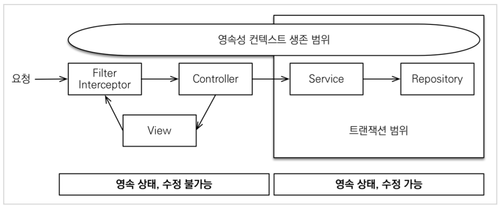
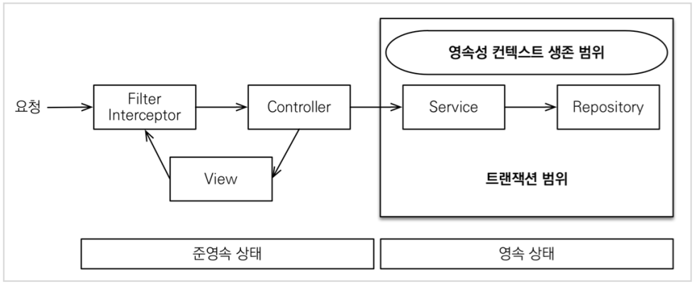

# Open Session In View (OSIV)

## OSIV란?

  

Open Session In View란 말 그대로 영속성 컨텍스트와 데이터 베이스 커넥션을, API 응답까지 유지하는 것을 말한다.  

  

`spring.jpa.open-in-view`의 기본 값은 true이며 애플리케이션 시작 시점에 warn 로그를 남긴다.  

#

OSIV 전략은 영속성 컨텍스트를 끝까지 유지시켜서, 지연 로딩이 가능하게 하는 큰 장점을 갖고 있다.  
이 덕분에 엔티티를 적극 활용해서 코드 중복을 줄일 수 있고, 유지 보수성을 높이는 데에 도움이 된다.  
 
하지만 이 때문에 데이터베이스 커넥션 리소스를 오랜시간 사용하게 되고, 실시간 트래픽이 많은 API에서는 커넥션이 모자라 장애로 이어질수 있다.

---

## OSIV OFF
 
  
 
OSIV를 끄면 트랜잭션 종료시점에 영속성 컨텍스트도 함께 종료된다.  
view template에서도 지연로딩이 동작하지 않고, 지연로딩을 트랜잭션 안에서 처리해야 한다.  
   
ADMIN 처럼 커넥션을 많이 사용하지 않는 곳에서는 OSIV를 키고, 실시간 트래픽이 많은 고객 서비스 API에서는 OSIV를 끄면 OSIV의 장점을 잘 활용할 수 있다.

---

## Reference

- [실전! 스프링 부트와 JPA 활용2 - API 개발과 성능 최적화](https://www.inflearn.com/course/%EC%8A%A4%ED%94%84%EB%A7%81%EB%B6%80%ED%8A%B8-JPA-API%EA%B0%9C%EB%B0%9C-%EC%84%B1%EB%8A%A5%EC%B5%9C%EC%A0%81%ED%99%94/dashboard)
