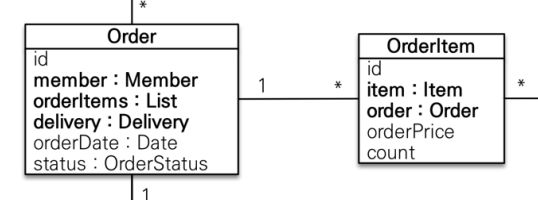
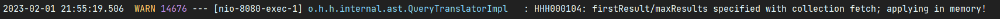
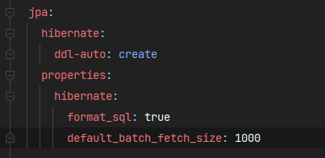
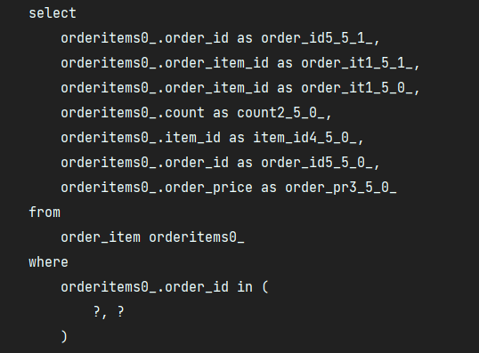
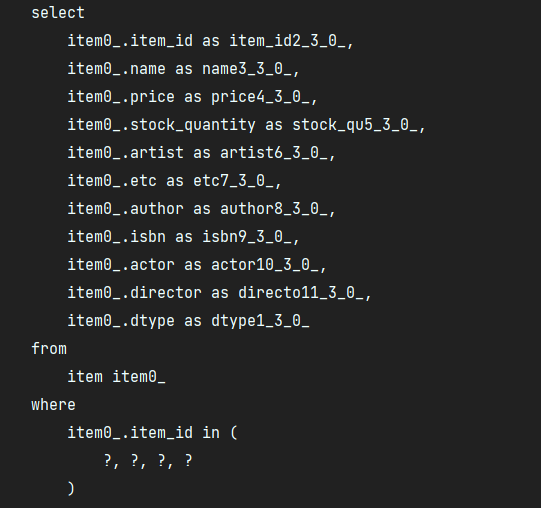

# API - OnToMany 성능 최적화

## 페치 조인 사용과 페이징 한계 돌파

- 일대일, 다대일 관계와 마찬가지로 일대다 관계에서 페치 조인을 활용하면 여러번 실행되는 SQL을 한 번으로 줄일 수 있다.
- 하지만 컬렉션을 페치 조인할 때는 주의할 점과 몇 가지 한계들이 존재한다.
- 가장 큰 문제로는 일대다 조인을 할 경우에는 데이터베이스 row가 늘어나는 점을 주의해야하고, 페치 조인을 사용하면 페이징이 불가능하다는 한계가 있다.
- [페치 조인의 자세한 내용: 특징과 한계](https://github.com/seokmyungham/TIL/blob/main/JPA/fetch_join_01.md)

---

### 컬렉션 페치 조인의 한계



- Order를 조회할 때 OrderItem의 정보도 함께 필요하다면, 개발자는 페치 조인을 사용하는 방법을 선택할 수 있다.
- 여기서 Order와 OrderItem은 일대다 관계이며 Order 엔티티는 `List\<OrderItem> orderItems`를 가지고 있다.

```java
public List<Order> findAllWithItem() {
    return em.createQuery("select distinct o from Order o" +
            " join fetch o.member m" + // Order <> Member 다대일
            " join fetch o.delivery d" + // Order <> Delivery 일대일
            " join fetch o.orderItems oi" + // Order <> OrderItem 일대다
            " join fetch oi.item i", Order.class) // OrderItem <> Item 다대일
            .getResultList();
}
```

- 위 처럼 페치 조인을 사용해서 원하는 모든 데이터를 SQL 한 번으로 가져오고 distinct 명령어를 사용하면 데이터의 중복도 제거할 수 있는 JPQL이 완성된다.
- SQL 한 번으로 원하는 데이터를 가져오는 큰 장점은 성능을 최적화하는데 도움이 될 수 있지만,
- 컬렉션을 페치 조인하는 방법은 큰 단점을 갖고있다. 바로 페이징이 불가능하다는 점이다.



- 만약 위 JPQL문에 setFirstResult(), setMaxResult()와 같은 페이징 메소드를 추가해서 페이징을 시도하면
- 하이버네이트는 경고 로그를 남기면서 모든 데이터를 DB에서 읽어오고, DB가 아닌 메모리에서 페이징을 시도한다.
- 그 이유는 일대다를 조인할 경우 데이터의 row수가 늘어나기 때문에, 늘어난 row에서 페이징을 시도해봤자 원하는 값을 얻는 것이 불가능하기 때문이다.
- 컬렉션 페치 조인을 페이징하는 것은 장애로 이어질 수 있는 매우 위험한 방법이며 다른 대안을 생각해야 한다.

---

## 페이징과 한계 돌파 : batch_fetch_size

- ToOne관계는 데이터 row수를 증가시키지 않으므로 페이징 쿼리에 영향을 주지 않기 때문에 페치 조인을 적극 활용하는 것이 좋다.
- 컬렉션은 지연 로딩으로 조회하되, 성능 최적화를 위해 하이버 네이트가 제공하는 batch_fetch_size를 활용하자.
- `hibernate.default_batch_fetch_size`를 글로벌 설정으로 사용하거나, `@BatchSize` 어노테이션을 사용한다.



- 옵션을 적용하면 컬렉션이나, 프록시 객체를 한꺼번에 설정한 크기만큼 IN 쿼리로 조회하는 것이 가능하다.

```java
public List<Order> findAllWithMemberDelivery(int offset, int limit) {
    return em.createQuery(
                        "select o from Order o" +
                        " join fetch o.member m" +
                        " join fetch o.delivery d", Order.class)
            .setFirstResult(offset)
            .setMaxResults(limit)
            .getResultList();
}
```

```java
@GetMapping("/api/v3.1/orders")
public Result ordersV3_page(@RequestParam(value = "offset", defaultValue = "0") int offest,
                            @RequestParam(value = "limit", defaultValue = "100") int limit) {

    List<Order> orders = orderRepository.findAllWithMemberDelivery(offest, limit);
    List<OrderDto> collect = orders.stream()
            .map(OrderDto::new)
            .collect(toList());

    return new Result(collect);
}

@Data
@AllArgsConstructor
static class Result<T> {
    private T data;
}

@Data
static class OrderDto {

    private Long orderId;
    private String name;
    private LocalDateTime orderDate;
    private OrderStatus orderStatus;
    private Address address;
    private List<OrderItemDto> orderItem;

    public OrderDto(Order order) {
        orderId = order.getId();
        name = order.getMember().getName();
        orderDate = order.getOrderDate();
        orderStatus = order.getStatus();
        address = order.getDelivery().getAddress();
        orderItem = order.getOrderItems().stream() //OrderItems: batch_fetch_size로 인해 지정한 크기만큼 한꺼번에 조회가 가능하다.
                .map(OrderItemDto::new)
                .collect(toList());
    }
}

@Data
static class OrderItemDto {

    private String itemName;
    private int orderPrice;
    private int count;

    public OrderItemDto(OrderItem orderItem) {
        itemName = orderItem.getItem().getName(); //Item: batch_fetch_size로 인해 지정한 크기만큼 한꺼번에 조회가 가능하다.
        orderPrice = orderItem.getOrderPrice();
        count = orderItem.getCount();
    }
}
```


   

- 현재 샘플 데이터는 단순히 MemberA, MemberB가 각각 OrderItem을 2개씩 주문하도록 입력했다.
- 페치 조인으로만 데이터를 전체 조회했을 경우 1(Order) + 2(OrderItem) + 4(Item) 번의 SQL이 실행 된다. (1+N+N)
    - 샘플 데이터의 수가 매우 적은데도 너무 많은 SQL이 실행되는 것을 확인할 수 있다.
- 배치 사이즈 옵션만 설정하면 7번 실행되던 SQL이 IN 쿼리와 함께 단 1 + 1 + 1 = 3번으로 줄어드는 것을 확인할 수 있다. (1+1+1)
- 컬렉션 조인을 하지 않으므로 데이터 row가 증가할 일도 없고, 페이징을 하는 것도 가능하다.

#

- 조인을 할 경우보다 DB 데이터 전송량이 최적화 된다. (일대다 관계를 조인하지 않으므로, 데이터 row가 증가할 일이 없다.)
- 페치 조인 방식과 비교해서 SQL 호출 수가 약간 증가하지만, DB의 데이터 전송량이 감소한다.
- 옵션의 사이즈는 DB 또는 애플리케이션이 순간 부하를 어느 정도까지 견딜 수 있는지를 확인하여 1000 이하로 설정하는 것이 좋다.


