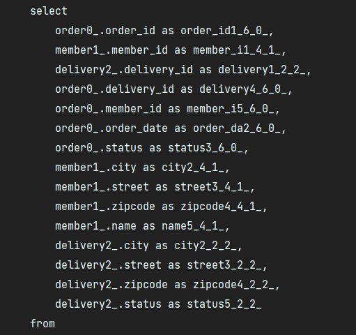
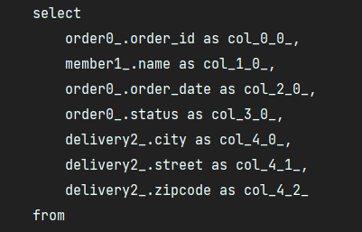

# API - xToOne 성능 최적화

## API 개발 시 발생하는 성능 문제 최적화

- 데이터를 조회할 때 지연 로딩을 잘못 사용해서 쿼리가 너무 많이 실행되는 경우가 있다.
- 이 때 의도하지 않은 쿼리가 N개씩 추가로 실행되어, 대부분 성능 문제의 원인이 된다. 이를 보통 N+1 문제라 말한다.
- 이를 해결하는 방법에는 일반적인 join 대신 JPQL이 제공하는 fetch join을 사용하는 방법과
- JPA에서 내가 원하는 데이터만 Dto를 활용하여 직접 조회하는 방법이 있다. 

---

## Fetch Join을 사용

```java
public List<Order> findAllWithMemberDelivery() {
    return em.createQuery(
            "select o from Order o" +
                    " join fetch o.member m" +
                    " join fetch o.delivery d", Order.class)
            .getResultList();
}
```


- 리포지토리에서 Order 엔티티를 패치 조인으로 쿼리 1번에 조회할 수 있다.

```java

@GetMapping("/api/v3/simple-orders")
public Result ordersV3() {
    List<Order> orders = orderRepository.findAllWithMemberDelivery(); //패치 조인으로 엔티티를 조회
    List<SimpleOrderDto> collect = orders.stream() // 엔티티를 Dto로 변환
            .map(SimpleOrderDto::new)
            .collect(toList());

    return new Result(collect);
}

@Data
@AllArgsConstructor
static class Result<T> {
    private T data;
}

@Data
static class SimpleOrderDto {

    private Long orderId; //Order
    private String name; //Member
    private LocalDateTime orderDate; //Order
    private OrderStatus orderStatus; //Order
    private Address address; //Delivery

    public SimpleOrderDto(Order order) {
        orderId = order.getId();
        name = order.getMember().getName();
        orderDate = order.getOrderDate();
        orderStatus = order.getStatus();
        address = order.getDelivery().getAddress();
    }
}
```

- 반환용 Dto를 만들어서 컬렉션을 Result 클래스로 감싸서 반환한다.
- 향후 필요한 필드를 자유롭게 추가할 수 있다.

#

## JPA에서 DTO로 바로 조회

```java
@Data
public class OrderSimpleQueryDto {

    private Long orderId;
    private String name;
    private LocalDateTime orderDate;
    private OrderStatus orderStatus;
    private Address address;

    public OrderSimpleQueryDto(Long orderId, String name, LocalDateTime orderDate, OrderStatus orderStatus, Address address) {
        this.orderId = orderId;
        this.name = name;
        this.orderDate = orderDate;
        this.orderStatus = orderStatus;
        this.address = address;
    }
```

```java
public List<OrderSimpleQueryDto> findOrderDtos() {
    return em.createQuery(
            "select new jpabook.jpashop.repository.order.simplequery.OrderSimpleQueryDto(o.id, m.name, o.orderDate, o.status, d.address)" +
            " from Order o" +
            " join o.member m" +
            " join o.delivery d", OrderSimpleQueryDto.class)
            .getResultList();
}
```



- new 명령어를 사용해서 JPQL의 결과를 DTO로 즉시 반환할 수 있다.
- Select 절에서 원하는 데이터를 직접 선택하므로 조금의 성능 최적화가 가능하다.
- 고객의 트래픽이 많은 서비스에서는 많은 튜닝이 될 것으로 예상된다.

---

## Fetch Join과 Dto를 직접 조회하는 방법간의 Trade-off

- 패치 조인을 활용할지, Dto를 직접 조회할지는 각각 장단점이 있고 상황에 따라 다르다.
- 패치 조인을 활용하여 엔티티를 조회하면 리포지토리 재사용성이 좋아지고, 개발도 단순해진다.
- 
- Dto를 직접 조회하면 약간의 성능을 향상시킬 수 있지만, 리포지토리 재사용성이 떨어지고
- API 스펙에 맞춘 코드가 리포지토리에 들어가는 단점이 있다.
- 때문에 이런 코드들은 별도로 분리하여 관리하는 것이 유지보수하는데 도움이 된다.

---

## Reference

- [실전! 스프링 부트와 JPA 활용2 - API 개발과 성능 최적화](https://www.inflearn.com/course/%EC%8A%A4%ED%94%84%EB%A7%81%EB%B6%80%ED%8A%B8-JPA-API%EA%B0%9C%EB%B0%9C-%EC%84%B1%EB%8A%A5%EC%B5%9C%EC%A0%81%ED%99%94/dashboard)
