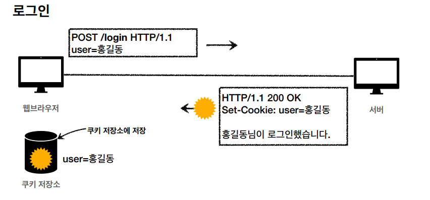
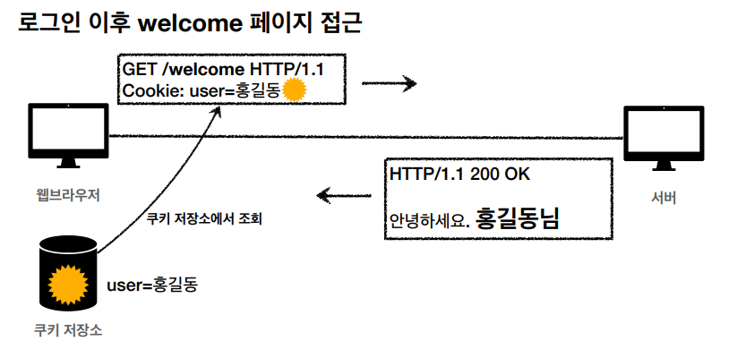

# 쿠키 (Cookie)

`쿠키`는 웹 서버와 웹 브라우저 사이에 정보를 교환하는데 사용되는 작은 데이터 조각이다.  
주로 클라이언트가 서버에서 받은 쿠키를 저장하고, HTTP 요청시 데이터와 함께 쿠키를 서버로 전달한다.  

#

`쿠키`는 여러가지 목적으로 활용되는데  
주로 `사용자 로그인 세션 관리`, `광고 정보 트래킹`, `온라인 쇼핑몰 장바구니 관리`에 사용된다.  
  
`HTTP`는 기본적으로 `Stateless` 프로토콜이기 때문에  
클라이언트와 서버는 상태를 유지하지 않고, 서버는 클라이언트의 이전 요청을 기억하지 못한다.  
그렇기 때문에 사용자 로그인 이후 로그인을 유지하고 증명하고자 `쿠키(세션 id)` 같은 최소한의 정보를 활용한다.  

사용자의 로그인이 서버에서 정상적으로 완료되면  
서버는 응답을 보낼 때 `사용자를 식별할 수 있는 쿠키 헤더`를 생성해서 전송하고, 웹 브라우저는 `쿠키 저장소에 쿠키를 저장`한다.

이후 웹 브라우저는 요청을 보낼 때 마다  
`자동으로 쿠키 저장소에서 쿠키를 조회`하고, `쿠키 헤더를 생성해서 서버로 전송`한다.

#

쿠키는 브라우저 종료시 삭제되는 `세션 쿠키`, 특정 날짜까지 유지되는 `영속 쿠키`가 존재한다.  
  
`http`, `https`를 구분하지 않고 전송되지만, `Secure`를 적용하면 `https`인 경우에만 전송되도록 설정할 수 있다.  
추가적인 보안 옵션으로는 `HttpOnly`, `SameSite`가 있다.  

#

쿠키 정보는 항상 서버에 전송되기 때문에 `추가적인 네트워크 트래픽`을 유발한다.  
그렇기 때문에 `세션 id`같은 최소한의 정보만 사용해야 하며 보안에 민감한 데이터는 저장하면 안된다.  
  
추가로 쿠키를 서버에 전송하지 않고, 클라이언트 로직에서만 사용하도록 웹 브라우저 내부 `웹 스토리지`에 저장할 수도 있다.  

---

## Reference

- [모든 개발자를 위한 HTTP웹 기본 지식](https://www.inflearn.com/course/http-%EC%9B%B9-%EB%84%A4%ED%8A%B8%EC%9B%8C%ED%81%AC/dashboard)
