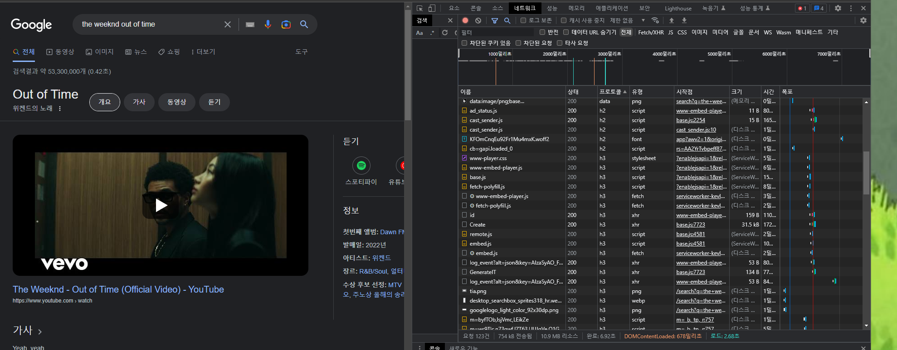
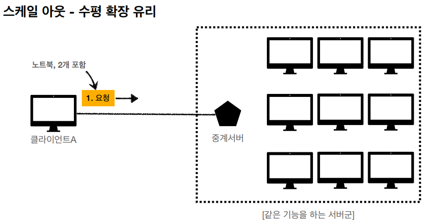
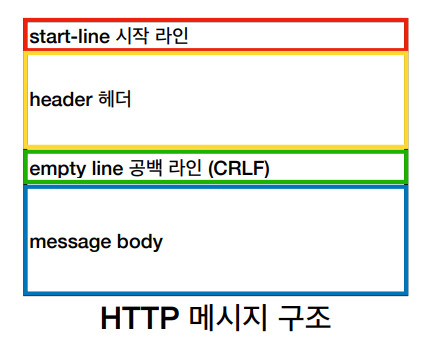
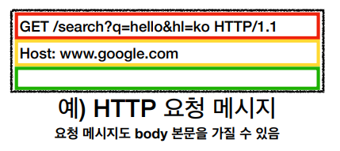
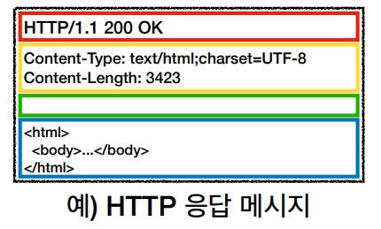

# HTTP Basic

## HTTP란? (HyperText Transfer Protocol) (하이퍼텍스트 전송 규약)

### HTTP 메시지에 모든 것을 전송 가능하다.

- HTML, TEXT, 이미지, 음성 및 영상, 파일, JSON, XML등 거의 모든 형태의 데이터를 전송할 수 있다.
- 서버간 데이터를 주고 받을 때도 대부분 HTTP를 사용한다.

### HTTP 기반 프로토콜

- TCP: HTTP/1.1, HTTP/2
- UDP: HTTP/3

- 구글 크롬으로 개발자 도구를 눌러 사용중인 프로토콜을 확인해보았다.
- 거의 h3(HTTP/3)을 사용중이다.

#

## HTTP의 특징

### 클라이언트 서버 구조

- 클라이언트와 서버를 분리.
- 클라이언트는 서버에 요청을 보내고 응답을 대기, 서버는 요청에 대한 결과를 만들어 응답한다.
- 
- 복잡한 비즈니스 로직과 데이터는 서버가, UI 및 사용성을 개선하는 부분은 클라이언트가 담당하여 서로 독립적인 성장이 가능.

### 무상태 프로토콜 (Stateless)

- 서버가 클라이언트의 이전 상태를 보존하지 않는다.
- 무상태는 클라이언트의 요청이 갑자기 증가해도 서버를 대거 투입할 수 있다.
  - 왜? 서버가 클라이언트의 만약 상태를 유지한다면, 클라이언트는 해당 서버와의 통신만이 가능할 것.
  - 해당 서버가 갑자기 장애가 발생한다면, 클라이언트는 새로운 서버와 다시 처음부터 통신을 해야한다.
- 응답 서버를 쉽게 바꿀 수 있다 -> 무한한 서버 확장성을 가진다!
- 반대의 개념은 상태유지 (Statefull) 이다.

### 무상태 프로토콜의 실무 한계

- 상태를 유지해야 하는 경우도 있다. (예: 로그인)
- 로그인한 사용자의 경우 로그인 했다는 상태를 서버에 유지해야한다.
- 일반적으로는 브라우저 쿠키와 서버 세션을 사용해서 상태를 유지한다.
- 최대한 무상태로 설계하되, 어쩔 수 없는 부분에만 상태 유지로 설계한다.

#

### 비 연결성(connectionless)

- Http는 기본이 연결을 유지하지 않는 모델이다.
- 일반적으로 초 단위 이하의 빠른 속도로 응답한다.
- 그렇기 때문에 수천명이 서비스를 이용해도 서버에서 동시에 처리하는 요청은 매우 적다.
- 서버 자원을 효율적으로 사용할 수 있다.

### 비 연결성의 한계와 극복

- 매우 짧은 순간에도 연결을 다시 시도하면 TCP/IP 연결을 새로 맺어야하는 단점이 존재한다.
  - HTML, 자바스크립트, css, 추가 이미지 다운로드 등
- 이를 현재는 HTTP 지속 연결(Persistent Connections)로 문제를 해결했다.

### 최대한 Stateless 상태로 설계하는 것이 중요하다!

- 같은 시간에 대용량 트래픽이 발생하는 경우가 있다. (예: 선착순 이벤트, 수강신청, 명절 KTX 예약 등)
- 이 때 Stateless를 최대한 활용하여 서버의 ScaleOut을 활용하자.

#

### HTTP 메시지 구조

- HTTP 메시지의 구조는 시작 라인, 헤더, 공백 라인, 메시지 바디를 가지고 있다.

- 요청 메시지의 경우 시작 라인에 HTTP 메서드와 요청 대상 path 및 쿼리파라미터, HTTP 버전 등이 포함된다.
- 헤더는 필드 이름 및 필드 값을 포함한다.
  - 여기서 field-name ":" OWS field-value의 형식이 지켜져야 한다.
- 메시지 바디가 없다면 공백 라인과 함께 요청 메시지가 끝이 난다.

- 응답 메시지의 경우에는 HTTP 버전이 먼저 들어가고, 뒤에 HTTP 상태코드가 들어간다.
  - 보통 200은 성공, 400은 클라이언트 요청 오류, 500은 서버 내부의 오류이다.
- 헤더에는 HTTP 전송에 필요한 모든 부가정보가 들어있다.
  - 메시지 바디의 내용 타입, 메시지 바디의 크기, 압축, 인증, 요청 클라이언트 정보 등등
  - 필요시 임의의 헤더 추가가 가능하다.
- 메시지 바디에는 실제 전송할 데이터가 포함된다.
  - HTML문서, 이미지, 영상, JSON 등등

---

## Reference

- [모든 개발자를 위한 HTTP웹 기본 지식](https://www.inflearn.com/course/http-%EC%9B%B9-%EB%84%A4%ED%8A%B8%EC%9B%8C%ED%81%AC/dashboard)
