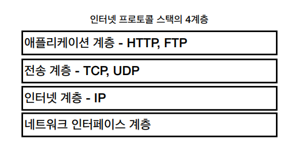
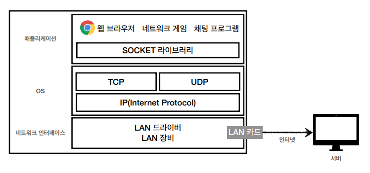
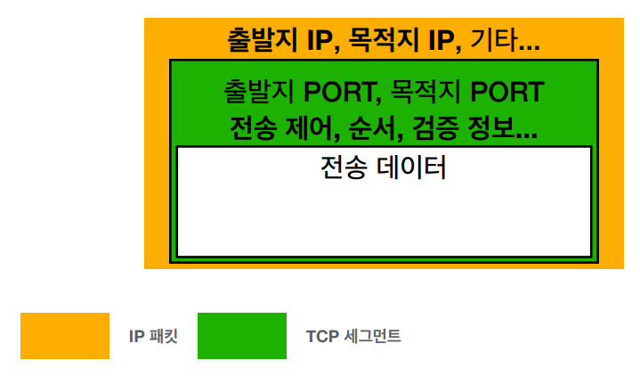
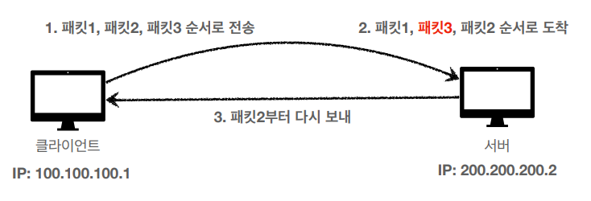

# Internet Network

## IP (Internet Protocol)

### 인터넷에서 컴퓨터 둘은 어떻게 통신할까 ?

- 인터넷 프로토콜은 송신자와 수신자 간 정보를 주고 받는 데 사용되는 규칙을 말한다.

## IP의 역할

- 지정한 IP 주소에 데이터를 전달할 수 있도록 정해진 규칙이다.
- 패킷(Packet)이라는 통신 단위로 데이터를 전달한다.
- 
- 출발지 IP, 도착지 IP, 전송 데이터 등이 포함된 IP 패킷을 인터넷 망에 던지면, 각 노드를 타면서 프로토콜을 따라 최종 목적지 까지 패킷이 도달하게 된다.

#

## IP 프로토콜의 한계

### 비연결성

- 패킷을 받을 대상이 없거나 서비스 불능 상태여도 패킷 전송

### 비신뢰성

- 중간에 패킷이 소실될 수 있는 문제
- 패킷 전달 순서 문제가 발생
  - Hello world! -> world! Hello

### 프로그램 구분

- 같은 IP를 사용하는 서버에서 통신하는 애플리케이션이 둘 이상이면 구분이 불가능
  - 한 PC에서 게임, 유튜브 등등 여러가지 애플리케이션을 사용하는 경우 어떤 애플리케이션에 해당하는 패킷인지 구분할 방법이 없다.

---

## TCP, UDP

### 인터넷 프로토콜 스택의 4계층

- 애플리케이션 계층 - HTTP, FTP
- 전송 계층 - TCP, UDP
- 인터넷 계층 - IP
- 네트워크 인터페이스 계층

#

### TCP/IP 패킷 정보

- IP 패킷에 출발지 IP, 목적지 IP가 담겨 있다면, TCP/IP는 IP 패킷 뿐만 아니라 TCP 관련 정보를 갖고 있다.
- TCP 세그먼트는 출발지 PORT와 목적지 PORT가 담겨있어, 패킷이 어느 프로세스(애플리케이션)에 해당하는 패킷인지 구분이 가능하다.
- 뿐만 아니라 전송 제어, 순서, 검증 정보를 가지고 있어 IP로는 해결이 안되었던 문제들을 해결할 수 있다.
- 신뢰할 수 있는 프로토콜이며 현재는 대부분 TCP를 사용한다.

#

## 전송 제어 프로토콜(TCP Transmission Control Protocol) 특징

### 연결 지향 - TCP 3 way handshake (가상 연결)

- 1\) 클라이언트에서 서버로 SYN(접속 요청)이라는 메시지 통신을 전송한다.
- 2\) 서버에서 클라이언트로 응답 메시지 SYN(접속 요청) + ACK(요청 수락)를 함께 보낸다
- 3\) 응답을 받은 클라이언트가 서버로 ACK(요청 수락) 메시지를 전송한다.
  - 여기서 ACK과 함께 데이터 전송이 가능하다.

#

### 데이터 전달 보증

- 클라이언트에서 서버로 데이터를 전송하면, 서버는 데이터를 잘 받았다는 응답을 보내준다.

#

### 순서 보장

- TCP 세그먼트에 포함된 순서 정보를 활용하여 패킷이 순서대로 잘 도착했는지 검증이 가능하다.

---

## 사용자 데이터그램 프로토콜(UDP User Datagram Protocol) 특징

- 하얀 도화지에 비유(기능이 거의 없다)
- 연결지향, 데이터 전달 보증, 순서 보장이 모두 되지 않는다.
- 데이터 전달 및 순서가 보장되지 않지만, 단순하고 빠르다.
- 
- IP와 거의 같으며 PORT, 체크섬 정도만 추가되어있다.
- 애플리케이션에서 추가 작업이 필요하다.

---

## Reference

- [모든 개발자를 위한 HTTP웹 기본 지식](https://www.inflearn.com/course/http-%EC%9B%B9-%EB%84%A4%ED%8A%B8%EC%9B%8C%ED%81%AC/dashboard)
