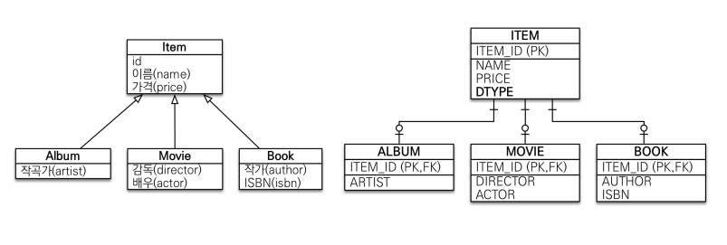
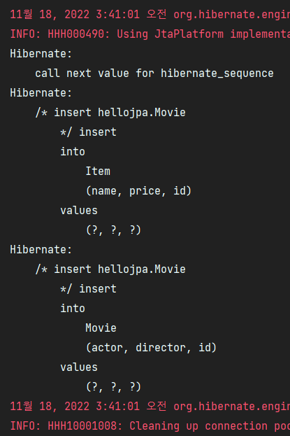
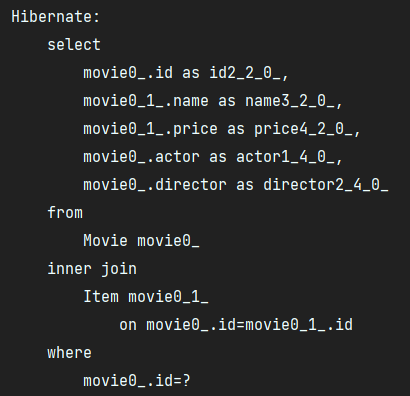
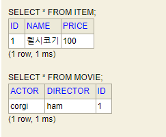
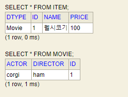
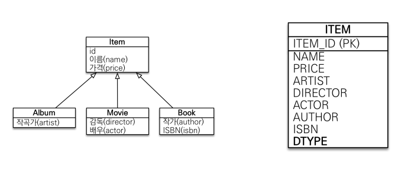
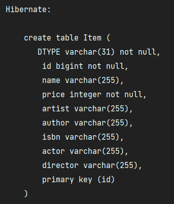
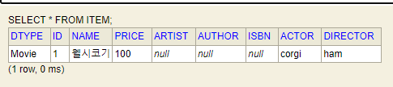
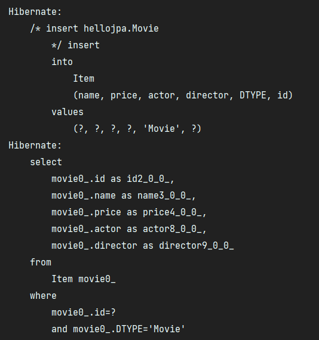
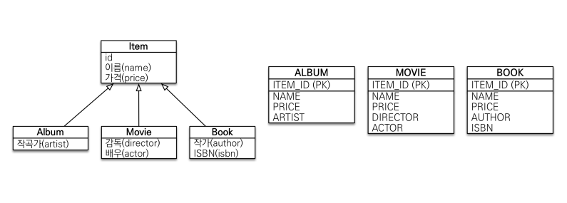

# 고급 매핑

## 상속관계 매핑

- 관계형 데이터베이스는 상속 관계라는 것이 존재하지 않는다.  
- RDB의 슈퍼타입 서브타입 관계라는 모델링 기법이 객체 상속과 유사하다.  

### 상속관계 매핑이란 객체의 상속 관계와 DB의 슈퍼, 서브타입 관계를 서로 매핑하는 것을 말한다.

#

슈퍼, 서브타입 논리모델을 실제 물리 모델로 구현하는 방법은 세가지가 있다.

### @Inheritance(strategy = InheritanceType.XXX)

- JOINED : 조인전략
- SINGLE_TABLE : 단일 테이블 전략
- TABLE_PER_CLASS : 구현 클래스마다 테이블 전략

---

## 조인 전략



```java
@Entity
@Inheritance(strategy = InheritanceType.JOINED)
public abstract class Item {

    @Id @GeneratedValue
    private Long id;

    private String name;
    private int price;
}
```

```java
@Entity
public class Movie extends Item {

    private String director;
    private String actor;
}
```

- `@Inheritance(strategy = InheritanceType.JOINED)` 을 사용한 부모 클래스를 자식에 물려주면 정교화된 조인 DB 모델을 구현할 수 있다.

```java
Movie movie = new Movie();
movie.setName("웰시코기");
movie.setDirector("ham");
movie.setActor("corgi");
movie.setPrice(100);

em.persist(movie);

em.flush();
em.clear();

Movie findMovie = em.find(Movie.class, movie.getId());
System.out.println("findMovie = " + findMovie);

tx.commit();
```



- 단지 Movie에만 값을 넣어도 JPA가 자동으로 INSERT 쿼리를 Item 테이블에도 날려준다.



- 값을 단지 Movie 클래스로 찾아오는 경우에도 JPA가 자동으로 inner join 쿼리를 날려준다.



#

## @DiscriminatorColumn

- `@DiscriminatorColumn` 어노테이션을 부모 클래스에 사용하면 테이블에 DTYPE이 생기면서, DB에서 어느 자식 타입의 데이터인지 확인할 수 있다.  
- name 속성으로 따로 컬럼 명을 지정할 수 있으며, 기본값은 엔티티 명이다.
- `@DiscriminatorValue(“XXX”)` 을 자식 클래스에 사용하면 어떤 값으로 데이터에서 나타낼지 설정이 가능하다.

  

- DTYPE은 DB 운영상 항상 있는게 좋다.

---

## 단일 테이블 전략

  

- 간단한 프로젝트를 진행할 때 조인 전략이 너무 복잡하다고 느껴지면 단일 테이블 전략을 활용하는 것도 가능하다.
- 한 테이블에 모든 것들이 들어가고, DTYPE으로 엔티티를 구별하는 전략이다.

```java
@Entity
@Inheritance(strategy = InheritanceType.SINGLE_TABLE)
public abstract class Item {

    @Id @GeneratedValue
    private Long id;

    private String name;
    private int price;
}
```
  
  


- 심플하게 Item 테이블에 모든 것들이 들어간다.
- 조인 전략과 다르게 단일 테이블 전략에서는 @DiscriminatorColumn 생략해도 DTYPE이 자동으로 생성된다.
- 단일 테이블이므로 DTYPE이 없으면 엔티티 구분이 안되기 때문이다.



- 저장과 조회쿼리 모두 Item에 한 번만 날리는 모습을 볼 수 있다.
- 조인을 할 필요도 없다.

---

## 구현 클래스마다 테이블 전략



```java
@Entity
@Inheritance(strategy = InheritanceType.SINGLE_TABLE)
public abstract class Item {

    @Id @GeneratedValue
    private Long id;

    private String name;
    private int price;
}
```

- 이 전략은 데이터베이스 설계자와 ORM 전문가들이 둘 다 추천하지 않는 방법이다.
- 부모 타입으로 데이터를 조회하게되면 매우 복잡한 쿼리가 나간다. (UNION SQL)
- 성능이 느려지게 된다.

---

## 각 전략의 장단점

### 조인 전략 장점

- 테이블이 정규화 되어있다.
- 외래키 참조 무결성 제약조건을 활용 가능하다.
    - 자식 테이블들이 부모의 기본키를 따라가므로 데이터를 믿을 수 있다.
- 저장공간이 효율적이다

### 조인 전략 단점

- 조회시 조인을 많이 사용해야한다. (성능이 저하되기는 하는데 그렇게 크지는 않음)
- 데이터 저장시 INSERT 쿼리를 2번 호출한다.

#

### 단일 테이블 전략 장점

- 조회 성능이 빠르다. (조인이 필요없음)
- 조회 쿼리가 단순하다.

### 단일 테이블 전략 단점

- 자식 엔티티가 매핑한 컬럼은 모두 null을 허용해야한다. (데이터 무결성 보장 X)

#

## 결론

- 기본적으로 조인 전략을 채용해서 사용하도록 설계를 하되
- 조인 전략의 장단점, 단일 테이블 전략의 장단점을 잘 생각해서 하나를 선택하자. (trade off)
- 구현 클래스마다 테이블을 생성하는 전략은 선택에서 제외하자.

---

## Reference

- [자바 ORM 표준 JPA 프로그래밍 - 기본편](https://www.inflearn.com/course/ORM-JPA-Basic/dashboard)
