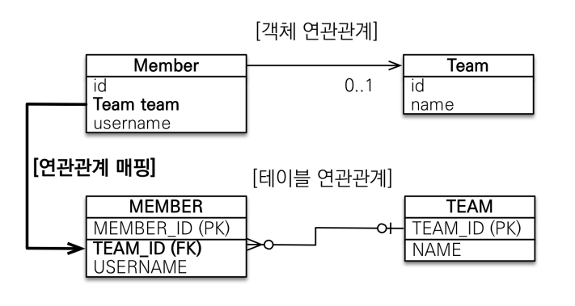
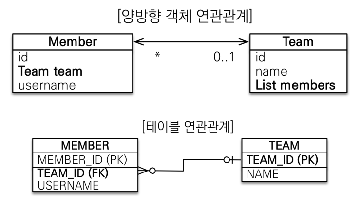

# 연관관계 매핑

## 연관관계가 필요한 이유

### 객체와 테이블간의 패러다임 차이

- 객체는 참조를 사용해서 연관된 객체를 찾는다.
- 테이블은 외래 키로 조인을 사용해서 연관된 테이블을 찾는다.
-
- 객체를 테이블에 맞추어 데이터 중심으로 모델링하면, 협력 관계를 만들 수 없다.

---

## 단방향 연관관계



```java
@Entity
public calss Member {
    
    @Id @GeneratedValue
    private Long id;
    
    @ManyToOne
    @JoinColumn(name = "TEAD_ID")
    private Team team;
    
    @Column(name = "USERNAME")
    private String name;  
}
```

- 객체의 참조와 테이블의 외래키를 매핑해야한다.
- 그리고 현재 두 객체가 어떠한 관계인지를 어노테이션으로 알려주어야 한다.
- 다대일 관점에서 Member가 다에 속하고 Team이 일에 속하므로 @ManyToOne 어노테이션으로 매핑한다.
- @Joincolumn 어노테이션으로 Team의 참조와 테이블의 외래키를 매핑할 수 있다.

#

## 양방향 연관관계



- 단방향과 양방향 테이블 형태는 모두 같다.
- 테이블은 단지 외래 키 하나로 두 테이블의 연관관계를 관리할 수 있다.
- 
- 하지만 객체는 양방향으로 참조하려면 단방향 연관관계를 2개 만들어야 한다.

```java
@Entity
public class Team {

    @Id @GeneratedValue
    @Column(name = "TEAM_ID")
    private Long id;
    
    private String name;

    @OneToMany(mappedBy = "team")
    List<Member> members = new ArrayList<Member>();
}
```

- @OneToMany 어노테이션으로 연관관계를 정의한다 (일대다)
- 어노테이션 속성 mappedBy를 사용해서 상대 객체에 누구와 관계가 있는지 알려주어야한다.

## 연관관계의 주인 (mappedBy)

### 양방향 매핑 규칙 (중요)

- 객체의 두 관계중 하나를 연관관계의 주인으로 지정해야 한다.
- 연관관계의 주인만이 외래 키를 관리해서 데이터 등록과 수정이 가능하다.
- 주인이 아닌쪽은 읽기만 가능하며 mappedBy 속성으로 주인을 지정해주어야 한다.


