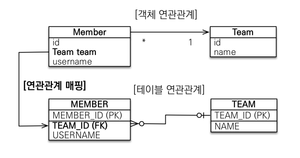
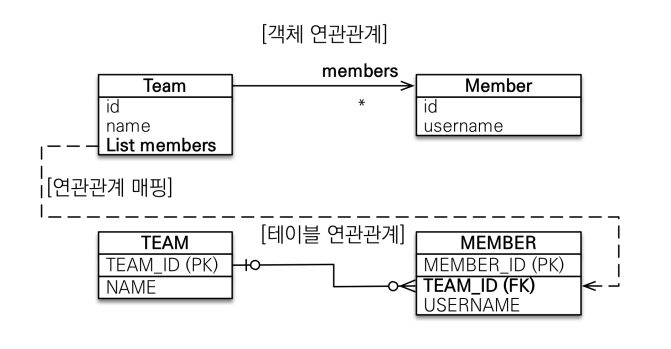
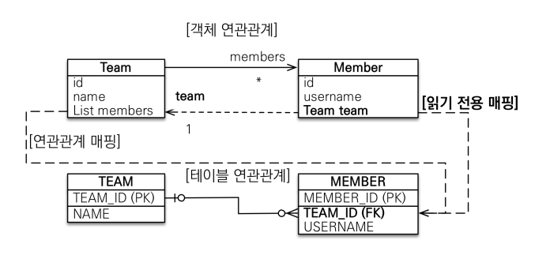

# 연관관계 매핑

## 다대일 \[N:1]

- 가장 많이 사용하는 연관관계이다.
- N에 외래키가 있는 것을 의미하며, 다대일의 반대는 일대다이다. 

### 다대일 단방향



```java
@Entity
public class Member {
    
    @Id @GeneratedValue
    private Long id;
    
    @ManyToOne
    @JoinColumn(name = "TEAD_ID")
    private Team team;
    
    @Column(name = "USERNAME")
    private String name;  
}
```

- @ManyToOne으로 관계를 알려주고, @JoinColumn으로 Team과 외래키를 매핑한다고 알려주기만 하면 된다.

### 다대일 양방향

```java
@Entity
public class Team {

    @Id @GeneratedValue
    @Column(name = "TEAM_ID")
    private Long id;
    
    private String name;

    @OneToMany(mappedBy = "team")
    List<Member> members = new ArrayList<Member>();
}
```

- Member 엔티티는 동일하고, Team 엔티티에 컬렉션을 추가해서 @ManyToOne의 반대인 @OneToMany를 걸어준다.
- 이 때 반드시 mappedBy 속성으로 연관관계의 주인이 누구인지 설정해야 한다. 
- 외래 키가 있는 쪽이 연관관계의 주인이다.

---

## 일대다 \[1:N]

- 다대일과 반대로, 1이 연관관계 주인인 것을 말한다.
- 테이블은 설계상 구조적으로 N쪽에 외래 키가 존재하게된다.
- 객체와 테이블의 차이 때문에 반대편 테이블의 외래 키를 관리하는 특이한 구조다.

### 일대다 단방향



```java
@Entity
public class Member {
    
    @Id @GeneratedValue
    private Long id;
    
    @Column(name = "USERNAME")
    private String name;  
}
```

```java
@Entity
public class Team {

    @Id @GeneratedValue
    @Column(name = "TEAM_ID")
    private Long id;
    
    private String name;

    @OneToMany(mappedBy = "team")
    @JoinColumn(name = "TEAM_ID")
    List<Member> members = new ArrayList<Member>();
}
```
- @JoinColumn을 꼭 사용해야 한다. (사용하지 않으면 기본 값인 조인 테이블 방식으로 동작하게 된다.)
- Team의 members에 값을 집어넣으면, 연관관계 관리를 위해 추가로 UPDATE SQL이 Member 테이블에 나가게된다.
- 일대다 단방향 매핑 보다는, 다대일 양방향 매핑을 사용하는 것이 좋다. (너무 헷갈림!)

### 일대다 양방향



- 일대다 양방향 매핑방법은 공식적으로 존재하지 않는다.
- 그런데 @JoinColumn(insertable=false, updatable=false)을 사용해서 마치 양방향 처럼 사용하는 것이 가능하다.
- 다대일 양방향을 사용하는게 제일 좋은 방법이다.

---
 
## Reference

- [자바 ORM 표준 JPA 프로그래밍 - 기본편](https://www.inflearn.com/course/ORM-JPA-Basic/dashboard)
