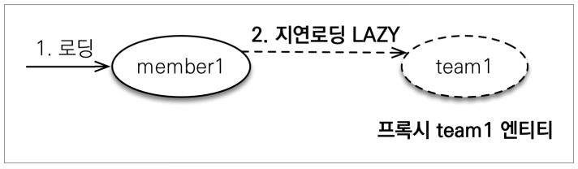
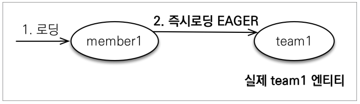

# 즉시 로딩과 지연 로딩

## 지연 로딩(LAZY LOADING)

```java
@Entity
public class Member {

    @Id @GeneratedValue
    @Column(name = "MEMBER_ID")
    private Long id;

    @Column(name = "USERNAME")
    private String username;

    @ManyToOne
    @JoinColumn(name = "TEAM_ID")
    private Team team;
}
```

- Member 엔티티의 Team 객체처럼, 단순히 member 정보만 사용하는 비즈니스 로직에서는 team 까지 조회할 필요는 없다.  
- 이 때 지연 로딩 LAZY를 사용해서 프록시로 조회하면 원하는 정보만 조회하는 것이 가능하다.



```java
@ManyToOne(fetch = FetchType.LAZY) //지연로딩
@JoinColumn(name = "TEAM_ID")
private Team team;
```

- team 인스턴스는 프록시로 생성이 되고, 실제 team을 사용하는 시점에 DB로 쿼리가 나가면서 team이 초기화된다.

#

## 즉시 로딩(EAGER LOADING)



```java
@ManyToOne(fetch = FetchType.EAGER) //지연로딩
@JoinColumn(name = "TEAM_ID")
private Team team;
```

- Member와 Team을 자주 함께 사용한다면 member를 조회할 때 team까지 같이 초기화 되는게 성능상으로 이득일 것이다.
- `fetch = FetchType.EAGER`을 사용하면 즉시 로딩을 사용할 수 있다. (프록시 X)

---

## 지연 로딩을 사용해야 한다!! (실무)

- 즉시 로딩을 사용하면 연관된 매핑 숫자만큼, 무수히 많은 join 쿼리와 예상하지 못한 SQL이 다발적으로 나갈 수 있다.
- 즉시 로딩은 JPQL을 사용할 때 N+1 개 만큼 문제를 일으킨다.
    - 내부적으로 최적화가 다 되어있는 em.find() 메소드와 달리
    - JPQL이 번역되어 생성되는 SQL에 의해 즉시 로딩으로 설정되어있는 인스턴스만큼 테이블에 쿼리가 별도로 더 나가게 된다.
-
- @ManyToOne, @OneToOne은 기본이 즉시 로딩이기 때문에 LAZY로 설정 해야한다.
- @OneToMany, @ManyToMany는 기본이 지연 로딩이다.


---

## Reference

- [자바 ORM 표준 JPA 프로그래밍 - 기본편](https://www.inflearn.com/course/ORM-JPA-Basic/dashboard)

