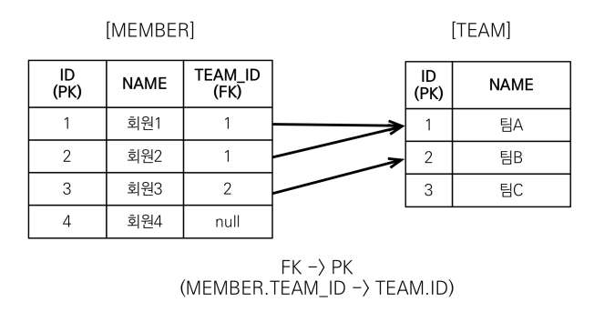
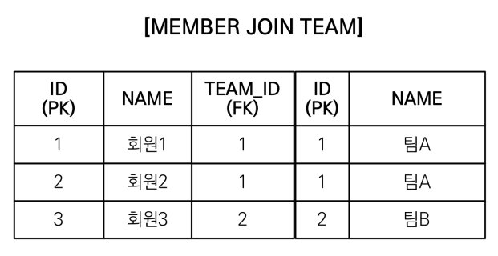
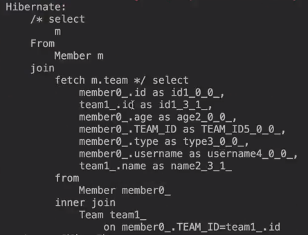
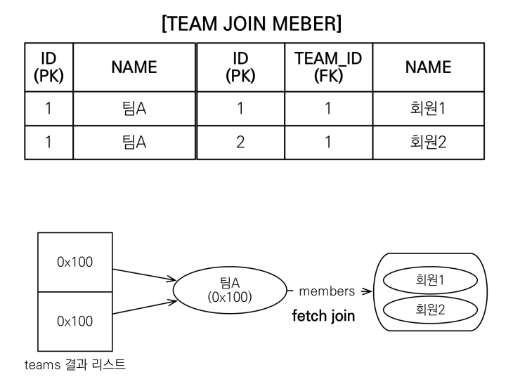

# 페치 조인

- 페치 조인은 일반적인 SQL에서 제공하는 join과 다르며, 연관된 엔티티나 컬렉션을 SQL 한 번에 함께 조회하는 기능을 갖고있다.
- JPQL에서 페치 조인을 잘 활용하면 N+1 문제와 같은 이슈를 해결할 수 있고 성능을 최적화 하는 것이 가능하다.
- 실무에서 매우 자주 쓰는 기능이고, 100% 이해하고 사용하는 것이 중요하다.

#

## 엔티티 패치 조인 (xxxToOne)



- Member와 Team엔티티가 ManyToOne관계로 묶여있다.
- Member를 조회할 때 페치 조인을 사용하면 Team도 함께 SELECT절에 포함시켜 데이터를 한 번에 조회할 수 있다.

```java
String jpql = "select m from Member m join fetch m.team";

List<Member> members = em.createQuery(jpql, Member.class).getResultList(); 
for (Member member : members) {
    System.out.println("username = " + member.getUsername() + ", " + "teamName = " + member.getTeam().name()); 
}
```



### 일반적인 join

- 일반적인 join을 사용하면 Member 조회를 위한 sql이 처음에 실행되고, Team엔티티는 지연 로딩에 의해 프록시 객체가 영속성 컨테이너에 등록된다.
- 그리고 Team 엔티티는 실질적으로 데이터 호출이 발생하는 `member.getTeam().name()` 시점에 프록시 객체 초기화를 위한 sql이 추가로 발생한다.
- 결과적으로 쿼리가 예상한 것보다 여러번 실행되는 문제점이 발생한다. (N+1 이슈)
- 
- 과정) Select Member -> Select Team (회원1, 팀A) -> 1차캐시 (회원2, 팀A) -> Select Team (회원2, 팀B)
- 결과적으로 쿼리가 3번 실행된 것을 알 수 있다.
- 만약 멤버의 데이터가 100명이고, 멤버가 소속된 팀도 각각 모두 다르다면 팀을 조회할 때마다 SQL이 실행될 것이고 총 101번의 SQL이 실행될 것이다. 

#

### JPQL이 제공하는 fetch join



- 페치 조인을 사용하면 지연 로딩을 무시하고 프록시 객체가 아닌 실제 Team엔티티 객체를 영속성 컨텍스트에 올릴 수 있다.
- 실제 DB에 전송되던 SQL도 세 번이 아니라 한 번으로 줄어든 것을 확인할 수 있다.
- Member와 Team의 데이터를 동시에 사용해야 할 일이 있다면 페치 조인을 사용하는 것이 성능상으로 매우 유리하다.

---

## 컬렉션 패치 조인 (OneToMany)

```java
String jpql = "select t from Team t join fetch t.members where t.name = '팀A'" 
List<Team> teams = em.createQuery(jpql, Team.class).getResultList();

for(Team team : teams) { 
    System.out.println("teamname = " + team.getName() + ", team = " + team); 
    
    for (Member member : team.getMembers()) { 
        System.out.println(“-> username = " + member.getUsername()+ ", member = " + member); 
    } 
}
```

- Team입장에서 Member는 OneToMany 일대다 관계이며, 컬렉션 데이터로 취급된다.
- 팀A 소속인 Member를 조회한다고 가정할 때, 페치 조인을 사용하면 이전처럼 데이터를 한 번에 조회하는 것이 가능하지만
- 컬렉션을 페치 조인 할 때는 몇가지 주의할 점이 있다.



- 팀A 입장에서는 소속된 멤버가 회원1, 회원2 총 2명이다.
- 이 상태에서 Team과 Member가 join을 하게 되면, 팀A 하나를 조회하는데 멤버가 2명인 상황이므로 팀A의 데이터가 두줄로 늘어나는 일이 발생한다.
- JPA 입장에서는 이 일을 알 방법이 없고, 팀A의 조회 결과로 동일한 팀 객체 2개를 반환하며 영속성 컨텍스트에는 팀A 객체 하나가 등록되는 과정이 일어난다.

#

### DISTINCT 사용

- Select 절에 distinct 명령어를 추가하면 애플리케이션에서 중복된 엔티티 데이터를 제거할 수 있다.
- DB입장에서 distinct 명령어는 row 데이터가 100% 동일한 경우에만 중복으로 판단하여 데이터를 제거한다.
- 하지만 조회 결과가 애플리케이션으로 넘어오면 JPA가 자동으로 같은 엔티티의 중복을 막아주고 제거해주어 데이터의 증가를 막는 것이 가능하다.
