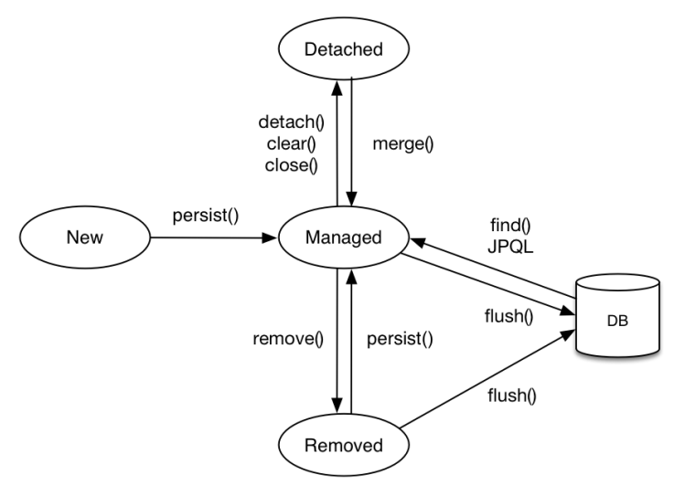
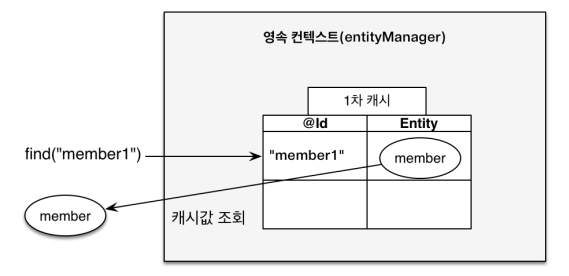
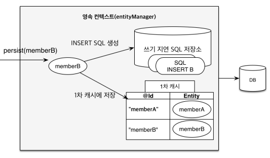
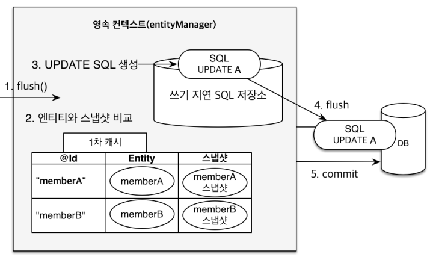

# 영속성 컨텍스트

## 영속성 컨텍스트란

- JPA를 이해하는데 가장 중요한 용어로, 엔티티를 영구 저장하는 환경을 의미한다.  
- 엔티티 매니저를 통해서 영속성 컨텍스트에 접근이 가능하고, 눈에 보이지 않는 논리적인 개념이다.
- `EntityManager.persist(entity);`

#

## 엔티티의 생명 주기



- 비영속
    - 영속성 컨텍스트와 관계가 전혀 없는 새로운 상태
    - ex) 객체만 생성
- 영속
    - 영속성 컨텍스트에 관리되는 상태
    - ex) em.persist()로 객체를 저장
- 준영속
    - 영속성 컨텍스트에 저장되었다가 분리된 상태
    - ex) em.detach()로 엔티티를 영속성 컨텍스트에서 분리
- 삭제
    - 삭제된 상태
    - ex) em.remove()로 엔티티를 영속성 컨텍스트에서 삭제

---

## 영속성 컨텍스트의 이점

- 1차 캐시
- 동일성(identity) 보장
- 트랜잭션을 지원하는 쓰기 지연
- 변경 감지(Dirty Checking)
- 지연 로딩(Lazy Loading)

#

### 1차 캐시



- 엔티티를 생성한 상태(비영속)에서 `em.persist(entity)`를 호출해 엔티티를 영속상태로 만들면,  
- PK_ID와 엔티티가 영속성 컨텍스트 내부의 1차캐시 공간에 Map(key, value) 형태로 저장이 된다. 
-
- 이후 `em.find(entity.class, id)`를 호출해서 엔티티 조회를 하면 우선적으로 DB가 아닌 1차 캐시에서 값을 찾는다.
- 만약 조회를 했는데 1차 캐시에는 없고 DB에만 값이 있으면, DB에서 값을 조회해서 먼저 1차 캐시에 저장한 다음에 엔티티를 반환한다.
- 
- 엔티티 매니저는 DB 트랜잭션 단위로 생성 종료되기 때문에, 1차 캐시로 인해 얻는 성능상 이점은 사실 크게 없다.

#

### 동일성(identity) 보장

- 자바 컬렉션에서 객체를 조회하듯이, JPA는 영속 엔티티의 동일성을 보장 해준다.

```java
// 영속
Member a = em.find(Member.class, "member1");
Member b = em.find(Member.class, "member1");

System.out.println(a == b) // true
```

#

### 트랜잭션을 지원하는 쓰기 지연 제공



- 트랜잭션 실행 후 엔티티 매니저는 `em.persist(member)`가 호출 되어도 바로 SQL을 데이터베이스에 보내지 않는다. (buffering)
- JPA는 엔티티를 분석해서 SQL을 생성하여 SQL 저장소에 보관하고 있다가
- 트랜잭션 커밋을 하는 시점, 커밋 직전에 SQL을 데이터베이스에 보낸다. (flush)

#

### 변경 감지(Dirty Checking)



- 영속 데이터의 변경이 감지되면 JPA는 알아서 update 쿼리를 데이터베이스에 날려준다. (자바 컬렉션을 다루듯이)
-
- 데이터베이스 트랜잭션을 커밋하는 시점에, JPA는 1차 캐시에 엔티티가 저장되었던 초기 상태(스냅샷)와 현재 상태를 비교한다.
- 엔티티의 변경이 감지되면 update 쿼리를 SQL 저장소에 저장한다음 DB에 날리고 트랜잭션을 커밋한다.

---

## Reference

- [자바 ORM 표준 JPA 프로그래밍 - 기본편](https://www.inflearn.com/course/ORM-JPA-Basic/dashboard)
