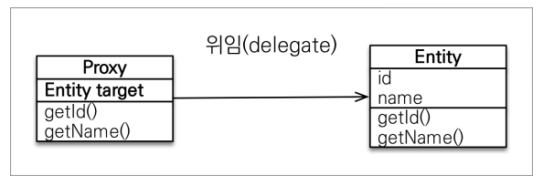
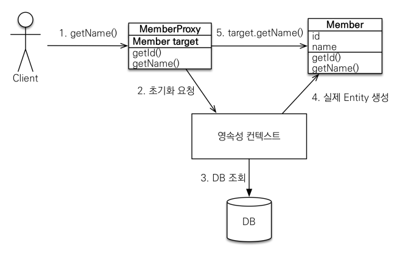

# 프록시

## 프록시란?

사전적 의미로는 Proxy, 대리(행위)나 대리권, 대리투표를 뜻하며, 시스템의 일부 기능을 다른 것이 임시로 대행하는 것을 말한다.  

### JPA를 사용할 때 프록시는 가짜 엔티티 객체를 의미한다.

- 실제 클래스를 상속 받아서 만들어진다.
- 실제 클래스와 겉 모양이 같다.
- 프록시 객체는 실제 객체의 참조(target)를 보관한다.
- 프록시 객체를 호출하면 프록시 객체는 실제 객체의 메소드를 호출한다.
-
- `em.find()` 를 호출하면 데이터 베이스를 통해서 실제 엔티티 객체를 조회하지만
- `em.getReference()` 를 호출하면 데이터베이스 조회를 미루는 프록시 객체를 조회한다.

#

- `em.getReference(Member.class, "id1");`를 호출한다고 즉시 데이터베이스에 조회 쿼리가 날라가는 것이 아니다.
- 영속성 컨텍스트에 프록시 객체만 생성해 놓고, 나중에 Member의 메소드나 초기화 요청이 호출되면 그 때 조회 쿼리를 DB에 날려서 실제 엔티티를 생성한다.
- 이렇게 프록시 객체를 이용하면, 필요한 데이터만 DB에서 바로 갖고오는 지연 로딩을 사용할 수 있다.

## 프록시의 특징

- 프록시 객체는 처음 사용할 때 한 번만 초기화된다.
- 프록시 객체는 원본 엔티티를 상속받기 때문에, 타입 체크시 주의해야한다. (== 대신, instanceof 를 사용)
- **영속성 컨텍스트는 같은 영속성 컨텍스트(같은 트랜잭션 레벨)의 영속된 데이터에 한해서 동일성을 보장한다. (== 비교시 true를 보장)**
    - 영속성 컨텍스트에 찾는 데이터가 이미 있다면 `em.getReference()`를 호출해도 실제 엔티티를 반환한다.
- 준영속 상태일 때, 프록시를 초기화하면 문제가 발생한다.
    - 하이버네이트는 이 때 `org.hibernate.LazyInitializationException` 예외를 터트린다.

## 프록시 확인 방법

- 프록시 인스턴스의 초기화 여부 확인
    - `emf.PersistenceUnitUtil.isLoaded(Object entity)`
- 프록시 강제 초기화
    - `Hibernate.initialize(entity)`
- JPA 표준은 강제 초기화 메소드가 없다. -> 엔티티 조회 메소드 호출

---
 
## Reference

- [자바 ORM 표준 JPA 프로그래밍 - 기본편](https://www.inflearn.com/course/ORM-JPA-Basic/dashboard)
