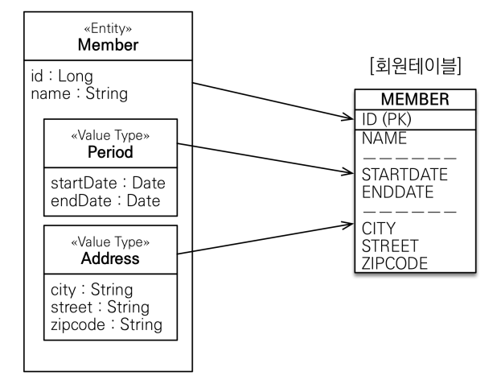
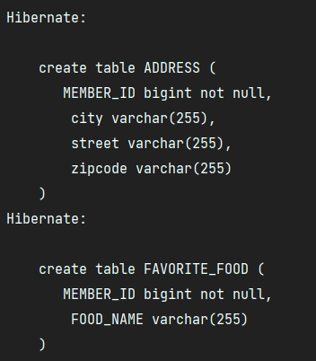

# 값 타입

### JPA의 데이터 타입은 엔티티 타입과 값 타입으로 나눌 수 있다.  
  
- 엔티티 타입은 @Entity로 정의하는 객체를 말하며, 데이터가 변해도 식별자로 지속해서 추적이 가능하다.  
- 값 타입은 단순히 값으로 사용하는 자바 기본 타입, 객체를 말하며, 식별자가 없고 값만 있으므로 변경시 추적이 불가능하다.

#

## 값 타입 분류

### 기본 값 타입

- 자바 기본 타입(int, double)
- 레퍼 클래스(Integer, Long)
- String

### 임베디드 타입(embedded type)

### 컬렉션 값 타입(collection value type)

---

## 임베디드 타입(복합 값 타입)

- 새로운 값 타입을 직접 정의할 수 있고, 주로 기본 값 타입을 모아서 만들어서 복합 값 타입이라고도 부른다.  
- 엔티티가 아닌, int와 String과 같은 값 타입으로 데이터가 변하면 추적이 불가능하다.
- 
- 임베디드 타입을 포함한 모든 값 타입은, 값 타입을 소유한 엔티티에 생명주기를 의존한다.
- 개발자가 원하면 해당 값 타입만 사용하는 의미 있는 메소드를 만들 수 있다. (객체 지향적 설계)

### 임베디드 타입 사용법

- @Embeddable : 값 타입을 정의하는 곳에 표시
- @Embedded : 값 타입을 사용하는 곳에 표시
- 기본 생성자가 필수로 존재해야 한다.

#

## 임베디드 타입과 테이블 매핑



- 임베디드 타입을 사용해도 테이블의 구조는 변하지 않는다.

```java
@Embeddable
public class Period {

    private LocalDateTime startDate;
    private LocalDateTime endDate;

    public Period() {
    }
}
```

```java
@Embeddable
public class Address {

    private String city;
    private String street;
    private String zipcode;

    public Address() {
    }
```

- 값 타입들을 뽑아내서 Period와 Address로 하나의 임베디드 타입으로 만들어 낼 수 있다.
- 이렇게 임베디드 타입을 사용해서 객체와 테이블을 아주 세밀하게 매핑하는 것이 가능하다.

```java
@Entity
public class Member {

    @Id @GeneratedValue
    @Column(name = "MEMBER_ID")
    private Long id;

    @Column(name = "USERNAME")
    private String username;

    //기간 Period
    @Embedded
    private Period workPeriod;

    //주소 Address
    @Embedded
    private Address homeAddress;
}
```

---

## 값 타입과 불변 객체

### 임베디드 타입 같은 값 타입을 여러 엔티티에서 공유하는 것은 위험하다.

- 값 타입의 실제 인스턴스인 값을 공유하는 것은 굉장히 위험하다. (공유 참조)
- 대신에 값을 복사해서 사용해야 한다.

### 임베디드 타입은 객체 타입이기 때문에 참조 값을 직접 대입하면 막을 방법이 없다.

#

## 불변 객체

불변 객체란 객체 생성 이후 그 상태를 바꿀 수 없는 객체를 말한다.  
불변 객체는 읽기 전용 메소드만 제공하며, 내부의 값을 안전하게 유지하기 위해 방어적 복사를 통해서 값을 반환한다.

### 값 타입은 불변 객체(immutable object)로 설계해야 한다.

- 객체 타입을 수정할 수 없게 만들어서 부작용을 원천 차단하자.
- 예시) 자바가 제공하는 Integer, String은 대표적인 불변 객체이다.

#

## 불변 객체를 만드는 방법(JAVA)

### final 키워드를 이용 해서 불변 클래스로 만들어야 한다.

- 멤버 변수에 private final을 붙인다.
- final 클래스로 선언해서 상속 가능성을 방지한다.
- 자바에서는 생성자를 따로 만들지 않으면 기본 생성자가 제공이 된다.
- 이 점을 염두하면서 생성자는 private으로 막고, 정적 팩토리 메소드를 추가해서 값을 생성하도록 유도하자.
- 멤버중에 참조 타입이 있다면 멤버 반환시 방어적 복사로 넘겨주게 하자.

#

## 불변 객체를 만드는 방법(JPA)

- @Setter를 막고 생성자에서 값을 모두 초기화하도록 해서 변경 불가능한 클래스를 만들도록 하자
- JPA 스펙상 엔티티나 임베디드 타입은 기본 생성자를 public 또는 protected로 설정해야 한다.
- public으로 두는 것 보다는 protected로 설정하는 것이 그나마 더 안전하다.
- 또는 정적 팩토리 메서드를 이용할 수도 있다.

---

## 값 타입 컬렉션

- 일대다 매핑처럼 엔티티를 컬렉션으로 쓰는 것이 아니라, 값 타입을 컬렉션으로 쓰는 것을 말한다.
- 값 타입을 하나 이상 저장할 때 사용하고, 컬렉션을 저장하기 위한 별도의 테이블이 필요하다.
- `@ElementCollection`, `@CollectionTable`으로 사용할 수 있다.

```java
@Entity
public class Member {

    @Id @GeneratedValue
    @Column(name = "MEMBER_ID")
    private Long id;

    @Column(name = "USERNAME")
    private String username;

    //기간 Period
    @Embedded
    private Period workPeriod;

    //주소 Address
    @Embedded
    private Address homeAddress;

    @ElementCollection
    @CollectionTable(name = "FAVORITE_FOOD", joinColumns =
        @JoinColumn(name = "MEMBER_ID"))
    private Set<String> favoriteFoods = new HashSet<>();

    @ElementCollection
    @CollectionTable(name = "ADDRESS", joinColumns =
        @JoinColumn(name = "MEMBER_ID"))
    private List<Address> addressHistory = new ArrayList<>();
}
```



- 값 타입은 엔티티와 달리 식별자 개념이 없다.
- 값을 변경하면 추적이 어렵다.
- **값 타입 컬렉션에 변경 사항이 발생하면,**
- **주인 엔티티와 연관된 모든 데이터를 삭제했다가 컬렉션에 있는 현재값을 모두 다시 저장하는 방식으로 동작한다.**
- 정말 단순한게 아니라면 값 타입 컬렉션은 안 쓰는게 낫다.

#

## 값 타입 컬렉션의 대안 => 엔티티로 승급, 연관 관계 매핑 활용

```java
@Entity
@Table(name = "ADDRESS")
public class AddressEntity {

    @Id @GeneratedValue
    private Long id;

    private Address address;
}
```

- 값 타입을 엔티티로 한 번 매핑하는 것이다.
- 자체적인 키를 가지고 있고, MEMBER_ID를 외래키로 사용한다.
- 기본 키를 갖는 엔티티이기 때문에, 값 추적이 가능하고 데이터 변경도 마음껏 가능하다.

```java
@OneToMany(cascade = CascadeType.ALL, orphanRemoval = true)
@JoinColumn(name = "MEMBER_ID")
private List<AddressEntity> addressHistory = new ArrayList<>();
```

- 값 타입 컬렉션 대신에 일대다 관계로 매핑해서 사용한다.
- 영속성 전이 + 고아 객체 제거를 사용해서 값 타입 컬렉션 처럼 사용이 가능하다.
    - 두 옵션을 모두 활성화 하면 부모 엔티티를 통해 자식의 생명 주기를 관리할 수 있다.

---

## Reference

- [자바 ORM 표준 JPA 프로그래밍 - 기본편](https://www.inflearn.com/course/ORM-JPA-Basic/dashboard)
