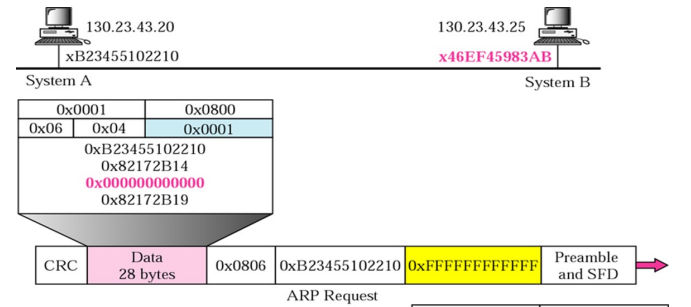
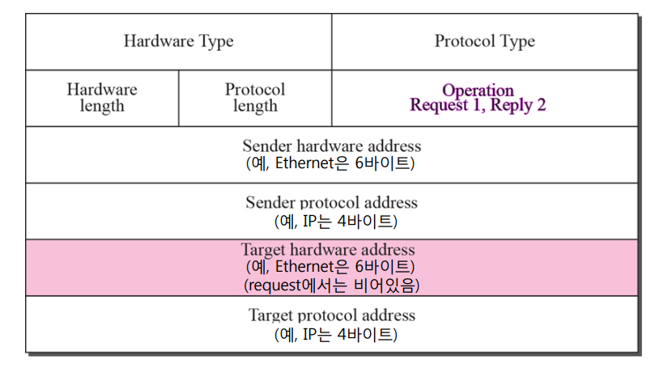

# ARP

`ARP`란 `Address Resolution Protocol`의 약자로 IP 주소와 MAC 주소 간의 매핑을 수행하는 데 사용된다.  

주로 호스트나 라우터가 IP 주소를 가지고 있는 다른 호스트나 라우터의 MAC 주소를 찾을 때 사용한다.  
IP 패킷을 물리적으로 전송하기 위해 필요한 매핑 과정이다.  

`IP 주소`와 `MAC 주소`를 이해하기 쉽게 비유해보면  
`IP 주소는 집 주소`에 해당하고 `MAC 주소는 사람의 주민등록번호`에 비유할 수 있다.  

## ARP TABLE

각 IP 노드(호스트나 라우터)는 ARP 테이블을 보유하고 있으며 몇 가지 정보를 테이블에 저장한다.  

- 대상 호스트나 라우터의 IP 주소
- 해당 IP와 관련된 MAC 주소
- TTL

아래는 A가 B라는 단말에 데이터 그램을 보낸다고 가정했을 때. B의 MAC 주소를 모르는 상황에 발생하는 일련의 과정들이다.  

  

```
A가 B라는 단말에 데이터 그램을 보낸다고 가정했을 때, A는 현재 B의 IP 주소만 알고 있고 MAC 주소는 모르는 상황이다.

그래서 A는
목적지 MAC 주소를 FF-FF-FF-FF-FF-FF 로 설정하고 B의 IP 주소를 ARP query에 담아 BroadCast로 전송한다.  

모든 노드들 중, B는 자신의 IP 주소와 일치하는 ARP query를 발견하고
FF-FF-FF-FF-FF-FF 대신 자신의 MAC 주소를 담아서 다시 A에게 전송한다.

이후 응답을 받은 A는 B의 IP 주소와 MAC 주소를 매칭시켜서 자신의 ARP 테이블에 보관한다.
```

#

## ARP Packet

  

ARP 패킷 형식은 다음과 같다.  

`Hardware type`: 네트워크 유형 정의 (Ethernet: 1)   
`Protocol type`: 프로토콜 정의 (IPv4: 0x0800)  
`Hardware length`: 물리 주소의 바이트 단위 길이  
`Protocol length`: 논리 주소의 바이트 단위 길이  
`Operation`: ARP의 구체적인 동작 패킷 유형 (요청: 1, 응답: 2)  
`Sender hardware address`: 송신자의 물리 주소  
`Sender protocol address`: 송신자의 논리 주소  
`Target hardware address`: 수신자의 물리 주소  
`Target protocol address`: 수신자의 논리 주소  
