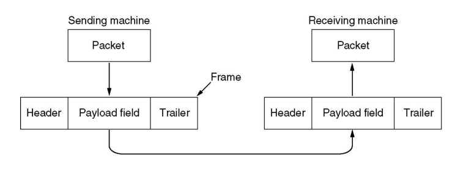

# Ethernet

## Data Link Layer

`링크 계층(Link Layer)`은 데이터그램을 한 노드에서 물리적으로 인접한 노드로 전송하는 역할을 담당한다.  
  
링크 계층에만 유독 `MAC`과 `LLC`라고 불리는 2개의 서브 레이어가 존재하는데  
그 이유는 `하드웨어 기반의 물리적 네트워크 접근`과 `논리적 데이터 흐름 제어`를 분리하여  
네트워크의 안정성과 확장성을 향상시키기 위함이다.

### LLC (Logical Link Controll)

이름에서 알 수 있듯이 `LLC 서브 레이어`는 상위 프로토콜과 하위 MAC 레이어 간의 인터페이스 역할을 한다.  

- 데이터 프레임의 흐름을 제어하고, 프레임의 주소 및 제어 정보를 다룬다.
- 에러 감지 및 복구, 흐름 제어, 프레임의 주소 확인 등 네트워크 계층과의 상호작용을 처리한다.

### MAC (Media/Medium Access Control)

`MAC 서브 레이어`는 물리적인 미디어에 접근하고 데이터를 다른 장치로 전송하기 위한 절차와 규칙을 정의한다.  
  
- MAC 주소를 사용해서 장치를 식별한다.

#

## Frame

프레임의 구조는 `헤더` + `페이로드` + `트레일러`로 구성되어 있다.  
  
특이하게도, 데이터 링크 계층만 이렇게 꼬리가 붙어있는데 그 이유는 데이터의 무결성을 확인하기 위함이다.  
트레일러를 사용해서 CRC와 같은 방법으로 에러를 감지하여 해당 프레임을 재전송 하도록 요청할 수 있다.
