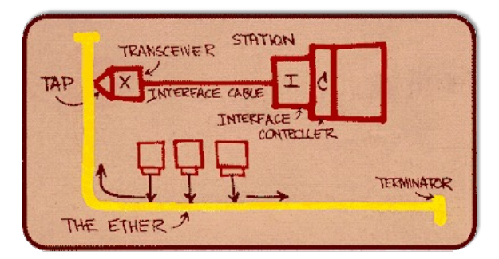
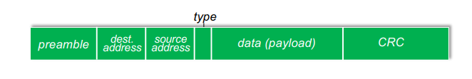
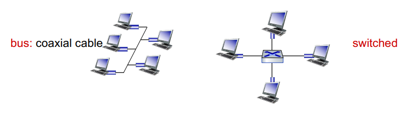

# Ethernet

`이더넷(Ethernet)`은 현재까지 가장 널리 사용되고 있는 `유선 LAN(Local Area Network)` 기술 중 하나이다.  

`이더넷`은 `데이터 링크 계층`에서 작동하며, 네트워크를 연결하고 데이터를 안전하게 전송하는 데 사용된다.

## Ethernet fram structure

이더넷 프레임의 구조는 다음과 같다  
  
`Destination Address`: 이더넷 프레임 목적지 MAC 주소  
`Source Address`: 이더넷 프레임 출발지 MAC 주소  
`Preamble`: 수신자와 송신자의 클럭 속도를 동기화 하기 위해 사용되는 일련의 비트  
`Payload`: 실제 데이터  
`CRC`: 오류를 감지하는 데 사용되는 체크섬 값  
`Type`: 상위 계층 프로토콜을 나타내는 값이다. 보통은 IP를 나타낸다  

#

## Ethernet Switch

90년대 중반까지는 `버스(BUS)`라고 불리는 이더넷 네트워크를 많이 사용했지만,  
최근에는 `스위치(Switched)`라고 불리는 장치를 사용한다.  

`버스 토폴리지`에서 모든 노드들은 서로 충돌할 가능성이 있다.  
하나의 노드가 데이터를 전송할 때, 다른 노드도 동시에 데이터를 전송하면 충돌이 발생한다.  

하지만 `스위치`의 경우 스위치가 중간에서 데이터 흐름을 조절해주기 때문에 노드 간 충돌을 최소화 할 수 있다.

### Switch Fowarding Table

`스위치`는 호스트가 어떤 인터페이스를 통해 도달 가능한지를 파악하기위해 `스위치 테이블`을 사용한다.  
스위치 테이블은 다음과 같은 항목을 포함한다.  
`호스트의 MAC주소`, `스위치의 인터페이스`, `시간 정보`  

스위치는 스스로 학습하는 `self-learning`능력을 가지고 있다.  
> 스위치는 데이터 프레임을 수신할 때, 해당 프레임의 출발지 MAC 주소를 확인하고, 이 출발지 주소가 어떤 인터페이스를 통해 수신되었는지를 기록한다.  
> 이 정보를 활용하여 나중에 동일한 호스트로 데이터를 전송할 때 어떤 인터페이스를 사용해야 하는지 파악한다.

이러한 `스위치`의 `self-learning`은  
네트워크 내의 호스트 및 인터페이스를 동적으로 추적하고 데이터를 효율적으로 전달하는데 도움을 준다.
