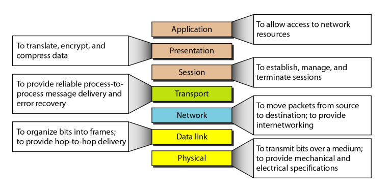
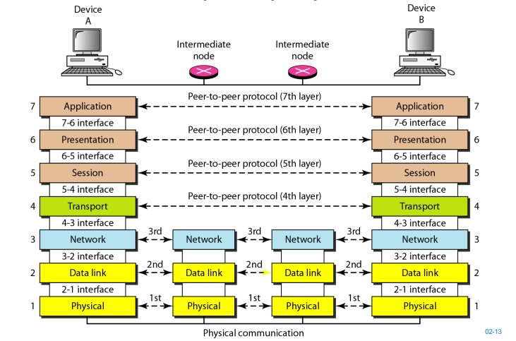

# Layering and Performance

## OSI Model

### Open System Interconnection  

모든 유형의 컴퓨터 시스템 간의 통신을 허용하는 네트워크 시스템 설계를 위한 계층 구조를 말한다.  
7개의 수직 계층이 존재하며, 각 계층은 다른 계층과 무관하게 자신의 독립적인 기능을 지원한다.
  
### OSI 모델의 목적
- 기본적인 하드웨어 또는 소프트웨어의 변경 없이 서로 다른 시스템 간에 개방 통신을 목적으로 한다.
- 유연하고, 튼튼하며, 상호 연동할 수 있는 네트워크 구조를 설계하고 이해하기 위한 모델이다.

#

OSI 모델의 계층은 총 7개이며, 각 계층의 기능은 다음과 같다.
  
> Application: 응용 프로그램이 네트워크 서비스에 접근할 수 있도록 하는 인간-컴퓨터 상호작용 계층  
> Presentation: 애플리케이션 계층이 데이터를 사용 가능하도록 준비하며, 데이터의 변환, 암호화, 압축을 담당  
> Session: 두 기기 사이의 통신을 시작하고 종료하는 일을 담당  
>   
> Transport: 두 기기 간의 종단 간 통신을 담당하며, 신뢰성 있는 데이터 전송을 보장, 흐름 제어 및 오류 제어 (TCP, UDP)  
>   
> Network: 서로 다른 두 네트워크 간 데이터 전송을 용이하게 하는 역할을 담당 (패킷의 세분화와 조립, 최적의 경로(라우팅))  
> Data Link: 동일한 네트워크에 있는 두 개의 장치 간 데이터 전송을 용이하게 하는 역할을 담당 (프레임)  
> Physical: 1과 0의 문자열인 비트 스트림으로 변환해서 데이터를 전송

#

### peer to peer process

peer to peer은 대등한 관계의 프로토콜 계층 끼리 통신하는 것을 의미한다.  

각 계층의 관점에서 바라보면  
`전송 계층`은 A에서 B까지가는 여러 개의 루트 중, 신뢰성 있는 데이터 전송을 위한 루트를 결정하는 일만 담당하면 되고,  
`네트워크 계층`은 다음으로, 그 루트에서 최적의 경로를 결정하는 라우팅 역할을 하는 것,  
`데이터 링크 계층`은 바로 다음 단계의 홉에 데이터를 잘 보내는 일만 책임을 지면 된다.  
  
각 계층은 다른 계층이 무슨 일을 하는지 신경쓰지 않고, 자신의 할 일만 책임을 진다.
  
중간에 있는 네트워크 코어(라우터)는 4,5,6,7 계층 데이터까지 알 필요가 없다.  
각 라우터는 최종 목적지가 어디인지 확인하고, 다음 라우터에 데이터를 잘 보내기만 하면 되기 때문이다.
