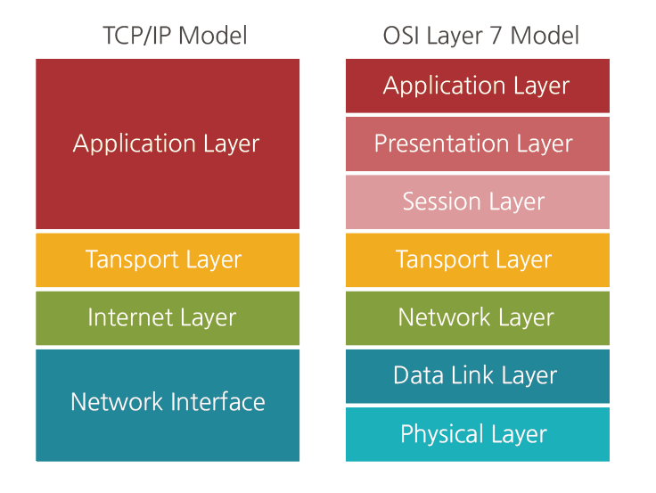
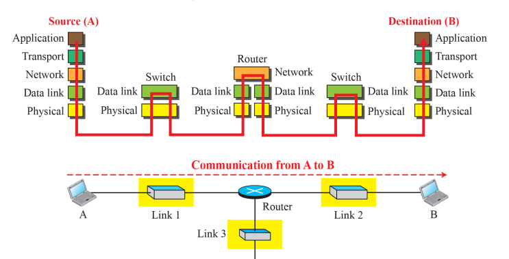
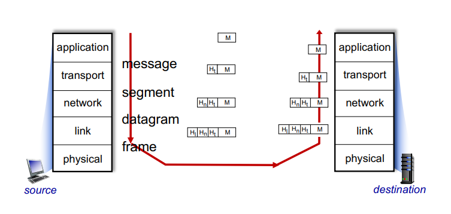

# Layering and Performance

## TCP/IP Model

기존 OSI 모델 사용시 7계층을 거치고, 중간에 3계층을 거치는 일련의 과정이 너무 복잡함에 따라,  
전문가들은 어플리케이션, 프레젠테이션, 세션 계층을 하나로 묶어도 생각보다 문제가 발생하지 않는 것을 알게되었다.  
  
이러한 복잡한 OSI 모델을 간소화하고 현실적인 상황에 더 적합하게 만들기 위해 TCP/IP 모델이 탄생하게 되었다.  

#

### Communication through an internet

  

위는 중간에 라우터가 1개만 존재하는 매우 이상적인 그림이다.  
`스위치`는 글로벌한 모델을 위해 설계된 라우터와, 로컬에 존재하는 나의 pc를 연결하기 위한 중간 장치이다.  

`라우터`는 글로벌한 루트를 찾아가는 역할을 담당하기 때문에 `최종 목적지의 ip 주소`를 알아야한다.  
그러므로 네트워크 계층까지 올라가서 데이터를 확인해야한다. `네트워크 계층의 가장 대표적인 프로토콜이 IP`이다.  
  
`스위치`는 굳이 최종 목적지의 ip 주소를 알 필요가 없다.  
동일한 네트워크안의 데이터 전송을 담당하는 `데이터 링크 계층`의 패킷의 내용만 확인하면 된다.  

발신자의 오리지널 패킷은 5계층부터 1계층까지 전달되면서 `인캡슐레이션` 과정을 거치고,  
수신자는 응용 계층까지 데이터를 `디캡슐레이션`하여 오리지널 패킷을 확인하는 과정을 거치게 된다.  

#

  

패킷은 각 계층마다 부르는 이름이 다르다.  
각각 `비트`, `프레임`, `데이터그램`, `세그먼트`, `메시지`로 불리며  
각 계층에서 오리지널 패킷에 헤더를 붙이고 분해하며 `인캡슐레이션`, `디캡슐레이션` 과정을 거친다.  

우리는 프로토콜 설계에 의해 정해져 있는 헤더 사이즈를 통해 해당 패킷이 어느 계층의 패킷인지 명확히 알 수 있다.  
  
일반적으로  
2계층 이더넷 `프레임`의 헤더 사이즈는 보통 `18 바이트` 이며  
3계층 IP 프로토콜에서의 `데이터그램` 헤더 사이즈는 `20 바이트`  
4계층 TCP 프로토콜에서의 `세그먼트` 헤더 사이즈는 `20 바이트` 이다.
