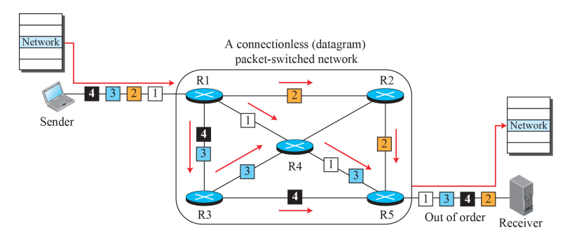
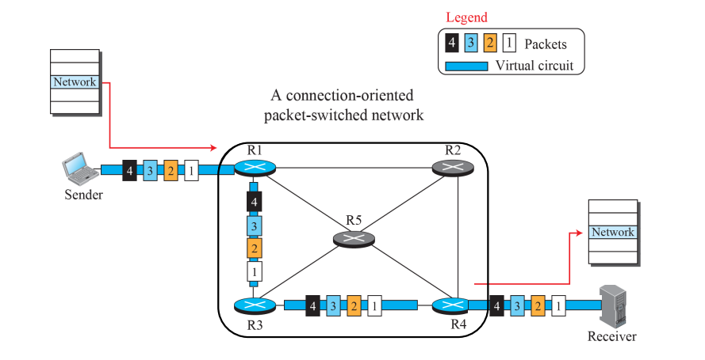

# Network Layer

`네트워크 계층(Network Layer)`는 OSI, TCP/IP 모델의 3계층에 해당하며    
`라우팅과 패킷 전달`, `논리적 주소 부여`, `패킷화`와 같은 역할을 수행한다.

#

네트워크 계층의 두 가지 주요 기능으로는 `포워딩`과 `라우팅`이 존재한다. 

### Fowarding

포워딩은 라우터 내에서 패킷을 입력 포트에서 출력 포트로 이동시키는 작업을 의미한다.  
각 라우터 내에서 로컬 결정을 내리고, 패킷을 다음 라우터로 보내거나 최종 목적지로 전송하는 역할을 의미한다.  

### Routing

라우팅은 패킷이 글로벌한 관점에서 출발지에서 목적지로 가기 위한 경로를 결정하는 과정이다.  
네트워크에서 패킷이 어떻게 이동해야 하는지 계획하고, 최적의 경로를 선택한다.  

쉽게 비유하자면 `포워딩`은 여행 중에 `하나의 톨게이트를 통과하는 과정`으로 생각할 수 있고,  
`라우팅`은 `출발지에서 목적지까지 여행 계획을 세우는 과정`으로 생각할 수 있다.

#

네트워크 계층은 링크 계층처럼 두 가지 서브 레이어로 나뉘는 것은 아니지만  
`Data plane`과 `Contol Plane`이라 불리는 두 가지 주요 기능으로 나눌 수 있다.  

### Data plane

`Data plane`은 `각 라우터 내에서 로컬하게 동작`하는 것을 말한다.  
라우터가 패킷을 입력 포트에서 출력 포트로 어떻게 전달해야 하는지 결정하고 fowarding function이라고도 한다.

### Contol plane

`Contol plane`은 네트워크 전체를 관리하는 부분으로, `네트워크의 전체 동작 및 라우팅 결정`과 관련이 있다.  
네트워크 전체에서 데이터 패킷이 출발지에서 목적이로 이동하기 위한 경로 및 라우팅 결정을 수행한다.

---

## Packetizing & Packet switching

네트워크 계층은 `패킷화`와 `패킷 교환`을 통하여
데이터를 패킷으로 나누고 각 패킷에 헤더 정보를 추가하여 목적지를 식별하고 전송 경로를 설정한다.  

전송 경로를 설정하는 방법은 `Datagram Approach`와 `Virtual-Circuit Approach`가 있다.

### Datagram Approach

데이터그램 방식은 `비연결형 서비스`를 제공하는 방식이다.  
  
데이터그램 방식에서 `각 패킷은 독립적으로 처리`되며 `패킷이 도착하는 순서와 경로는 보장이 되지 않는다.`  
목적지까지 동일한 경로로 라우팅될 수도 있고, 다른 경로로 라우팅될 수도 있다.  

그래서 별도의 연결 설정이 필요하지 않다는 것이 큰 특징이다. UDP는 데이터그램 방식의 전형적인 예시이다.  
  
이 방식은 연결 설정을 셋업하지 않기 때문에 부하를 줄일 수 있지만  
패킷의 순서가 보장이 되지 않기 때문에, 패킷을 조립하는 시간 및 패킷을 기다리는 시간이 추가적으로 소요된다.

### Virtual-Circuit Approach 

  

반대로 가상 회선 방식은 `연결형 서비스`를 제공한다.  
  
통신을 시작하기 전 보조 패킷을 이용하여 가상 회선을 설정하고, 실제 패킷들이 이 가상 회선을 통해 전송된다.  
가상 회선이 유지되는 동안 패킷은 경로에 따라 순차적으로 전달되며, 동일한 경로를 따라 이동한다.  

가상 회선 방식에서 포워딩은 패킷의 레이블에 따라 결정이 되는데  
경로의 라우터들은 보조 패킷에 레이블을 부여해서, 레이블을 통해 실제 패킷이 올바른 경로로 라우팅 되도록 유도한다.  
  
모든 라우터가 특정 가상 회선을 위한 포워딩 테이블을 완성하면, 실제 데이터 패킷을 순서대로 전송할 수 있다.

#

결론적으로 4GB 영화를 전송한다고 가정하면  
패킷들의 순서가 보장이 되는 `가상 회선 방식`이 더 적합할 것이고  
   
간단한 메시지를 하나 전송하는 일이라면  
별도의 연결 설정이 필요하지 않은 `데이터 그램 방식`이 더 적절한 선택일 것이다.
