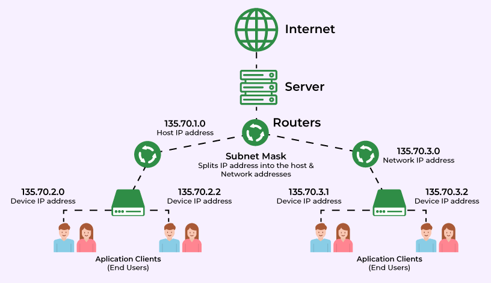
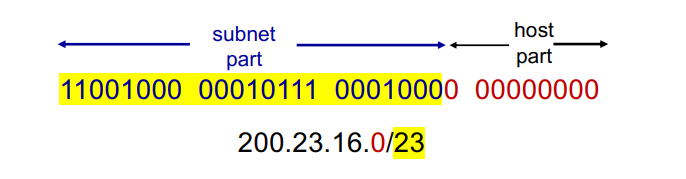

# Network Layer

## Subnets

  

> https://www.geeksforgeeks.org/subnet-cheat-sheet/

`서브넷`은 IP 네트워크를 논리적으로 나누어 더 작고 관리하기 쉽게 분할하는 것을 의미한다.  

IP 주소 관점에서, 서브넷은 IP 주소의 구조를 통해 정의되며, IP 주소는 두 가지 부분으로 나뉜다.  

### Subnet Part

IP 주소의 상위 비트는 장치가 속한 서브넷을 결정하는 데 사용된다.  
동일한 서브넷에 속한 장치는 IP 주소의 상위 비트가 동일하며, 이 부분으로 네트워크를 식별할 수 있다  

### Host part

IP 주소의 하위 비트는 동일한 서브넷 내에서 개별 장치를 고유하게 식별하는 데 사용된다.  

#

## CIDR (Classless InterDomain Routing)

  

전통적인 IP 클래스 구분은 IP주소의 4바이트를 8비트 단위로 서브넷 부분과 호스트 부분으로 나누었다.  

8비트 단위로 나누게 될 시, 호스트 주소 개수가 기하급수적으로 늘어남에 따라  
불필요한 주소 낭비를 방지하고 조금 더 효율적으로 서브넷을 정의하고 관리하고자  
전통적인 IP 클래스 구분을 무시하고 `서브넷 부분의 길이를 임의로 정의할 수 있는 CIDR`이 도입되었다.
