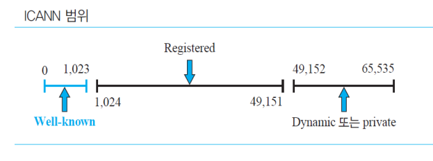
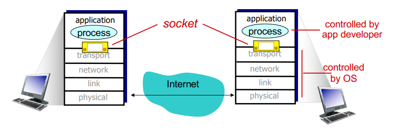

# Transport Layer

`전송 계층`의 가장 핵심 임무는 `신뢰성 있는 전송`을 하는 것이다.  
계층 바로 위에 사용자와 직접적으로 맞닿는 `응용 계층`이 존재하기 때문에, `응용 계층`으로 어떻게 데이터를 정확히 전송할지를 고려한다.  
  
#
  
`전송 계층`은 프로세스-to-프로세스 통신 서비스를 제공하기 위해 특별한 주소 체계를 갖는다.  
  
`IP 주소`뿐만 아니라, 올바른 프로세스에 정확히 데이터를 전달하기 위해 프로세스와 매칭되는 `포트 번호`를 이용하는데  
`IP 주소`와 `포트 번호`를 합쳐서 `소켓 주소(Socket address)`라고 부른다.  
  

  
`포트 번호`는 사용 관점에서 3가지 범주로 분류할 수 있다.  
- `0 ~ 1023`: `Well-known Port` (잘 알려진)
  - 네트워크 통신에서 특정 서비스나 프로토콜을 위해 예약되어 있다. (HTTP:80, HTTPS:443)
- `1024 ~ 49,151`: `Registerd Port` (등록된)
  - 특정 애플리케이션이나 서비스를 위해 할당되었지만, 표준은 아니다.
- `49,152 ~ 65,535`: `Dynamic Port` (동적)
  - 클라이언트 프로그램이 서버에 접속할 때 임시로 사용되는 포트 번호이다.
 
#

### Socket Programming

`전송 계층`에서 중요한 점은 프로세스간 통신을 하기 위해 `소켓`이라고 불리는 추상적인 개념을 활용한다는 것이다.  
  
`포트 번호`와 `IP 주소`의 조합으로 식별되는 각 `소켓`은 일종의 `도어`로 생각할 수 있고,  
이 `도어`를 통해 데이터가 들어오고 나간다.  
  
각 프로세스가 특정 소켓을 통해 데이터를 주고 받음으로써,  
각각의 프로세스는 `자신에게 할당된 소켓`을 통해 특정한 목적지로 데이터를 보낼 수 있다.  

`전송 계층`은 이러한 `소켓`들을 관리하고, 데이터를 `세그먼트`로 나누어 전송한다.  
`세그먼트`에는 `송신자와 수신자의 소켓 정보`, `헤더 및 페이로드`가 포함되어 있다.
