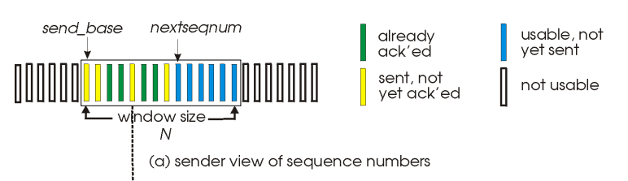

# Transport Layer

## RDT(Reliable Data Transfer)

`RDT`를 그대로 해석하면 신뢰성 있는 데이터 교환이다.  
`송/수신하는 데이터가 오류 없이 온전히 전송되는 것`을 목표로 하며,  
`전송 하위의 계층들에서 신뢰성을 보장할 수 없어 발생하는 문제들`을 해결하기 위해 `전송 계층`에서 RDT 프로토콜을 사용한다.  

## RDT 3.0: Stop-and-Wait Protocol

`흐름 제어`와 `오류 제어`를 제공하는 연결형 프로토콜이다.  
`크기가 1인 sliding window`를 사용하며, 확인 응답이 오기 전까지는 다음 패킷을 전송하지 않는다.  

`checksum`, `timeout interval`을 이용하여, 패킷의 훼손 및 손실을 감지하고 패킷을 재전송한다.

---

## Pipelined Protocols

`Stop-and-Wait` 프로토콜의 가장 큰 단점은 `크기가 1인 sliding window`를 사용하기 때문에  
단일 패킷마다 확인 응답을 모두 기다려야하고, 패킷을 모두 전송하는데 매우 긴 시간이 필요하다는 점이다.  
  
이를 간단히 해결하는 방법은 패킷의 응답을 기다리지 않고 계속해서 패킷을 전송하는 것이다.  
이를 `파이프라이닝(Pipelining)`이라고 말하며, `크기가 1 이상인 sliding window`, `sequence number`를 활용한다.  

#

## Pipelined Protocols: Go-Back-N

`Go-Back-N` 방식은 `cumulative`하게 `ACK`을 전송하는 특징을 갖는다.  

  
수신자는 패킷을 받지 못하거나, 잘못된 패킷을 받으면  
오류 발생 이후 정상적으로 전달 받은 패킷에 관해서는 `ACK`을 전송하지 않고, 모두 폐기한다.  

오류가 발생한 패킷을 정상적으로 수신할 때 까지 해당 패킷에 대한 `ACK`을 중복적으로 전송하며  
`sequence number`에 따라 정상적으로 통신이 완료된 패킷시점부터 window를 sliding시킨다.  

송신자는 각 패킷 전송 시점부터 시작되는 타이머를 가지고 있는데  
전송한 패킷의 `ACK`이 돌아오지 않으면 `timeout interval`에 따라 `timeout`이 발생하고  
해당 패킷을 전송하는 과정에서 문제가 생겼다는 것을 감지하여, `해당 패킷부터 이후의 모든 패킷들을 재전송`한다.
  
해당 방식의 단점은 오류 발생 이후 버려지는 패킷들과 중복 전송되는 ack이 존재한다는 것이다.  
만약 통신 초반에 이러한 통신 오류가 발생할 경우, 정상적으로 패킷이 전송되더라도 모두 버려지게 된다.

#

## Pipelined Protocols: Selective Repeat

`Selective Repeat` 방식은 `individually`하게 `ACK`을 전송하는 특징을 갖는다.  

수신자는 각각의 패킷에 대해 개별적인 `ACK`을 전송하고  
중간에 패킷 하나가 손실되어도, 해당 패킷에 대한 `ACK`만 재전송할 수 있다.  
  
또한 수신자는 오류가 발생하지 않은 패킷들을 버리지 않고 버퍼에 저장하기 때문에  
송신자는 오류 패킷의 `timeout` 발생 시 `해당 패킷만 다시 재전송`하면 된다.  

이후 오류가 발생했던 패킷을 정상적으로 전달받으면  
버퍼에 저장해놓았던 패킷들을 `sequence number`에 따라 정렬한다.
