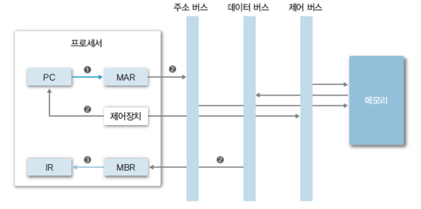

# Computer system overview

## 운영체제(OS, Operating System)

### What is OS?

컴퓨터 시스템 자원(Computer Hardware)을 효율적으로 관리해서  
사용자나 응용프로그램에게 서비스를 제공하는 역할을 하는 소프트웨어를 말한다.  

여기서 Computer Hardware는  
`프로세서`, `메모리`, `주변장치`를 말한다.

---

## 프로세서 (Processor)

프로세서는 컴퓨터의 두뇌(중앙처리장치)에 해당하며  
연산을 수행하거나 컴퓨터의 모든 장치의 동작을 제어하는 역할을 한다.  

### 레지스터 (Register) 
프로세서 내부에 있는 메모리를 `레지스터`라고 하며, 프로세서가 사용할 데이터를 저장한다.  
레지스터는 분류에 따라 `전용, 범용 / 사용자 가시, 사용자 불가시 / 데이터, 주소, 상태 레지스터`로 나눌 수 있다.

> 사용자 가시 레지스터  
> `데이터 레지스터(DR)`: 함수 연산에 필요한 데이터를 저장한다.  
> `주소 레지스터(AR)`: 주소 또는 유효 주소를 계산하는 데 필요한 주소의 일부분을 저장한다.  
> 주소 레지스터에는 기준 주소 레지스터, 인덱스 레지스터, 스택 포인터 레지스터가 있다.
>
> 사용자 불가시 레지스터  
> `프로그램 카운터(PC)`: 다음에 실행할 명령어의 주소를 보관한다.  
> `명령어 레지스터(IR)`: 현재 실행하는 명령어를 보관한다.  
> `누산기(ACC)`: 데이터를 일시적으로 저장한다.  
> `메모리 주소 레지스터(MAR)`: 프로세서가 참조하려는 데이터의 주소를 명시하여 메모리에 접근하는 버퍼 레지스터이다.  
> `메모리 버퍼 레지스터(MBR)`: 프로세서가 메모리에서 읽거나 메모리에 저장할 데이터 자체를 보관하는 버퍼 레지스터이다.  

---

## 메모리 (Memory)

### 주기억장치 (Main memory)

프로세서가 수행할 프로그램과 데이터를 저장한다.  
매우 빠른 CPU와 느린 보조 기억 장치(디스크) 사이에서 중재 역할을 한다. (디스크 입출력 병목현상 해소)

### 캐시 (Cache)

프로세서 내부에 있는 메모리이다.  
속도가 빠르고 가격이 비싸며 메인 메모리의 입출력 병목현상을 해소한다.  

CPU가 데이터를 요청하여 캐시 메모리에 접근했을 때 `해당 데이터를 캐시 메모리가 가지고 있다면` `캐시 히트`  
해당 데이터가 캐시 메모리에 없어서 `메인 메모리에서 가져와야 하는 경우`를 `캐시 미스` 라고 말한다.  

### 지역성

지역성은 캐시 적중률과 밀접한 관련이 있다.  
캐시 적중률이 높을 수록 알고리즘 성능이 좋아진다. 지역성을 잘 고려해서 코드를 설계하는 것이 좋다.

`공간적 지역성 (Spatial locality)`: 참조한 주소와 인접한 주소를 참조하는 특성  
`시간적 지역성 (Temporal locality)`: 한 번 참조한 주소를 곧 다시 참조하는 특성  

# 보조기억 장치

프로세서가 직접 접근할 수 없으며 주기억장치를 거쳐서 접근한다.  
만약 게임의 용량(20GB)이 메인 메모리의 크기(16GB)보다 커도 우리는 `가상 메모리` 덕분에 게임을 실행할 수 있다.  

용량이 크고, 가격이 저렴하다.

---

## 시스템 버스 (System Bus)

하드웨어들이 데이터 및 신호를 주고 받는 물리적인 통로를 말한다.  

`데이터 버스`: 프로세서와 메인 메모리, 주변장치 사이에서 데이터를 전송한다.  
데이터 버스를 구성하는 배선 수는 프로세서가 한 번에 전송할 수 있는 비트수를 결정하는데, 이를 워드라고 한다.  

`주소 버스`: 프로세서가 시스템의 구성 요소를 식별하는 주소 정보를 전송한다.  
주소 버스를 구성하는 배선 수는 프로세서와 접속할 수 있는 메인 메모리의 최대 용량을 결정한다.  

`제어 버스`: 프로세서가 시스템의 구성 요소를 제어하는 데 사용한다.  
제어 신호로 연산장치의 연산 종류와 메인 메모리의 읽기나 쓰기 동작을 결정한다.

---

## 주변 장치

프로세서와 메모리를 제외한 하드웨어들을 말한다.  
입력장치, 출력장치, 저장장치가 있다.

---

# Reference

**위 내용은 KOREATECH 김덕수 교수님의 운영체제 강의를 듣고 정리한 내용입니다.**

- [https://hpclab.tistory.com/1?category=887083](https://hpclab.tistory.com/1?category=887083)
