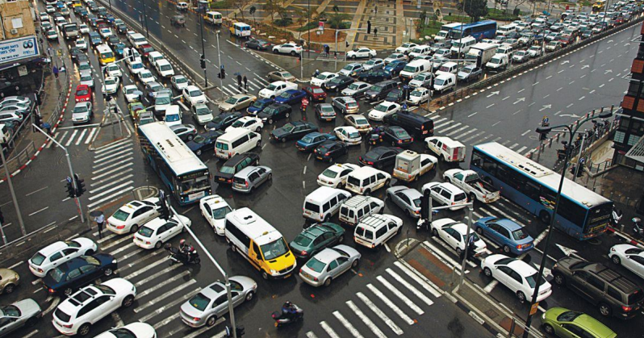
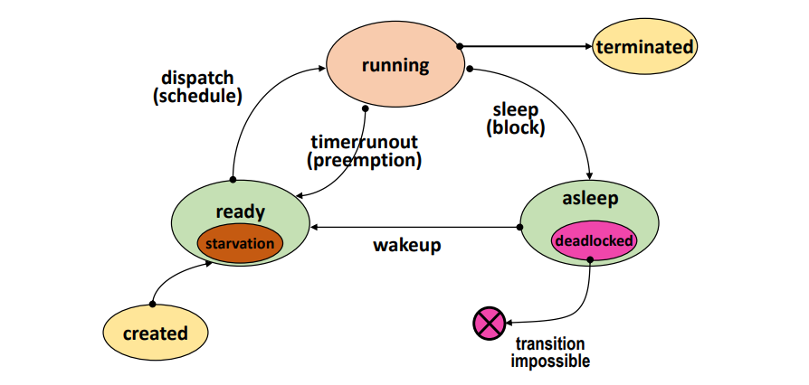
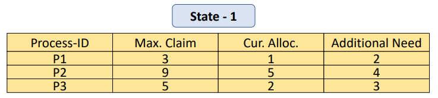
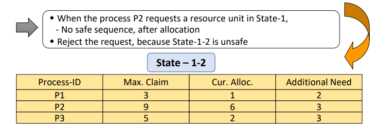
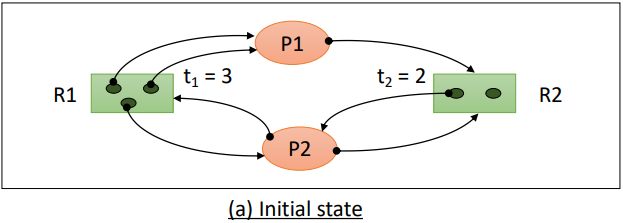

# Deadlock Resolution

`데드락`은 프로세스들이 서로 필요한 자원을 점유하고 있어 더 이상 진행이 불가능한 상태로,  
발생 가능성이 전혀 없는 이벤트를 기다리는 상황을 의미한다.  

  

asleep/blocked 상태에 존재하는 데드락은 프로세스가 일어날 가능성이 0인 이벤트를 기다리는 상황을 의미하며, 
프로세스가 우선순위에 밀리거나 운이 없게도 CPU를 지속적으로 할당 받지 못해서 일을 하지 못하는 기아현상과는 의미가 다르다.  

#

### Deadlock 발생 필요 조건

데드락 발생 조건은 네가지가 있는데, 이 네가지 조건을 동시에 만족하면 데드락이 발생한다.  

1. Exclusive use of resources:  
한 순간에 한 프로세스만 사용 가능한 자원일 경우, 즉 자원이 상호배제를 성립할 경우

2. Non-preemptible resources:  
선점 불가능한 자원인 경우, 다른 프로세스에 의해 강제로 빼앗길 수 없는 자원이 존재하는 경우

3. Hold and wait:  
프로세스가 최소 하나의 자원을 보유하고 있으면서 동시에 다른 자원을 요청하는 경우

4. Circular wait:  
프로세스와 자원 집합에서 서로 요청 및 할당하는 관계가 circle을 이루는 경우

---

## Deadlcok prevention

반대로 위 네가지 조건중 하나를 제거할 수 있으면 데드락은 절대 발생하지 않는다.  
즉 데드락이 발생하지 않도록 예방하는 것이다.
  
- 모든 자원의 공유를 허용하거나  
- 모든 자원에 대해 선점을 허용
- 자원을 한번에 모두 프로세스에게 할당하거나
- 자원들에게 순서를 부여해서 관계가 circle을 이루지 않도록 하는 방법이 존재할 수 있다.

하지만 단순히 생각해봐도 1, 2 조건을 해결하는 방법은 현실적으로 불가능하고  
3, 4 조건을 해결하는 방법은 자원을 효율적으로 사용하는 측면에서 너무 좋지 못하다.  

따라서 데드락을 예방하는 방법은 언뜻 보면 간단해보이지만  
심각한 자원 낭비가 발생할 수 있고 조건에 따라 너무 비현실적일 수 있다.  

---

## Deadlock Avoidance

데드락을 해결하는 방법중 또 다른 하나는 데드락을 회피하는 것이다.  
  
이 방법은 시스템의 상태를 계속 감시해서  
시스템이 데드락 상태가 될 가능성이 있는 자원 할당 요청을 보류하여 시스템을 항상 `safe state`로 유지하는 것이다. 
> Safe state란?  
> 모든 프로세스가 정상적 종료 가능한 상태를 말한다.
> 이 때 Safe sequence가 하나라도 존재하면 Safe state를 만족하며 데드락 상태가 되지 않을 수 있음이 보장된다.
>
> 하지만 Unsafe state가 데드락을 반드시 발생시킨다는 의미는 아니며 데드락 상태가 될 가능성이 존재함을 뜻한다.

데드락 회피 알고리즘은 특정 가정을 기반으로 동작하며  
그중에서도 가정이 어느정도 제한되어 있는 경우에 적용되는데, 가정은 다음과 같다.

- 프로세스의 수가 고정됨
- 자원의 종류와 수가 고정됨
- 프로세스가 요구하는 자원 및 최대 수량을 알고 있음
- 프로세스는 자원을 사용한 후 반드시 반납한다

### Banker's 알고리즘

다익스트라가 설계한 은행원 알고리즘은 데드락 회피를 위한 간단한 이론적 기법이다.  
이 알고리즘에서는 한 종류의 자원이 여러 개 존재한다고 가정한다.
> 여러 종류의 자원을 고려하는 Habermann’s 알고리즘도 따로 존재한다.

  

프로세스마다 `자원의 최대 필요 개수`, `현재 할당 받은 개수`, `추가로 필요한 개수`를 계속해서 추적하고  
이후 자원 요청에 따라 자원을 할당했을 때 safe sequence가 존재하는지 미리 계산해서 요청을 승인하거나 보류한다.  
  
다음의 상황이 safe state라면 해당 요청을 승인하고, unsafe state일 경우 요청을 거절하는 방법으로 데드락을 회피하는 것이다.  
unsafe state가 무조건 데드락을 유발하는 것은 아니지만, 시스템을 항상 safe state로 유지하는 것에 목적이 있기 때문이다.  
  
  

위 상황의 경우 P2가 자원 1개를 요청해서 이를 승인했을 때를 가정하여 미리 계산한 상황이다.  
남은 자원은 1개가 되고 safe seqeunce를 찾을 수 없기 때문에 이 요청은 거절된다.

#

데드락 회피 기법은 시스템을 항상 safe state로 유지함으로써 데드락 발생을 막을 수 있다.  
하지만 별로 현실적이지 못하고 여러가지 단점이 존재한다.

- 시스템을 항상 감시하고 있어야 하기 때문에 오버헤드가 크다
- safe state를 유지하기 위해 사용 되지 않는 자원이 발생할 수 있다
- 프로세스 수와 자원 수가 고정되어야 하고, 필요한 최대 자원 수를 미리 알고 있어야 한다

--- 

## Deadlock Detection & Recovery

데드락 방지를 위한 사전 작업을 하지 않고 주기적으로 데드락 발생을 확인한다.  
데드락 발생을 확인하는 방법으로 Resource Allocation Graph(RAG)를 많이 사용한다.

  

위와 같은 RAG에서 엣지를 하나씩 지워가는 방법으로 데드락을 탐지한다.  
이 때 reduction 규칙은 Unblocked를 만족하는 프로세스이다.
> Unblocked 프로세스란?  
> 필요한 자원을 모두 할당 받을 수 있는 프로세스를 말한다.

- Unblocked 프로세스에 연결된 모든 엣지가 제거하는 과정을 반복해서
- 모든 엣지가 제거되면 현재 데드락에 빠진 프로세스가 없는 상태이고
- 지울 수 없는 엣지가 존재하면 현재 데드락이 존재하는 상태로 판단한다.

위와 같이 Graph Reduction 과정 또한 오버헤드가 크다.  
검사 주기에 영향을 많이 받고 노드의 수가 많으면 많을 수록 오버헤드가 점점 커질 수 있다.

#

데드락을 탐지한 후 해결 하는 방법으로 두가지를 생각해볼 수 있다.

- 프로세스를 종료시키는 방법
- 프로세스로부터 자원을 빼앗는 방법
  - 자원을 빼앗긴 프로세스는 종료되고 이후에 재시작된다.

두 방법 모두 프로세스가 종료되기 때문에  
이를 조금 더 보완하기 위해 체크포인트를 만들고 재시작 하는 방법도 생각해볼 수 있다.  
프로세스의 수행 중 특정 지점마다 context를 저장하고 롤백을 위해 사용하는 것이다.

---

# Reference

- [https://hpclab.tistory.com/1?category=887083](https://hpclab.tistory.com/1?category=887083)
