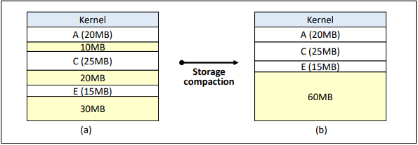

# Main Memory Management

메모리의 종류로는 CPU 내부에 존재하고 CPU가 관리하는 `레지스터`, `캐시`  
CPU 외부에 존재하고 OS가 관리하는 `메인 메모리`, `보조기억장치`로 나누어 생각할 수 있다.
  
`블록`은 보조기억장치와 주기억장치 사이의 데이터 전송 단위이며 1\~4KB 크기를 가진다.  
`워드`는 주기억장치와 레지스터 사이의 데이터 전송단위이며 16\~64bits 크기를 가진다.  
  
따라서 보조기억장치의 데이터를 1bit만큼 읽어도 메인 메모리에 적재되는 데이터의 크기는 블록의 크기와 같다.

#

`Address Binding`이란 프로그램의 논리 주소를 실제 메모리의 물리 주소로 매핑하는 작업이다.  
이를 바인딩 시점에 따라 `컴파일 타임 바인딩`, `로드 타임 바인딩`, `런타임 바인딩`으로 구분할 수 있다.  

컴파일 타임 바인딩과 로드 타임 바인딩은 `정적 바인딩`이며 런타임 바인딩은 `동적 바인딩`이다.  
자바에서는 `메소드 오버라이딩`과 `인터페이스를 통한 다형성`이 실행 시에 객체의 실제 타입을 고려하여 메소드나 변수를 결정하므로 `동적 바인딩`을 사용하는 것이라 볼 수 있다.  

동적 바인딩은 유연함의 측면에서 이점이 있지만, 정적 바인딩에 비해 성능이 저하 가능성이 존재한다.

### Compile time binding

코드가 컴파일 되는 시점에 바인딩을 시도하기 때문에 컴파일러가 현재 메모리의 상황을 완벽하게 이해하고 있어야 한다.
  
또한 주소가 컴파일 시점에 정적으로 할당되기 때문에 프로그램 실행 중에는 주소가 변하지 않고  
프로그램이 실행되기 전에 프로그램 전체가 메모리에 올라가야 하므로 메모리 관리에 제약이 있을 수 있다.

### Load time binding

바인딩이 로드 타임에 이뤄지기 때문에 메모리 적재 위치를 컴파일 시점에서 알 수 없다.  
컴파일 시점에는 절대 주소값 대신 이후 대체 가능한 상대 주소를(u, u+100) 생성해놓고 적재 시점에 시작 주소를 반영하여 사용자 코드 상의 주소를 재설정하고 메모리에 적재한다.

또한 프로그램 실행중에 주소가 변하지 않고 프로그램 실행 전 프로그램 전체가 메모리에 올라가 있어야 한다.

### Run-time binding

말 그대로 프로세스가 실행이 될 때 메모리 주소를 동적으로 할당하겠다는 뜻이다.  
  
따라서 프로세스 실행 전에는 할당 될 주소를 알 수 없고
프로세스의 상태가 block, ready를 거쳐 running이 될 시점마다 주소를 새로 할당하기 때문에 주소가 변할 수 있다.  

추가로 MMU의 도움이 필요하고 현재 대부분의 OS는 이 방법을 사용하고 있다.

---

## Continuous Memory Allocation

프로세스를 하나의 연속된 메모리 공간에 할당하는 정책이다.  
메모리에 동시에 올라갈 수 있는 프로세스 수에 따라 `Uni-programming`, `Multi-programming`으로 나눌 수 있다.  

## Uni-programming

말 그대로 하나의 프로세스만 메모리 상에 존재하도록 하는 할당 방법이다.  
메모리에 여러 프로세스를 동시에 적재하지 않고, 하나의 프로세스가 완전히 실행될 때 까지 기다리는 방식이다.
  
이 때 메모리 크기보다 프로그램 크기가 클 경우 문제가 발생할 수 있는데  
이를 해결하기 위해서 사용자가 메모리에 당장 필요한 영역만 적재하도록 하는 Overlay structure가 사용된다.

## Multi-programming

메모리 상에 여러 프로세스를 적재할 수 있도록 하는 할당 방법이다.  
메모리 공간을 어떻게 분할하느냐에 따라 `Fixed Partition`, `Variable Partition`으로 나눌 수 있다.

### Fixed Partition Multiprogramming

FPM은 메모리 공간을 고정된 크기로 미리 분할하고 프로세스를 적재하는 방식이다.  
한 파티션에는 하나의 프로세스만 적재하며, 커널 영역과 각 파티션을 구분짓기 위해 경계 레지스터를 사용한다.  
  
이때 고정된 파티션의 크기로 인해 단편화 문제가 발생하게 되는데  
프로세스의 크기보다 파티션이 커서 낭비되는 메모리 공간이 발생하는 `내부 단편화` 문제  
남은 메모리 공간의 총 합이 프로세스의 크기보다 큼에도 불구하고 적재하지 못하는 `외부 단편화` 문제가 존재한다.

### Variable Partition Multiprogramming

FPM과 달리 프로세스를 처리하는 과정에서 메모리 공간을 동적으로 분할하는 방식이다.  
파티션의 크기가 동적으로 관리되기 때문에 내부 단편화 문제는 발생하지 않는다.  

수행이 완료된 프로세스가 종료됨에 따라 중간에 빈 메모리 공간이 발생하게 되는데  
이때 다음 프로세스를 어디에 배치할 것인지 결정하는 여러가지 전략이 존재한다. 
> First-fit, Best-fit, Worst-fit, Next-fit

그리고 메모리 공간을 동적으로 분할함에도 불구하고 여전히 외부 단편화 문제는 존재한다.  

이를 해결하기 위해서 `Coalescing`, 인접한 빈 메모리 공간을 하나의 파티션으로 통합하는 것이다.
프로세스가 메모리를 반환하고 나갈 때 비교적 적은 오버헤드로 파티션을 통합할 수 있다.

또 다른 방식은 `Compaction`, 모든 빈 공간을 하나로 통합해버리는 것이다.  
프로세스 적재를 하기 위해 공간 확보가 필요할 때 수행한다.  
모든 프로세스를 중지시키고 재배치하기 때문에 많은 시스템 자원을 소비하고 오버헤드가 크고 필요한 순간에만 수행되어야 한다.

---

# Reference

- [https://hpclab.tistory.com/1?category=887083](https://hpclab.tistory.com/1?category=887083)
