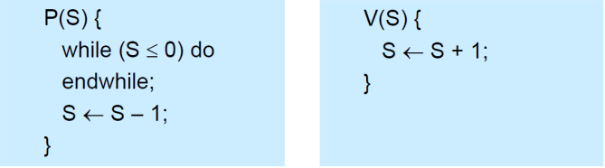

# Mutual Exclusion Solutions

`상호 배제`를 달성하기 위한 여러 기법 중 가장 대중적으로 알려진      
`Spinlock`, `Mutex`, `Semaphore`, `Monitor`를 자세히 학습해보고 기법 간의 차이점을 알아보자.

## Spinlock

`스핀락`은 `초기화`, `P()`, `V()` 연산으로만 접근이 가능한  
`특별한 정수 변수(S)`로써 임계 구역 진입 이전 및 이후에 자물쇠 역할을 수행한다.

위 연산 실행 중에는 `preemption 되지 않도록 OS가 보장`해주어 `P()`, `V()` 연산 전체가 한 명령 주기에 수행 된다.  

`P(S)` 연산은 Lock를 가져가는 행위로 비유할 수 있고  
`V(S)` 연산은 Lock를 반납하는 행위로 표현할 수 있다.

#

`S` 대신 `active` 스핀락 변수를 사용해서 두 프로세스가 CS에 진입하는 예시이다.  
`active` 변수는 처음에 1로 초기화 되어있는 상황이다.  
  
Pi는 CS 진입 전에 P(active) 연산을 통해 Lock(active)이 있는지 확인하고, Lock을 가져가면서 CS로 진입한다.  
Pj가 뒤에 도착해도 Lock(active)의 크기는 0이므로 CS로 들어가지 못하고 계속 조건을 확인하며 기다리고 있게 된다.  

이후 Pi가 자신의 일을 모두 끝내고 CS를 나가면서 V(active) 연산을 통해 Lock을 반납한다. (active <- active + 1)  
Pj는 그동안 계속 Lock이 있는지 확인하는 작업을 수행하다가 Lock을 가지고 CS에 들어갈 수 있게 된다.

#

P(), V() 연산은 OS가 원자성을 보장해주기 때문에 
CS에 프로세스가 동시에 들어가거나, 아무도 들어가지 못하는 이상 현상이 발생하지 않고 ME 문제를 해결할 수 있다.  
  
또한 프로세스 혹은 스레드는 자원을 계속해서 기다리고
스핀락을 사용하는 동안에는 Context Switching이 발생하지 않는 장점이 존재한다.

#

### 스핀락은 멀티 프로세서 시스템에서만 사용 가능하다.

만약 CPU를 점유하고 있는 프로세스 Pi가 락을 획득해서 CS에 진입하여 일을 수행하던 도중    
preeption이 발생하여 Pj가 CPU를 점유하게 되면 어떻게 될까?   
  
Pj는 Lock을 획득하기 위해 P() 연산을 수행하게 되고  
sleep state에 있는 Pi가 Lock을 반환하지 못하면 Pj는 무한 대기하게 되는 현상이 발생한다.
  
Pi가 다시 CPU를 점유하고 싶어도 P() 연산은 OS가 원자성을 보장하기 때문에  
OS는 Pj의 P() 연산을 멈추지 않는 아이러니한 상황이 발생할 수 있다.
  
즉 아무도 CS에서 일을 할 수 없는 이상 상황이 발생한다.

#

### 여전히 Busy waiting 문제에서 벗어날 수 없다.

SW solution, HW solution(TAS)에 비해 매우 간단하게 ME 문제를 해결할 수 있게 되었지만  
프로세스가 락을 얻기 위해 반복문을 계속 수행하고 기다리게 되므로 여전히 비 효율적인 CPU 점유와 Busy waiting 상태가 발생한다.

---

# Reference

- [https://hpclab.tistory.com/1?category=887083](https://hpclab.tistory.com/1?category=887083)

