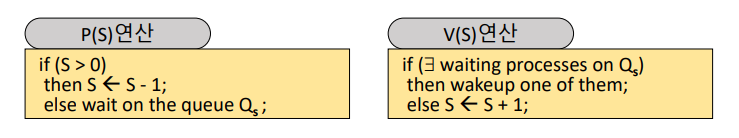
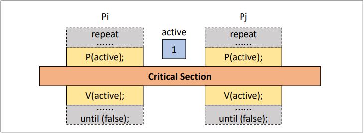
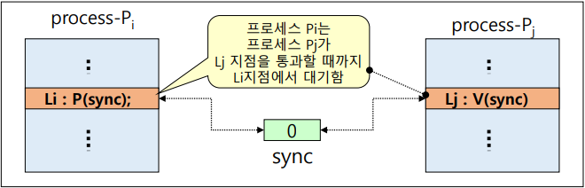
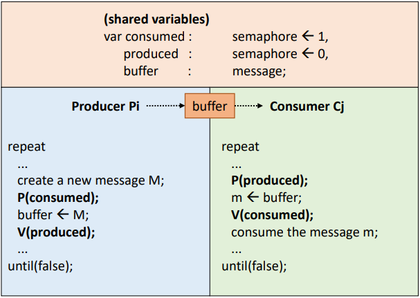
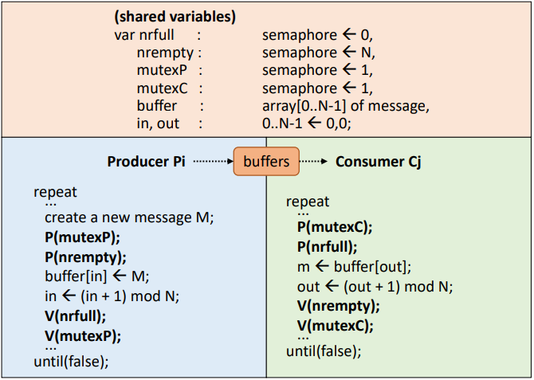
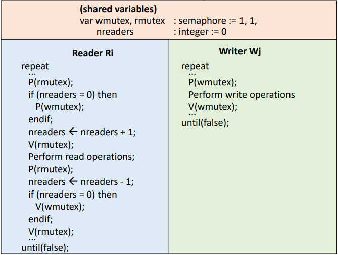

# Mutual Exclusion Solutions

`상호 배제`를 달성하기 위한 여러 기법 중 가장 대중적으로 알려진      
`Spinlock`, `Mutex`, `Semaphore`, `Monitor`를 자세히 학습해보고 기법 간의 차이점을 알아보자.

## Semaphore

`세마포어`는 다익스트라가 1965년에 Busy waiting 문제를 해결하고 상호 배제를 달성하기 위해 제안한 기법이다.  

세마포어는 변수 S가 0과 1 두 종류의 값만 갖는 경우인 `Binary semaphore`와  
S가 0이상의 정수 값을 가질 수 있는 `Couning semaphore`가 존재하며 목적에 따라 둘을 다르게 사용한다.  

`스핀락`과 마찬가지로 특별한 세마포어 정수 변수를 사용하고 초기화, P(), V() 연산으로만 접근이 가능하다.  
또한 `연산 전체가 한 명령 주기에 수행 되도록 OS가 보장`해주어 중간에 preemption이 발생하지 않는다. (indivisible)
> 음이 아닌 정수형 변수 S를 사용한다.

#

하지만 `스핀락`과 가장 큰 차이점은 `임의의 S 변수 하나에 ready queue 하나가 할당` 되어  
프로세스가 계속 반복문을 통해 조건을 확인하고 기다리는 방식이 아닌    
`queue 안에서 기다리도록` 프로세스의 상태를 `block(asleep)`으로 변경 시킨다는 점이다.  
> Process States: https://github.com/seokmyungham/TIL/blob/main/OS/process_management.md#process-states

또한 CS를 나갈 때 queue에 기다리고 있는 프로세스가 있는지 확인하고  
만약 기다리고 있는 프로세스들이 존재한다면, `기다리는 프로세스들 중 하나를 깨우는 과정`을 거친다.  
기다리는 프로세스가 없다면 Lock을 반환 (S <- S + 1)하고 빠져 나간다.
> `wakeup one of them` 이므로, 기다리는 순서는 보장되지 않는다.

이로 인해 프로세스는 큐에서 대기하는 동안 CPU를 사용하지 않으므로 불필요한 CPU 사용을 줄일 수 있고  
여러 프로세스나 스레드 간에 자원을 효과적으로 조절할 수 있다.

세마포어를 통해 해결할 수 있는 대표적인 동기화 문제들은 다음과 같다.

- Mutual Exclusion (상호 배제 문제)
- Process Synchronization (프로세스 동기화 문제)
- Producer-Consumer (생산자-소비자 문제)
- Reader-Writer
- Dining philosopher

---

### Mutual Exclusion

스핀락과 기본적인 흐름은 매우 유사하다.  
  
하지만 세마포어의 경우 자원을 기다리는 프로세스는 코드를 반복하며 대기하는 것이 아니라 큐에서 대기한다는 점  
그리고 CS에서 수행을 마친 프로세스는 큐에 기다리는 프로세스가 존재하는지 확인하고 프로세스들 중 하나를 깨우는 점이 다르다.
  
이를 통해 상호 배제를 간단하게 달성하고 Busy waiting 문제도 해결할 수 있게 되었다.  

#

### Process Synchronization

sync 세마포어 변수를 양 프로세스의 동일한 구간에 한 쪽에는 P(sync), 다른 한 쪽에는 V(sync)를  
사용하도록 구현하면 프로세스간 실행 순서를 동기화하는 문제도 간단하게 해결할 수 있다.  

#

### Producer-Consumer Problem

위는 세마포어를 활용해서 single buffer일 경우의 생산자-소비자 문제를 해결한 예시이다.  
`consumed` 세마포어 변수는 `소비되었는가?`를 의미하고  
`produced` 세마포어 변수는 `생산되었는가?`를 의미한다.  

Pi는 새로운 메시지 M을 생성하고 buffer에 접근하기 전에 `P(consumed)` 연산으로 버퍼가 비었는지 확인하는 과정을 거친다.  

`만약 comsumed가 0보다 크다면` `소비되었다 = 버퍼가 비었다`는 뜻으로,  
Pi는 CS(버퍼에 저장하는 로직)에 접근할 수 있게되고 데이터를 버퍼에 저장한다.
   
`만약 consumed가 0이라면` Pi는 asleep 상태로 queue에 가서 소비자가 V(consumed) 연산을 통해 자신을 깨울 때 까지 기다린다.  

Cj가 데이터를 소비하는 과정 흐름 또한 위와 동일하다.

#

위는 N-buffers일 경우의 생산자-소비자 문제를 해결한 예시이다.  

생산자나 소비자가 여러 명일 경우를 고려해서 `mutexP`, `mutexC` 세마포어 변수가 추가되었다.  
`P(mutex)`, `V(mutex)` 연산을 통해 생산자나 소비자는 각각 상호 배제 문제를 해결할 수 있다.   
  
`nrfull`, `nrempty` 변수는 버퍼가 차있는 크기, 비어있는 크기를 의미하고  
nrfull + nrempty는 총 버퍼의 크기와 같다.

#

### Reader-Writer Problem

Reader-Writer 문제는 읽기 연산을 수행하는 Reader와 쓰기 연산을 수행하는 Writer 간 데이터 무결성을 보장해야 하는 점을 다룬다.  

동시에 읽는 것은 가능하지만, 동시에 쓰는 것은 불가능하도록    
그리고 읽는 도중 쓰는 행위, 쓰는 도중 읽는 행위를 하지 못하도록 상호 배제해야 한다.  

  

위는 Reader에게 우선권을 준 해결 방안 예시이다.  
  
읽는 행위는 여러 명이 할 수 있는데 굳이 rmutex 세마포어 변수가 등장하는 이유는  
독자의 read operation 이전의 P(rmutex)-V(rmutex) 연산과 이후 P(rmutex)-V(rmutex)의 목적이 다르기 때문이다.  

독자는 시작 P(rmutex) 연산 이후,  
만약 자신이 동시간대의 첫 번째 독자일 경우 P(wmutex) 연산을 수행함으로써 저자의 write operation을 방지한다.  
이후 독자의 수를 1 증가시킨 다음 V(rmutex) 연산을 수행하고 궁극적으로 read operation을 수행한다.  

read operation 이후 또 다시 P(rmutex) 연산을 하게되는데
이 때는 자신이 마지막으로 읽고 퇴장하는 독자인지 확인하고, 저자가 write operation을 할 수 있도록 V(wmutex)을 수행한다.  

이를 통해 읽고 있는 사람이 1명이라도 존재한다면  
저자는 write operation을 수행할 수 없고, 독자가 없을 때만 저자는 write operation을 수행할 수 있다.
  
P(), V() 연산은 모두 OS에 의해 원자성이 보장된다는 점을 생각해보면  
읽는 행위와 쓰는 행위 이전, 이후에 세마포어 변수를 통해 상호 배제를 철저하게 수행함으로써  
수행 연산은 P(wmutex)로 동일하지만, 독자의 P(wmutex)와 저자의 P(wmutex)는 목적이 다른 것을 파악할 수 있다.

---

### 기아 상태를 야기할 수 있다. (wakeup one of them)

세마포어는 세마포어 변수의 ready queue에 대한 wakeup 순서가 비결정적이기 때문에  
대기하는 프로세스가 많으면, 특정 프로세스는 계속해서 자원을 할당 받지 못하는 단점이 존재한다.

---

# Reference

- [https://hpclab.tistory.com/1?category=887083](https://hpclab.tistory.com/1?category=887083)
