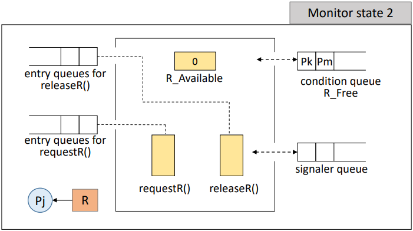

# Mutual Exclusion Solutions

## Monitor

`Monitor`는 상호 배제를 해결하기 위한 High-level Mechanism의 동기화 도구이다.  
프로그래밍 언어의 일부로서, 고급 언어 수준의 동기화 추상화를 제공하는데, 객체지향 프로그래밍에서의 클래스 및 메소드와 유사하다.  

예를 들면 `Java의 synchronized` 키워드는 Monitor를 사용하는 대표적인 예시이다.  
내부적으로 Monitor를 사용해서 Lock을 획득 및 반환하며, 객체에 대한 스레드 동기화를 통해 한 번에 하나의 스레드만이 접근하도록 보장한다.  

#

`Monitor`는 공유 데이터와 Critical section이 함께 존재하는 하나의 방이라고 생각하면 이해하기 편하다.  
그래서 Monitor 내부에는 하나의 프로세스, 하나의 스레드만 들어갈 수 있으며 여러가지 조건 변수들과 연산들이 존재한다.  
> Monitor 내부의 Mutual Exclusion을 Language가 보장해주어 덕분에 많은 문제들이 간단하게 해결된다.  
  
- Monitor entry queues
  - Monitor 내의 procedure의 수만큼 `queue`가 존재
- Condition queues
  - Monitor 내의 특정 이벤트를 기다리는 프로세스가 대기하는 `queue`가 존재
- Waiting signaler queue
  - Monitor에는 항상 하나의 `신호제공자 queue`가 존재한다.
  - 큐에는 signal() 명령을 실행한 프로세스가 임시 대기하게 된다.

---

### 자원 할당 시나리오

모니터 내부에는 자원 사용 가능을 알리는 변수 R_Available  
자원을 요청하는 프로시저 requestR(), 반환하는 프로시저 releaseR()이 존재하고
각 프로시저의 수 만큼 큐가 존재한다.  
  
위 그림으로 보면 Pj는 자원을 사용하기 위해  
requestR()의 큐로 진입해서 모니터 내부에 사용자가 존재하는지 확인한다.  
모니터 내부가 비었으므로 이후 모니터 안에서 requestR()을 호출하고 R_Available을 1에서 0으로 변경한다.

Pj가 자원 R을 사용하는 동안  
Pk, Pm이 requestR()의 큐에 도착하면 차례대로 모니터 내부로 진입해서 requestR()을 호출하게 되고  
R_Available이 0이므로 Pk와 Pm은 자원을 사용하지 못하고 condition queue로 들어가 대기하게 된다.

Pj는 자원 사용이 끝나면, 자원을 반환하기 위해 releaseR()의 큐로 들어가 모니터 내부로 진입한다.  
이후 자원을 반환하고 R_Available 을 0에서 1로 변경한다음 대기하고 있는 프로세스를 깨우기 위해 signaler queue로 이동한다.  

Pj가 signlaer queue로 이동하면 현재 모니터는 비어있는 상태가 되고  
signal() 명령을 실행해서 대기중이던 프로세스가 깨어나 모니터 안으로 진입할 수 있게 된다.  
  
이후 Pj는 Pk가 자원을 사용하는 동안 다시 모니터 안으로 돌아와서 남은 작업을 수행하는 과정을 거치고 모니터를 빠져나간다.  

---

`Monitor`는 위와 같이 `wait()`, `signal()` 연산을 통해 간단하게 상호 배제 문제를 해결한다.  
Language-level에서 지원하기 때문에 사용이 쉽고, Deadlock등 error 발생 가능성이 낮다.  

하지만 이와 반대로 Monitor를 지원하는 언어에서만 사용이 가능하고  
컴파일러가 Critical Section 접근을 위해 OS를 이해하고 있어야 한다는 단점도 존재한다.  

---

# Reference

- [https://hpclab.tistory.com/1?category=887083](https://hpclab.tistory.com/1?category=887083)
