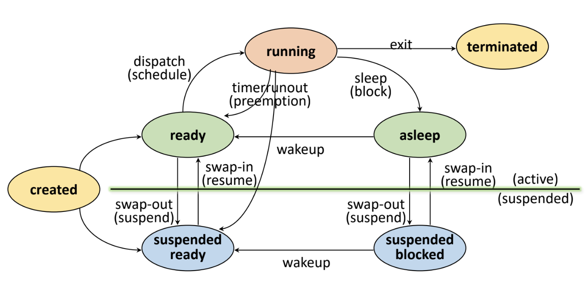

# Process Management

## Job & Process

`Job(작업)`은 아직 `실행 요청 전의 상태`의 프로그램과 데이터의 집합을 의미하고  
`Process(프로세스)`는 실행을 위해 `커널`에 등록된 상태의 `작업`을 의미한다.  

`프로세스`는 성능을 최적화하고, 프로세스 간 충돌을 방지하도록 안정성을 유지하기 위해 `커널`에 의해 관리된다.  

### PCB

운영체제 내의 커널 영역에 존재하는 `Process Control Block(PCB)`라고 불리는 데이터 구조체가 
각 프로세스가 생성될 때마다 생성되며 `커널`은 `PCB를 사용`하여 `해당 프로세스를 스케줄링하고 관리`한다.  
  
> PCB 정보는 OS 별로 서로 다르며  
> PCB 참조 및 갱신 속도는 OS의 성능을 결정 짓는 중요한 요소중 하나로 작용한다.

> `PCB가 관리하는 정보`  
> PID (Process Identification Number)  
> 스케줄링 정보  
> 프로세스 상태  
> 메모리 관리 정보  
> 입출력 상태 정보  
> 문맥 저장 영역  
> 계정 정보

#

### Resource

`프로세스`를 실행 중에 각종 자원을 요구, 할당, 반납하며 진행하는 `능동적인 개체`로 본다면  
`자원`은 커널의 관리 하에 `프로세스`에게 할당, 반납되는 `수동적인 개체`로 볼 수 있다.  
  
> 하드웨어 자원의 종류는 프로세서(CPU), 메모리, 디스크, 모니터, 키보드  
> 소프트웨어 자원의 종류로는 메시지, 시그널, 파일, 설치된 소프트웨어 등이 존재한다.

---

## Process States

`프로세스의 상태`는 자원 간의 상호작용에 의해 결정되는데, 크게 메모리 할당 상태 유무에 따라 `Active`, `Suspended`로 분류할 수 있다.  

### Created

`작업`이 커널에 등록되어 `프로세스`가 생성되고 PCB가 할당된 상태를 의미한다.  

#

### Ready

`프로세스`가 프로세서(CPU) 외에 `다른 모든 시스템 자원`을 할당 받은 상태를 말한다.  
  
`프로세스`는 실행을 위해 메모리를 할당받고, 필요한 파일에 대한 접근 권한이나 입출력을 위한 장치에 접근 권한을 획득해서
오로지 CPU만을 기다리는 즉시 실행 준비가 가능한 상태를 의미한다.

#

### Running

`프로세서`와 `필요한 자원`을 모두 할당 받은 상태를 말한다.  

이 상태에서 프로세스는 프로세서 스케줄링에 의해 다시 `Ready` 상태로 돌아갈 수도 있고 
I/O등 자원 할당 요청으로 인해 `Asleep` 상태로 진행될 수도 있다.  

- `Preemption`: Timer run-out, 프로세서를 빼앗기는 것을 말한다.
- `Block`(Sleep): I/O등 자원 할당을 요청하는 것을 말한다.

#

### Blocked/Asleep

`프로세서 외에 다른 자원`을 기다리는 상태를 말한다.  

`프로세스`가 `특정 자원(입출력 장치, 파일, 메모리)`을 필요로 할 때, 이를 요청하기 위해 `시스템 콜을 사용`하는데 그 동안 `프로세스`는 
자원을 얻을 때 까지 기다리며 다른 작업을 수행할 수 없는 상태가 된다.  
  
자원이 사용 가능해지거나 할당되면, 프로세스는 `Wake-up`되어 다시 실행 가능한 상태인 `Ready` 상태로 변환된다.

#

### Suspended

`프로세스`가 메모리를 할당받지 못하거나 빼앗긴 상태가 되어 일시적으로 중단된 상태를 말한다.

`Suspended` 상태가 되는 경우는 크게 두가지로 나뉜다.  

- 커널에 의한 중단
  - 운영체제는 메모리 부족으로 인해 실행중인 프로세스 중 일부를 일시적으로 중단시킬 수 있다.
- 사용자에 의한 중단
  - 사용자가 직접 프로세스를 중단시킬 수 있다.
  
이 상태에서 지금까지 실행된 프로세스의 기록, `메모리 이미지`는 `스왑 장치(주로 디스크)`에 저장된다.  

#

### Terminated

프로세스 수행이 끝난 상태를 말한다.  
  
프로세스가 모든 자원을 반납한 후 커널 내에 일부 PCB 정보만 남아 있는 상태이다.  

---

## Interrupt

`인터럽트`는 외부에서 발생한 이벤트라는 의미로, 프로세서가 프로그램을 실행 중일 때 다른 외부 이벤트나 요청이 발생하여
프로세서에게 처리해야 할 작업이 있을 때 발생한다.  
  
이를 통해 `프로세서는 실행 중인 프로그램을 중단`하고, 해당 이벤트를 처리하고 나서 원래의 작업으로 돌아간다.  

### 인터럽트 처리 과정

`인터럽트`가 발생하면 커널이 개입해서 프로세스를 중단시킨다.  
  
이 때 `문맥 교환`이 발생하는데 지금까지 실행 중이던 프로세스의 상태(흐름)을 PCB에 저장하고  
이후 커널은 인터럽트 발생 장소, 원인을 파악하고 `인터럽트 서비스 루틴(ISR)`이라 불리는 특수한 코드 블록으로 이동하여 해당 인터럽트를 처리한다.  
  
`ISR`이 끝나면 중단되었던 프로세스가 다시 시작되는 것이 아니라,  
대기 하고 있었던 `프로세스중에서 스케줄링에 의해 결정된 프로세스`가 `CPU를 할당받아 실행`된다.

#

### Context Switching

`Context(문맥)`이란 `프로세스와 관련된 정보(프로세스의 상태)`들의 집합을 의미한다.  
문맥은 CPU 안의 레지스터, 메모리 두 군데에 저장 될 수 있다.  

`문맥`은 프로세스 간의 전환시에 중요한 역할을 하며  
`문맥 교환`을 통해 하나의 프로세스가 중단 되고 다른 프로세스가 실행 될 때 이 정보들이 저장되고 복구 되어야한다.  

이를 통해 운영체제는 여러 프로세스를 효율적으로 관리하고 프로세스들이 CPU를 공유하며 안정적으로 동작할 수 있도록 지원한다.

---

# Reference

- [https://hpclab.tistory.com/1?category=887083](https://hpclab.tistory.com/1?category=887083)
