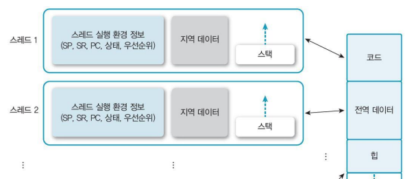
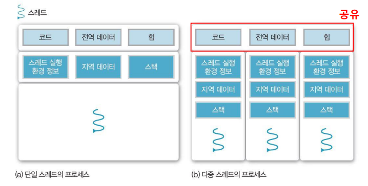

# Thread

프로세스가 자원을 할당 받고 자원을 제어하는 부분에 있어,  
`스레드`는 프로세스 안의 작은 실행단위로 `자원을 공유`하고 `독립적으로 작업을 수행`하여 효율적인 병렬 처리와 자원 관리를 지원한다.

  
`스레드`는 각각 독립적인 작업 수행을 위해 몇 가지 정보들을 유지하는데  

- 스레드가 다음에 실행할 명령어의 주소를 가리키는 `PC 레지스터`
- 스레드의 현재 상태를 저장하는 레지스터 값, `레지스터 상태`
- 함수 호출, 지역 변수, 임시 데이터를 저장하기 위한 `스택` 및 `스택 포인터`
- 스레드를 식별하기 위한 고유한 ID, `스레드 ID` 들이 존재한다.

#

## 사용자 응답성

우리가 게임을 하나 실행한다고 가정해보자.  
`모니터 화면 출력은 W1`, `화면을 전환하기 위한 마우스 입출력은 W2`, `팀원과 소통하기 위해 소리를 입출력하는 일은 W3`이라고 생각 해봤을 때  
  
`스레드가 하나인 프로세스`의 경우, W2와 W3같은 I/O 입출력이 발생하게 되면 프로세스의 상태는 `Running상태`에서 `Blocked`로 이동하게 된다.  
사용자는 게임 화면을 볼 수 없는 상태가 발생하고 I/O 입출력이 끝나야 다시 화면이 켜지게 되는 상황이 발생하게 될 것이다.  

`멀티 스레드를 사용하는 프로세스`라면 스레드가 각각 W1, W2, W3에 해당하는 독립적인 작업을 수행할 수 있고  
자원을 공유할 수 있어 일부 스레드 작업이 지연되더라도 다른 스레드는 계속 작업을 처리할 수 있다.

## 자원을 공유한다는 것

스레드의 가장 큰 장점중 하나는 자원을 공유한다는 점에서 비롯되는데  
  
프로세스 P1와 프로세스 P2가 존재하고 둘 다 A라는 자원이 필요하여 둘 다 A자원을 사용하게 된다면  
번갈아 사용하는 과정에서 `문맥 교환이 계속 발생`하게 될 것이고, 문맥 교환의 발생은 프로세서의 성능에 영향을 끼치게 된다.  

만약 프로세스가 아닌 다중의 스레드 T1, T2가 하나의 자원을 공유하여 사용할 수 있다면  
`새로운 프로세스를 생성하는 일`, `문맥 교환과 커널의 개입을 피하고` 작업을 더 효율적으로 진행할 수 있을 것이다.  

#

**또한 스레드는 프로세스와 다르게 `자원을 공유`한다는 점에서, 오류가 발생했을 때 다르게 작용될 수 있다.**  
    
`멀티 스레드` 중 하나의 스레드가 오류가 발생해서 문제가 생길 경우, 자원을 공유하는 다른 스레드까지도 영향을 끼칠 수 있다.  
이는 `다른 스레드들의 종료`로 이어질 수 있고 전체 프로세스가 종료될 수 있다.  

또한 자원 공유하여 사용하는 측면에서, 충돌이 일어나지 않도록 각 스레드들을 적절히 동기화 하는 것도 매우 중요하다.  

## 멀티 프로세서

스레드의 또 다른 장점 중 하나는 `멀티 프로세서 환경`에서 여러 작업을 동시에 병렬적으로 처리하여 성능을 향상시킬 수 있다는 점이다.

코어를 하나만 사용하는 `단일 프로세서 환경`에서는 물리적으로 여러 스레드를 동시에 실행시킬 수 없다.  
**CPU는 `시분할 방식`을 이용해 여러 스레드를 번갈아 실행하는데, 매우 빠른 속도로 진행되기 때문에 여러 스레드가 동시에 실행되는 것처럼 보일 뿐이다.**  

하지만 `멀티 프로세서 환경`에서 `멀티 스레드`를 사용할 경우, 스레드 간 작업을 분할하여 여러 작업을 동시에 처리할 수 있다.  
따라서 시스템의 전체적인 처리량이 증가하고, 작업을 빠르게 수행할 수 있다는 큰 장점이 존재한다.

---

# Reference

- [https://hpclab.tistory.com/1?category=887083](https://hpclab.tistory.com/1?category=887083)
