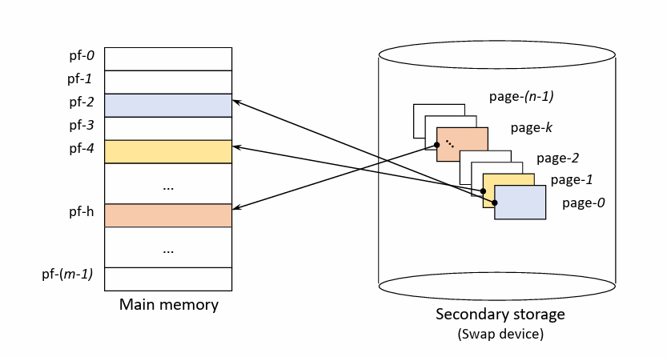
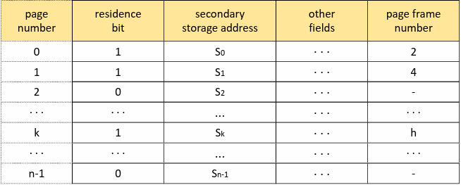
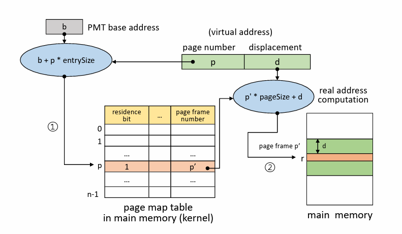
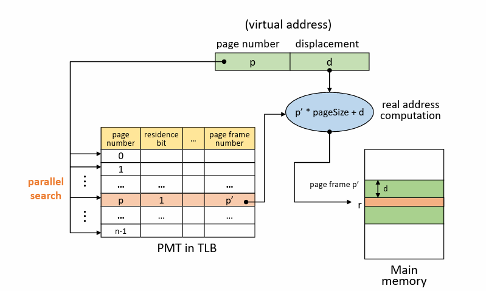
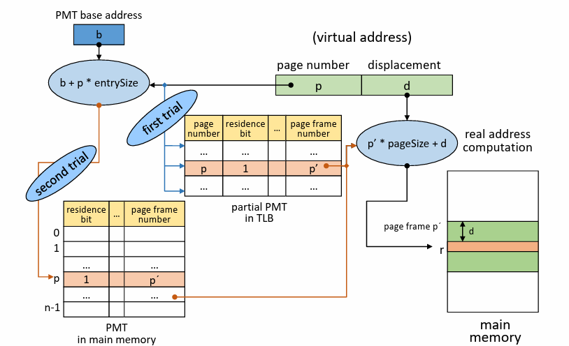

# Virtual memory

## Non-continuous allocation

`가상 메모리`란 주로 운영체제가 제공하는 기능으로  
사용자 프로그램을 여러 개의 블록으로 분할하고, 실행 시 필요한 블록들만 메모리에 적재할 수 있도록 하여  
물리적인 메모리 크기보다 큰 프로세스를 실행할 수 있도록 하는 매커니즘이다.  

이 때 메모리에 적재되지 않은 나머지 블록들은 보조 저장 장치인 스왑 디바이스, 주로 HDD나 SSD에 저장되어  
물리 메모리와 스왑 디바이스 간에 데이터를 주고받음으로써 효율적인 메모리 관리를 실현한다.  

또한 가상 주소와 실제 주소간의 변환 과정인 Address Mapping을 통해  
프로그램 전체가 메모리에 연속적으로 적재되었다고 가정하고 사용자/프로세스를 실행할 수 있다.

---

## Paging system

`페이징`은 가상 메모리 매커니즘을 구현하는 방법 중 하나로, 프로그램을 페이지라고 부르는 고정된 크기의 블록으로 분할하는 방법이다.  
따라서 메모리도 블록의 크기만큼 미리 분할되어 있으며 한 페이지가 적재되는 공간을 `페이지 프레임`이라고 부른다.
  
이 때 프로그램을 논리적으로 분할하는 것이 아니라, 단순히 정해진 크기에 맞춰 분할하기 때문에  
단순하고 효율적이지만 페이지를 공유하고 보호하는 과정이 `세그멘테이션` 대비 복잡하다는 특징이 있다.  
  
메모리에 적재되는 블록의 크기가 고정되어 있으므로 외부 단편화는 일어나지 않고 내부 단편화는 발생할 수 있다.  
따라서 성능과 오버헤드 사이에서 페이지의 크기를 잘 결정하는 것이 매우 중요하다. 

---

다음은 가상 주소와 실제 주소간의 변환 과정인 주소 사상(Address Mapping) 방식이다.

- 직접 사상(Direct Mapping)
- 연관 사상(Associative Mapping)
- 직접/연관 사상(Hybrid Direct/Associative Mapping)

## Direct Mapping

직접 사상은 블록 사상(Block Mapping) 방법과 유사하며  
커널 안에 저장되어 있는 `페이지 맵 테이블(PMT)`을 이용해서 주소 변환 과정을 수행한다.  
> 커널 공간에 프로세스마다 하나의 PMT를 가지고 있고 주소 사상 정보를 관리한다.

대략적인 변환 과정은  
먼저 해당 프로세스의 PMT가 저장되어 있는 주소 b에 접근하여 PMT에서 원하는 페이지에 대한 엔트리의 위치를 찾는다.  

찾아낸 엔트리의 존재 비트(Residence bit)를 검사해서 해당 페이지가 메모리에 현재 존재하는지 확인한다.  
> 만약 존재 비트가 0인 경우 페이지 폴트가 발생하고, 스왑 디바이스에서 해당 페이지를 메모리로 적재시키기 위해 문맥 교환이 발생한다.(Disk I/O)(Process state: Running -> Asleep -> Ready)
  
존재한다면, 테이블의 페이지 프레임 정보와 가상 주소의 변위를 사용하여 실제 주소를 계산해서 실제 주소를 통해 메모리에 접근한다.
  
#

직접 사상의 문제점은 메모리상의 원하는 공간에 접근하기 위해서 메모리 안 커널에 존재하는 PMT에 접근해야 한다는 것이다.  
즉 메모리 접근 횟수가 2배인 것이고 이는 성능 저하에 영향을 끼친다.  

---

## Associative Mapping

연관 사상은 직접 사상의 메모리를 2배 접근하는 문제점을 해결하기 위해 `TLB`에 PMT를 적재하는 방법이다.  
TLB는 Translation Look-aside Buffer의 약자이며 가상 메모리 시스템에서 주소 변환을 빠르게 처리하기 위한 캐시 메모리이다.
> 현재 모든 데스크탑 및 서버용 프로세서는 하나 이상의 TLB를 가지고 있다고 한다.  
> 페이지 단위나 세그먼트 단위로 처리하는 가상 메모리를 사용하는 거의 모든 하드웨어는 TLB를 사용한다.

PMT를 커널 대신 TLB에 적재해놓고, 원하는 페이지를 PMT에서 병렬적으로 탐색하여 주소 변환 속도를 크게 향상시킬 수 있다.
  
하지만 MMU에 속하는 TLB는 CPU 내부에 탑재되어 있는 캐시 메모리이기 때문에 가격이 비싸다.  
정확하게 가격을 알 수는 없지만 캐시 메모리는 21세기 현재에도 메모리 소자 중에서 가장 비싼편이며, 지난 20년 간 가격이 3%정도 하락하는 데 불과했다고 한다.

---

## Hybrid Direct/Associative Mapping

이러한 TLB의 비용적인 한계를 돌파하기 위해 두 기법을 혼합하여 사용하는 직접/연관 사상이 등장한다.  
작은 크기의 TLB에 최근에 사용된 페이지들에 대한 엔트리만을 저장하고 지역성을 활용하면 하드웨어 비용은 줄이고 연관 사상의 장점을 활용할 수 있다.   

엔트리를 찾기 위해 커널 안의 PMT를 조회하는 것이 아니라, 우선적으로 TLB에 적재되어 있는 PMT에 접근한다.  
  
만약 현재 찾는 엔트리가 TLB에 적재되어 있으면, 존재 비트를 검사하고 페이지 프레임 번호를 확인해서 실제 주소를 계산한다.  
그게 아니라면 직접 사상으로 커널 안의 PMT에 접근하여 페이지 프레임 번호를 확인하고 해당 PMT 엔트리를 TLB에 적재한다.  
> 커널 안의 PMT에도 존재하지 않으면 페이지 폴트가 발생한 것이고 직접 사상의 페이지 폴트 루틴을 따른다.

이렇게 우선적으로 연관 사상을 수행하고 그 후에 직접 사상을 이용하면  
이전에 찾았던 페이지를 다시 찾게 될 경우 적은 비용으로 지역성을 활용하여 성능을 향상시킬 수 있다.

---

# Reference

- [https://hpclab.tistory.com/1?category=887083](https://hpclab.tistory.com/1?category=887083)
