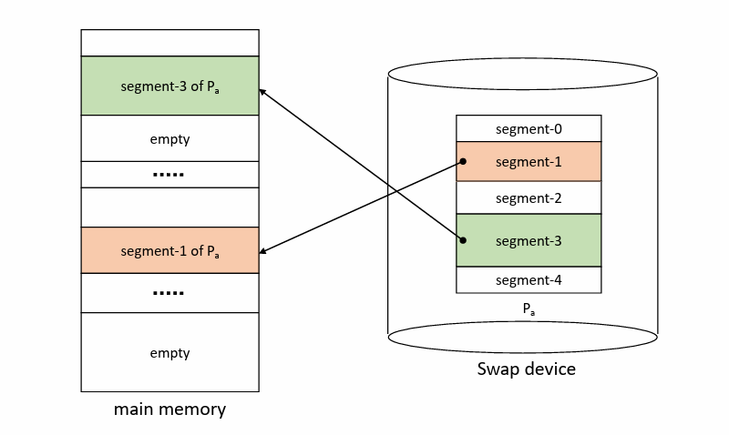
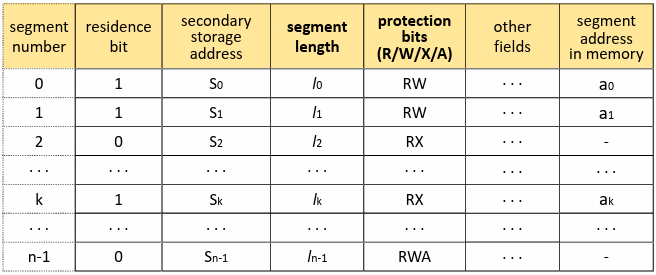
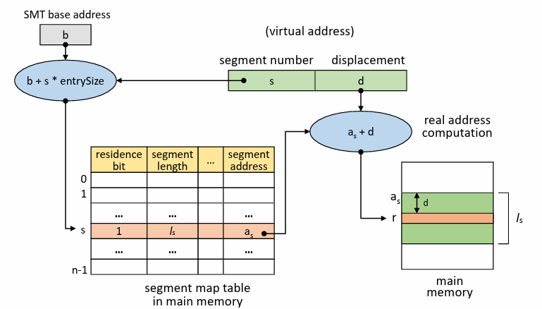

# Virtual Memory

## Segmenation system

페이징 시스템이 프로그램을 단순히 일정한 크기로 분할하는 방식이었다면,  
`세그멘테이션 시스템`은 프로그램을 논리적 블록으로 분할하는 방법이다.  

여기서 논리적이라 함은 프로그램을 스택, 힙, 메인 프로시저, 공유 라이브러리, 기능에 따라 나누는 것을 말하며     
따라서 `세그먼트`(블록)의 크기가 서로 다를 수 있다.  

메모리를 미리 분할하지 않는 VPM(Variable Partition Multiprogramming)과 유사하고  
페이징 시스템에 비해 세그먼트를 공유하고 보호하는 것에 용이하다.  

하지만 블록의 크기가 서로 다르므로 Address mapping 및 메모리 관리의 오버헤드가 크고  
페이징 시스템과 반대로 내부 단편화는 발생하지 않지만 외부 단편화는 발생할 수 있다.  

#

세그멘테이션 시스템에서 주소 사상 과정은 페이징 시스템과 유사하다.  
다만 SMT는 PMT에서 세그먼트의 길이와 권한을 나타내는 프로텍션 비트가 추가된 모습이다.  
  
기능에 따라 세그먼트가 형성된 만큼 프로텍션 비트를 통해 수행 권한을 프로텍션 비트로 관리하여 세그먼트에 대한 접근을 쉽게 보호할 수 있다.

직접 사상에서는 프로세스의 SMT가 저장되어 있는 주소 b에 접근하여  
가상 주소의 세그먼트 번호를 이용해서 SMT에서 원하는 세그먼트 엔트리를 찾는다.  

찾아낸 엔트리의 존재 비트를 검사해서 해당 세그먼트가 메모리에 존재하는지 여부를 확인한다.  
> 만약 존재 비트가 0일 경우 세그먼트 폴트 발생, 스왑 디바이스로부터 해당 세그먼트를 메모리로 적재하고 SMT를 갱신한다.  
> 이 과정은 DISK I/O에 해당하고 문맥 교환이 발생한다. (Overhead)

이 때 변위(d)가 세그먼트 길이보다 큰 경우, 세그먼트의 크기를 벗어나는 주소를 접근하려는 행위이고  
segment overflow exception 처리 모듈을 호출한다.  

이어서 프로텍션 비트를 검사하여 허가되지 않은 연산일 경우 (R/W/X/A)  
segment overflow exception 처리 모듈을 호출한다.  

위 과정을 모두 수행하고 나서 실제 주소를 계산한 후 메모리에 접근한다.  

세그멘테이션 시스템에서도 TLB같은 하드웨어를 활용해서  
메모리를 2배 접근하는 문제를 해결할 수 있고 직접/연관 사상을 활용할 수 있다.  
https://github.com/seokmyungham/TIL/blob/main/OS/virtual_memory.md

---

