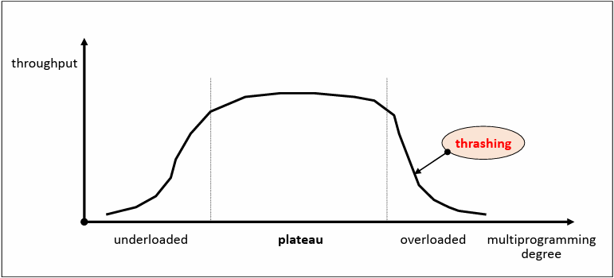

# Virtual memory management

가상 메모리를 관리하는 목적은 페이지 폴트 발생률을 줄여서 문맥 교환과 커널의 개입을 최소화하는 데에 있다.  
TLB나 비트 벡터같은 `하드웨어 요소`를 이용하거나, `소프트웨어 요소`, `페이지 교체 전략`들을 활용하는 방법이 존재한다.  

---

## Hardware components

- Address translation device
- Bit Vectors

## Bit Vectors

`비트 벡터`란 페이지 사용 상황에 대한 정보를 기록하는 비트들을 말한다.  
`Reference bit vector`와 `Update bit vector`에 메모리에 적재된 각각의 페이지가 최근에 참조 되었는지,  
프로세스에 의해 수정 되었는지를 표시하고 이후에 이 정보를 활용함으로써 페이지를 효율적으로 관리할 수 있다.
> 프로세스에 의해 참조되면 페이지의 Ref bit를 1로 설정하고 주기적으로 Ref bit를 0으로 초기화한다.  
> 프로세스에 의해 수정되면 페이지의 Update bit를 1로 설정해서 해당 페이지에 대한 Write-back이 필요함을 알린다.

---

## Software components

가상 메모리의 성능 향상을 위한 관리 전략들은 매우 다양하다.  

- `Allocation strategies (할당 전략)`: 각 프로세스에게 메모리를 얼마 만큼 줄 것인지?
- `Fetch strategies`: 특정 페이지를 메모리에 언제 적재할 것인지?
- `Placement strategies (배치 전략)`: 페이지/세그먼트를 어디에 적재할 것인지?
- `Replacement strategies (교체 전략)`: 새로운 페이지를 어떤 페이지와 교체할 것인지?
- `Cleaning strategies (정리 전략)`: 변경 된 페이지를 언제 write-back 할 것인지?
- `Load control strategies (부하 조절 전략)`: 시스템의 부하 수준을 어떻게 유지할 것인지?

### 메모리 할당 전략

각 프로세스에게 메모리를 얼마 만큼 줄 것인지 결정하는 전략이다.  
  
프로세스 실행 동안 고정된 크기의 메모리를 할당하는 `Fixed allocation`과 크기가 유동적인 `Variable allocation`이 해당된다.  
  
메모리 할당 전략에서는 프로세스 실행에 필요한 메모리 양을 예측하는 것이 중요하다.    
프로세스에게 너무 큰 메모리를 할당하면 메모리를 낭비하게 되고  
너무 적은 메모리를 할당하면 페이지 폴트 발생률이 증가하여 시스템 성능이 저하 될 것이다.  

#

### 페치 전략

특정 페이지를 메모리에 언제 적재할 것인지 결정하는 전략이다.  
  
해당 전략에는 프로세스가 참조하는 페이지들만 적재하는 `Demand fetch(요구 적재)` 방법과  
가까운 미래에 참조될 가능성이 높은 페이지를 예측하여 미리 적재하는 `Anticipatory fetch(예측 적재)` 방법이 있다.  

예측 적재같은 경우 예측 성공시 페이지 폴트 오버헤드가 없지만, 예측하는 오버헤드가 존재하고 적중률에 민감하다.  
알고리즘을 설계할 때 내가 다음 메모리에 적재될 데이터를 예측할 수 있다면 페치 전략을 활용하여 성능을 개선시킬 수 있을 것이다.

#

### 정리 전략

변경 된 페이지(dirty bit)를 언제 스왑 디바이스에 반영할 것인지 결정하는 전략이다.  

해당 페이지가 메모리에서 내려올 때 write-back하는 `Demand cleaning` 방법과  
더 이상 변경될 가능성이 없다고 판단할 때 미리 write-back하는 `Anticipatory cleaning` 방법이 있다.  
  
마찬가지로 예측이 성공하면 비용이 절약되지만, 만약 write-back 이후 페이지 내용이 수정되면 오버헤드가 발생한다.  
그래서 내가 알고리즘을 설계할 때 적절히 두 방법을 혼합해서 사용한다면 성능 상 이점을 기대할 수 있으며  
실제 대부분의 시스템은 일반적으로 준수한 성능을 보여주는 Demand cleaning 기법을 사용한다고 한다.

#

### 부하 조절 전략

시스템의 멀티 프로그래밍 차수를 조절해서 자원과 성능 시스템 상태를 적절하게 유지시키는 전략이다.  

적정 수준의 멀티 프로그래밍 차수를 유지하는게 중요한데  
저부하 상태는 시스템 자원을 낭비하고, 하드웨어의 성능을 온전히 다 사용하지 못해서 성능이 낭비될 것이다.  
고부하 상태는 자원에 대한 경쟁이 심화되어 성능이 저하되고 과도한 페이지 폴트가 발생하는 현상인 `Thrashing` 현상이 발생한다.  

---

# Reference

- [https://hpclab.tistory.com/1?category=887083](https://hpclab.tistory.com/1?category=887083)
