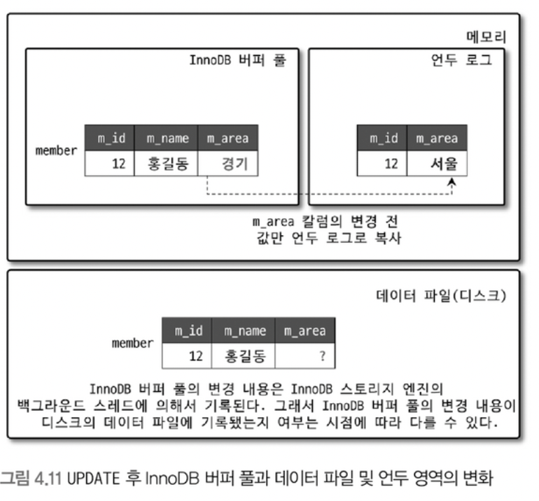

# InnoDB 스토리지 엔진 아키텍처


`InnoDB`는 MySQL에서 사용할 수 있는 스토리지 엔진 중 거의 유일하게 레코드 기반의 잠금을 제공한다.  
덕분에 높은 동시성 처리가 가능하고 안정적이며 성능이 뛰어나다.

## InnoDB 스토리지 엔진의 주요 특징

- [프라이머리 키에 의한 클러스터링](https://github.com/seokmyungham/TIL/blob/main/RealMySQL/innodb_engine_architecture_01.md#%ED%94%84%EB%9D%BC%EC%9D%B4%EB%A8%B8%EB%A6%AC-%ED%82%A4%EC%97%90-%EC%9D%98%ED%95%9C-%ED%81%B4%EB%9F%AC%EC%8A%A4%ED%84%B0%EB%A7%81)
- [외래 키 지원](https://github.com/seokmyungham/TIL/blob/main/RealMySQL/innodb_engine_architecture_01.md#%EC%99%B8%EB%9E%98-%ED%82%A4-%EC%A7%80%EC%9B%90)
- [Muti Version Concurrency Control](https://github.com/seokmyungham/TIL/blob/main/RealMySQL/innodb_engine_architecture_01.md#mvcc)
- [잠금 없는 일관된 읽기(Non-Locking Consistent Read)](https://github.com/seokmyungham/TIL/blob/main/RealMySQL/innodb_engine_architecture_01.md#%EC%9E%A0%EA%B8%88-%EC%97%86%EB%8A%94-%EC%9D%BC%EA%B4%80%EB%90%9C-%EC%9D%BD%EA%B8%B0)
- [자동 데드락 감지](https://github.com/seokmyungham/TIL/edit/main/RealMySQL/innodb_engine_architecture_01.md#%EC%9E%90%EB%8F%99-%EB%8D%B0%EB%93%9C%EB%9D%BD-%EA%B0%90%EC%A7%80)
- 자동화된 장애 복구
- [InnoDB 버퍼 풀](https://github.com/seokmyungham/TIL/blob/main/RealMySQL/innodb_engine_architecture_02.md#innodb-%EB%B2%84%ED%8D%BC-%ED%92%80)
- [Double Write Buffer](https://github.com/seokmyungham/TIL/edit/main/RealMySQL/innodb_engine_architecture_01.md#double-write-buffer)
- 언두 로그
- 체인지 버퍼
- 리두 로그 및 로그 버퍼

---

## 프라이머리 키에 의한 클러스터링

InnoDB의 모든 테이블은 기본적으로 기본 키를 기준으로 정렬되어 저장되고, 세컨더리 인덱스는 기본 키의 값을 논리적인 주소로 사용한다.  
> 레코드의 주소 대신 기본 키의 값을 논리적인 주소로 사용하는 이유는 효율적인 데이터 접근 및 데이터 변경시 효율적으로 대처하기 위함이다.  

기본 키가 클러스터드 인덱스이기 때문에 기본 키를 이용한 레인지 스캔은 상당히 빨리 처리된다. 그리고 쿼리의 실행 계획에서 기본 키는 기본적으로 다른 세컨더리 인덱스에 비해 비중이 높게 설정된다.  

그러나 MyISAM 스토리지 엔진에서는 클러스터드 인덱스를 지원하지 않는다. 그래서 MyISAM 테이블에서는 기본 키와 세컨더리 인덱스는 구조적으로 아무런 차이가 없다. 
기본 키는 그저 유니크 제약 조건을 가진 세컨더리 인덱스일 뿐이다.  

그리고 MyISAM 스토리지 엔진에서 모든 인덱스는 InnoDB와 다르게 물리적인 레코드 주소 값을 가져서 데이터 업데이트시 인덱스를 업데이트 하는 데 추가적인 작업을 필요로 한다.

## 외래 키 지원

외래 키는 InnoDB 스토리지 엔진 레벨에서 지원하며, MyISAM 및 MEMORY 테이블에서는 사용할 수 없다.  
외래 키는 DB 서버 운영의 불편함 때문에 서비스용 데이터베이스에서는 생성하지 않는 경우도 자주 있는데, 그럼에도 개발 환경의 데이터베이스에서는 좋은 가이드 역할을 할 수 있다.  

InnoDB에서 외래 키는 부모 테이블과 자식 테이블 모두 해당 칼럼에 인덱스 생성이 필요하고, 변경 시에는 반드시 부모 테이블이나 자식 테이블에 데이터가 있는지 체크하는 작업이 필요하기 때문에
`잠금이 여러 테이블로 전파`된다. 그로 인해 `데드락`이 발생할 때가 많아 개발할 때도 외래 키의 존재에 주의하는 것이 좋다.  

수동으로 데이터를 적재하거나, 스키마 변경 등의 관리 작업이 실패할 때 또는 서비스에 문제가 있어서 긴급하게 조치를 취해야할 때 `foreign_key_checks` 시스템 변수를 OFF로 설정해서 외래 키 관계에 대한 작업을 일시적으로 멈출 수 있다.  
> 외래 키 체크가 비활성화되면 외래 키 관계의 부모 테이블에 대한 작업(CASCADE)도 무시한다.

일시적으로 멈추면 레코드 적재나 삭제 등의 작업도 부가적인 체크가 필요 없어 훨씬 빠르게 처리가 가능하다.  
하지만 외래 키 체크를 일시적으로 해제 했다고 그대로 방치해도 된다는 것을 의미하지 않는다. 외래 키와 관련된 레코드 작업을 했다면 연관된 테이블에도 반드시 데이터 일관성을 유지하는 작업을 해야하며 작업 후 외래 키 체크 기능을 활성화해야 한다. 

외래 키 체크 시스템 변수는 GLOBAL, SESSION 적용 범위를 설정할 수 있는데 반드시 현재 작업을 실행하는 세션에만 적용되도록 주의하자. 
SESSION 키워드를 명시하지 않으면 자동적으로 현재 세션의 설정만 변경한다.

```sql
SET foreign_key_checks=OFF;
SET SESSION foreign_key_checks=OFF;
```

## MVCC

`MVCC`란 Multi Version Concurrency Control의 약자로 하나의 레코드에 대해 여러 개의 버전을 동시에 관리하는 기능이다. 따라서 레코드 레벨의 트랜잭션을 지원하는 DBMS가 제공하는 기능이며
잠금을 사용하지 않고 일관된 조회를 제공하기 위해 사용된다.
 
InnoDB는 `언두 로그`를 사용해서 이 기능을 구현한다.  



위 그림은 이름이 홍길동, 지역이 `서울`인 레코드를 하나 추가한 후,  
해당 레코드의 지역 컬럼의 값이 `경기`로 변경되었을 때 언두 로그가 어떻게 작동하는지를 보여주는 그림이다.  

UPDATE SQL이 실행되면 커밋 실행 여부와 관계없이 InnoDB 버퍼 풀은 새로운 값인 경기로 업데이트 된다.  
그리고 디스크의 데이터 파일에는 `체크포인트`나 InnoDB의 쓰기 스레드에 의해 새로운 값으로 업데이트 될수도 있고 아닐 수도 있는데 보통 ACID를 보장하기 위해 일반적으로 버퍼 풀과 데이터 파일은 동일한 상태를 유지한다.  

아직 커밋이나 롤백이 되지 않은 상황인데, 이 상태에서 다른 사용자가 해당 레코드에 조회 쿼리를 날렸을 때 InnoDB는 어떤 데이터를 읽고 반환할까? 
이는 MySQL 서버의 시스템 변수(transaction_isolation)에 설정된 `격리 수준`에 따라 달라진다.  

격리 수준이 `READ_UNCOMMITED`인 경우 InnoDB 버퍼 풀이 현재 가지고 있는, 변경된 데이터를 읽어서 반환한다. `READ_COMMITED`거나 그 이상(`REAPEATABLE_READ`, `SERIALIZABLE`)인 경우 아직 커밋되지 않았기 때문에
변경되기 이전의 내용을 보관하고 있는 `언두 영역`에 있는 데이터를 반환한다. 즉 하나의 레코드에 대해 여러 버전이 유지되고 필요에 따라 어느 데이터가 보여지는지 상황에 따라 달라진다.  

이 상태에서 커밋을 실행하면 InnoDB는 더 이상 변경 작업 없이 현재 버퍼 풀의 상태를 영속화 한다.  
하지만 롤백을 실행하면 InnoDB는 언두 영역에 저장한 데이터를 버퍼 풀로 다시 복구하고, `더이상 언두 영역을 필요로 하는 트랜잭션이 없을 때` 백업 데이터를 삭제한다.

## 잠금 없는 일관된 읽기

InnoDB는 MVCC 기술을 이용해서 잠금을 걸지 않고 읽기 작업을 수행한다.  
MVCC를 통해 한 레코드에 대해 여러 버전이 있기 때문에, InnoDB에서 읽기 작업은 잠금이 필요하지 않고 다른 트랜잭션의 잠금을 기다릴 필요가 없다.  
  
격리 수준이 `SERIALIZABLE`이 아닌 `REAPEATABLE_READ` `READ_COMMITED` `READ_UNCOMMITED`일 경우 INSERT와 연결되지 않은 순수한 SELECT 작업은 다른 트랜잭션의 변경 작업과 관계없이
항상 잠금을 대기하지 않고 바로 실행된다. 또한 특정 사용자의 레코드 변경 작업이 아직 커밋되지 않았더라도 다른 사용자의 SELECT 작업을 방해하지 않는다.  

다만 오랜 시간동안 활성된 트랜잭션으로 인해 언두 로그를 삭제하지 못하고 계속 유지하게 되면, 가끔 MySQL 서버가 느려지거나 문제가 발생할 수 있다.
이를 막기위해 트랜잭션이 시작됐다면 가능한 한 빨리 롤백이나 커밋을 통해 트랜잭션을 완료하는 것이 좋다.

## 자동 데드락 감지

InnoDB 스토리지 엔진은 내부적으로 잠금이 교착 상태에 빠지지 않았는지 체크하기 위해 `잠금 대기 목록`을 `그래프` 형태로 관리한다. 그리고 `데드락 감지 스레드`가 주기적으로 잠금 대기 목록 그래프를 검사해서
교착 상태에 빠진 트랜잭션을 찾고 그 중 하나를 강제 종료(롤백)한다.  
  
여기서 둘 중에 강제 종료할 트랜잭션을 선택하는 기준은 `언두 로그의 양`이다. 언두 로그의 양이 적다는 뜻은 롤백 시 언두 처리를 해야할 데이터가 적다는 의미이며 강제 롤백으로 인한 MySQL의 부하도 덜 유발하기 때문이다  

동시 처리 스레드가 매우 많아지거나 각 트랜잭션이 가지는 잠금의 개수가 많아지면 데드락 감지 스레드가 느려진다. 데드락 감지 스레드는 잠금 목록을 검사할 때 잠금 상태의 변경을 막기 위해 잠금 테이블에 새로운 잠금을 걸고
데드락 스레드를 찾게 되는데, 잠금의 개수가 많다는 것은 데드락 감지 스레드가 해야할 일이 많아져 느려진다는 의미이다. 따라서 서비스 쿼리를 처리 중인 스레드는 더이상 작업을 진행하지 못해고 대기하게 되면서 서비스에 악영향을 미친다.  

데드락 감지 스레드를 사용하는 것이 부담스럽다면 `innodb_deadlock_detect` 시스템 변수를 OFF로 설정해서 데드락 감지 스레드를 비활성화 하여 문제를 해결할 수 있다. 
또한 `innodb_lock_wait_timeout` 시스템 변수를 활성화하면 데드락 상황에서 일정 시간이 지났을 때 자동으로 요청이 실패하고 에러 메시지를 반환하도록 할 수 있다.

## Double Write Buffer

InnoDB 스토리지 엔진의 리두 로그는 페이지의 변경된 내용만 기록한다. 이로 인해 InnoDB 스토리지 엔진이 더티 페이지를 디스크 파일로 플러시할 때 하드웨어 오작동이나 시스템의 비정상 종료가 일어나면 일부만 기록되는 문제가 발생할 수 있다.
이러한 문제를 막기 위해 InnoDB 스토리지 엔진은 `Double Write` 기법을 이용한다.
  
쉽게 말하면 더티 페이지를 플러시할 때, 실제 데이터 파일에 변경 내용을 기록하기 전 더티 페이지들을 묶어 시스템 테이블 스페이스에 존재하는 Double Write 버퍼에 먼저 기록한다. 
만약 비정상적으로 시스템이 종료되면 InnoDB 스토리지 엔진은 재시작하면서 항상 Double Write 버퍼의 내용과 데이터 파일의 페이지들을 모두 비교하고, 내용이 다르면 버퍼의 내용을 데이터 파일의 페이지로 복사하는 과정을 수행한다.
  
Double Write 기능은 `innodb_doublewirte` 시스템 변수로 제어할 수 있고, SSD 처럼 랜덤 IO나 순차 IO의 비용이 비슷한 저장 시스템에서는 상당히 부담스러울 수 있다.
데이터의 무결성이 매우 중요한 서비스는 Double Write의 활성화를 고려하는 것이 좋고, 성능이 가장 우선시되어 InnoDB 리두 로그 동기화 설정을 1이 아닌 값으로 설정 했다면 Double Write도 비활성화하는 것이 좋다.

## 언두 로그

## Reference 

**위 글은 책 RealMySQL 8.0을 구입하여 읽고 정리한 내용입니다.**
- [도서 홈페이지 https://wikibook.co.kr/realmysql801/](https://wikibook.co.kr/realmysql801/)
