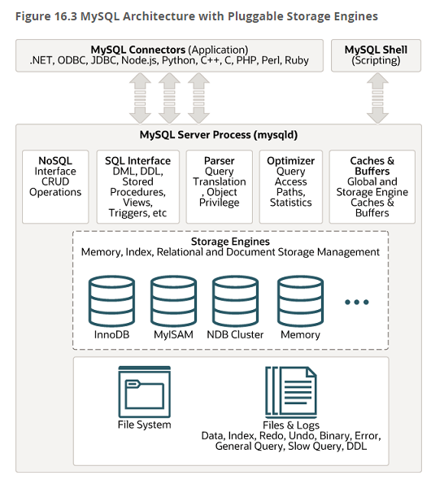

# 아키텍처

## MySQL의 전체 구조



MySQL 서버는 사람의 머리역할을 하는 MySQL 엔진과 손발 역할을 담당하는 스토리지 엔진으로 구분할 수 있다.  

그 중에서 MySQL 엔진은 클라이언트의 접속 및 쿼리 요청을 처리하는 커넥션 핸들러와 SQL 파서 및 전처리기, 쿼리의 최적화된 실행을 위한 옵티마이저가 중심을 이룬다.  
반대로 스토리지 엔진은 실제 데이터를 디스크 스토리지에 저장하거나 디스크 스토리지로부터 데이터를 읽어오는 부분을 전담한다.  

#

MySQL 서버에서 MySQL 엔진은 하나지만 스토리지 엔진은 여러 개를 동시에 사용하는 것이 가능한데  

```sql
CREATE TABLE test_table (fd1 INT, fd2 INT) ENGINE=INNODB;
```

위와 같이 테이블이 사용할 스토리지 엔진을 지정해서 지정한 스토리지가 해당 테이블의 모든 읽기 작업이나 변경 작업을 전담하도록 할 수 있다.

