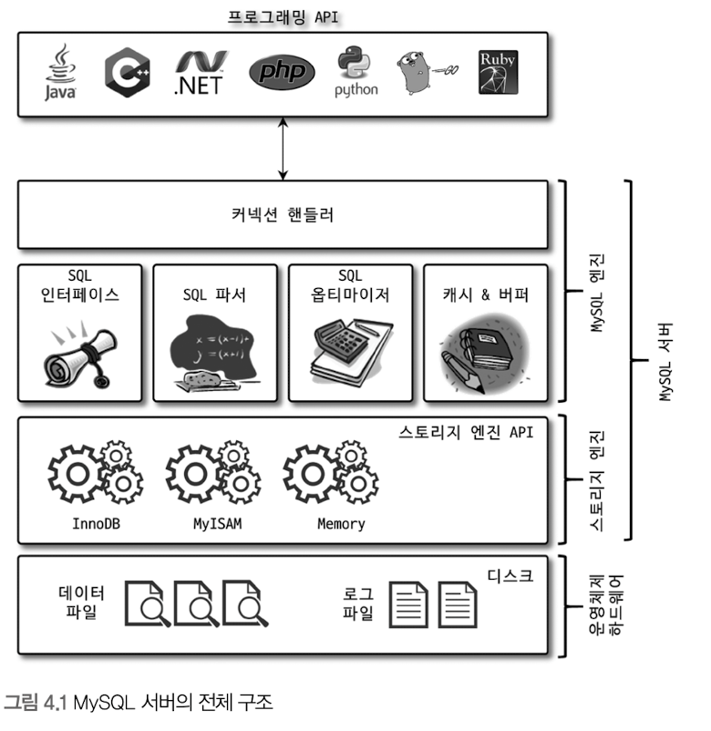

# 아키텍처

## MySQL의 전체 구조


MySQL 서버는 ```사람의 머리역할을 하는 MySQL 엔진```과 ```손발 역할을 담당하는 스토리지 엔진```으로 구분할 수 있다.  

그 중에서 MySQL 엔진은 클라이언트의 접속 및 쿼리 요청을 처리하는 커넥션 핸들러와 SQL 파서 및 전처리기, 쿼리의 최적화된 실행을 위한 옵티마이저가 중심을 이룬다.  
반대로 스토리지 엔진은 실제 데이터를 디스크 스토리지에 저장하거나 디스크 스토리지로부터 데이터를 읽어오는 부분을 전담한다.  

#
  
MySQL 서버에서 MySQL 엔진은 하나지만 스토리지 엔진은 여러 개를 동시에 사용하는 것이 가능한데  

```sql
CREATE TABLE test_table (fd1 INT, fd2 INT) ENGINE=INNODB;
```
 
위와 같이 테이블이 사용할 스토리지 엔진을 지정해서  
지정한 스토리지가 해당 테이블의 모든 읽기 작업이나 변경 작업을 전담하도록 할 수 있다.

---

## 핸들러 API

스토리지 엔진과 MySQL 엔진은 ```핸들러 API``` 라는 것으로 데이터를 주고받을 수 있는데  
```MySQL 엔진의 쿼리 실행기는 각 스토리지 엔진에 쓰기, 읽기를 요청```해서 데이터를 주고 받으며 이를 핸들러 요청이라고 말한다.

```sql
SHOW GLOBAL STATUS LIKE 'Handler%';
```

#

## MySQL Thread


MySQL 서버는 스레드 기반으로 작동하며, 크게 포그라운드 스레드와 백그라운드 스레드로 구분할 수 있다.  
스레드 목록을 확인해보면 전체 44개, 41개의 백그라운드 스레드와 3개의 포그라운드 스레드가 실행 중인 것을 확인할 수 있다.  
  
이 중에서 ```thread/sql/one_connection``` 스레드만 실제 사용자 요청을 처리하는 포그라운드 스레드다.  

## Foreground Thread (Client Thread)

포그라운드 스레드는 주로 각 클라이언트 사용자가 요청하는 쿼리 문장을 처리하는 역할을 한다.  
  
MySQL의 데이터 버퍼나 캐시로부터 데이터를 가져오는데,  
버퍼나 캐시에 없는 경우에는 직접 디스크의 데이터나 인덱스 파일로부터 데이터를 읽어와서 작업을 처리한다.

> MyISAM 테이블의 경우 디스크 쓰기 작업까지 포그라운드 스레드가 처리하지만  
> InnoDB 테이블은 데이터 버퍼나 캐시까지만 포그라운드 스레드가 처리하고, 나머지 버퍼로부터 디스크까지 기록하는 작업은 백그라운드 스레드가 처리한다.
  
최소 MySQL 서버에 접속된 클라이언트 수만큼 존재하며, 커넥션이 종료되면 해당 커넥션을 담당하던 스레드는 다시 스레드 캐시로 되돌아간다.  
이때 시스템 변수 ```thread_cache_size```로 최대 스레드 개수를 설정해서 스레드를 종료시켜 일정 개수의 스레드만 스레드 캐시에 존재하도록 할 수 있다.  

## Reference

**위 내용은 책 RealMySQL 8.0을 구입하여 읽고 정리하였습니다.**
- [도서 홈페이지 https://wikibook.co.kr/realmysql801/](https://wikibook.co.kr/realmysql801/)
- [MySQL 8.0 Document https://dev.mysql.com/doc/refman/8.0/en/pluggable-storage-overview.html](https://dev.mysql.com/doc/refman/8.0/en/pluggable-storage-overview.html)
