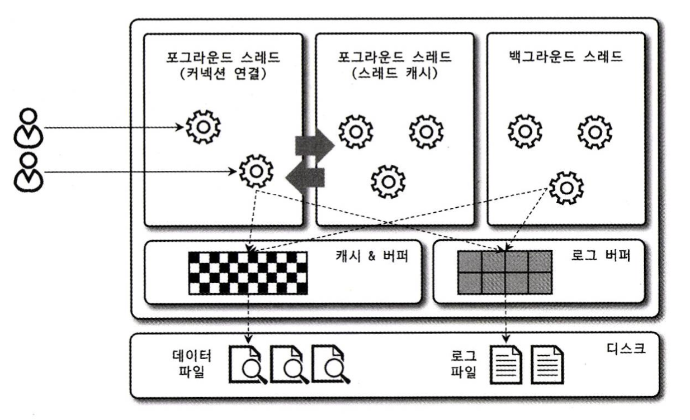

# 아키텍처 (MySQL Engine)

## MySQL의 전체 구조


MySQL 서버는 `사람의 머리역할을 하는 MySQL 엔진`과 `손발 역할을 담당하는 스토리지 엔진`으로 구분할 수 있다.  

그 중에서 MySQL 엔진은 클라이언트의 접속 및 쿼리 요청을 처리하는 커넥션 핸들러와 SQL 파서 및 전처리기, 쿼리의 최적화된 실행을 위한 옵티마이저가 중심을 이룬다.  
반대로 스토리지 엔진은 실제 데이터를 디스크에 저장하거나 디스크로부터 데이터를 읽어오는 부분을 전담한다.  

#
  
MySQL 서버에서 MySQL 엔진은 하나지만 스토리지 엔진은 여러 개를 동시에 사용하는 것이 가능하다.  

```sql
CREATE TABLE test_table (fd1 INT, fd2 INT) ENGINE=INNODB;
```
 
위와 같이 테이블이 사용할 스토리지 엔진을 지정해서  
지정한 스토리지가 해당 테이블의 모든 읽기 작업이나 변경 작업을 전담하도록 할 수 있다.

---

## MySQL Thread



MySQL 서버는 스레드 기반으로 작동하며, 크게 `포그라운드 스레드`와 `백그라운드 스레드`로 구분할 수 있다.  

MySQL 커뮤니티 에디션에서 사용되는 전통적인 스레드 모델은 커넥션 별로 포그라운드 스레드가 하나씩 생성되고 할당된다.  
  
MySQL 엔터프라이즈 에디션과 Percona MySQL 서버에서는 전통적인 스레드 모델뿐만 아니라 `스레드 풀(Thread Pool)` 모델을 사용할 수도 있다. 
스레드 풀에서는 커넥션과 포그라운드 스레드의 관계가 1:1이 아닌 하나의 스레드가 여러 커넥션을 전담한다.


## Foreground Thread (Client Thread)

포그라운드 스레드는 주로 각 클라이언트 사용자가 요청하는 쿼리 문장을 처리하는 역할을 한다.  
  
MySQL의 데이터 버퍼나 캐시로부터 데이터를 가져오는데,  
버퍼나 캐시에 없는 경우에는 직접 디스크의 데이터나 인덱스 파일로부터 데이터를 읽어와서 작업을 처리한다.

> MyISAM 테이블의 경우 디스크 쓰기 작업까지 포그라운드 스레드가 처리하지만  
> InnoDB 테이블은 데이터 버퍼나 캐시까지만 포그라운드 스레드가 처리하고, 나머지 버퍼로부터 디스크까지 기록하는 작업은 백그라운드 스레드가 처리한다.
  
최소 MySQL 서버에 접속된 클라이언트 수만큼 존재하며, 커넥션이 종료되면 해당 커넥션을 담당하던 스레드는 다시 스레드 캐시로 되돌아간다.  
이때 시스템 변수 `thread_cache_size`로 유지시킬 최대 스레드 개수를 설정해서 일정 개수의 스레드만 스레드 캐시에 존재하도록 할 수 있다.  

#

## Background Thread

InnoDB에서는 MyISAM과 달리 여러가지 작업들이 백그라운드 스레드로 처리된다.  

> Insert Buffer를 병합하는 스레드  
> 로그를 디스크로 기록하는 스레드  
> InnoDB 버퍼 풀의 데이터를 디스크에 기록하는 스레드  
> 데이터를 버퍼로 읽어오는 스레드  
> 잠금이나 데드락을 모니터링 하는 스레드  
  
이 중에서도 가장 중요한 스레드는 `로그 스레드와`, 버퍼의 데이터를 디스크에 기록하는 `쓰기 스레드`이다.  
  
InnoDB에서도 데이터를 읽는 작업은 주로 포그라운드 스레드에서 처리되기 때문에 읽기 스레드의 개수는 많이 설정할 필요가 없지만  
쓰기 스레드는 아주 많은 작업을 백그라운드로 처리하기 때문에 충분히 설정하는 것이 좋다.  

읽는 작업과 달리 쓰는 작업은 아주 많은 작업을 백그라운드 스레드로 처리하기 때문에 일반적인 내장 디스크를 사용할 때는 2~4 정도,  
DAN나 SAN과 같은 스토리지를 사용할 때는 디스크를 최적으로 사용할 수 있을 만큼 충분히 설정하는 것이 좋다.

### 지연 쓰기: InnoDB와 MyISAM

일반적인 상용 DBMS(InnoDB)는 대부분 쓰기 작업을 `버퍼링`해서 일괄 처리하는 기능이 탑재되어 있다.  
이러한 이유로 InnoDB에서는 쿼리로 데이터가 변경되는 경우 데이터가 완전히 디스크에 반영될 때 까지 기다리지 않아도 된다.  
- 사용자는 더 빠른 응답을 받을 수 있고, 작업이 백그라운드에서 처리되는 동안 다른 작업을 수행할 수 있다.
- 더 효율적이고 성능이 향상된다.
  
하지만 MyISAM은 클라이언트 스레드가 쓰기 작업까지 처리하도록 설계되어있기 때문에 일반적인 쿼리는 쓰기 버퍼링 기능을 사용할 수 없다.

## Reference

**위 내용은 책 RealMySQL 8.0을 구입하여 읽고 정리하였습니다.**
- [도서 홈페이지 https://wikibook.co.kr/realmysql801/](https://wikibook.co.kr/realmysql801/)
- [MySQL 8.0 Document https://dev.mysql.com/doc/refman/8.0/en/pluggable-storage-overview.html](https://dev.mysql.com/doc/refman/8.0/en/pluggable-storage-overview.html)
