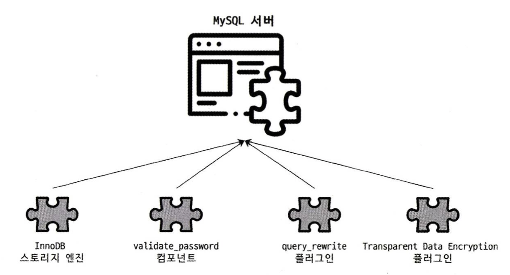

# 아키텍처 (MySQL Engine)

## 플러그인 모델

MySQL의 독특한 구조 중 대표적인 것이, `플러그인으로 서버 기능을 확장`을 할 수 있도록 지원하는 것이다.  

> 플러그인(plugin)이란?  
> plug-in, 끼워넣는다는 의미로, 기존 응용프로그램이나 컴퓨터에 추가 프로그램을 설치하여 특정 기능을 수행할 수 있도록 하는 소프트웨어를 말한다.

MySQL은 기본적으로 많은 스토리지 엔진을 지원하며  
스토리지 엔진 뿐만 아니라, 검색어 파서, 여러 Authentication들도 모두 플러그인도 구현되어 제공된다.  
플러그인 덕분에 원한다면 사용자가 직접 스토리지 엔진을 개발할 수도 있다.

## 컴포넌트

플러그인 아키텍처를 대체하기 위해 MySQL은 8.0 버전부터 `컴포넌트 아키텍처`를 지원하며,  
아래의 플러그인 단점들을 보완해서 구현되었다.

- 플러그인은 오직 MySQL 서버와 인터페이스할 수 있고, 플러그인끼리는 통신할 수 없다.
- 플러그인은 MySQL 서버의 변수나 함수를 직접 호출하기 때문에 안전하지 않다.
- 플러그인은 상호 의존 관계를 설정할 수 없어서 초기화가 어렵다.
- 플러그인이 작동하려면 실행 중인 서버가 필요하다.

플러그인과 마찬가지로 서버 기능을 확장하는 측면에서는 기능이 유사하다.  
하지만 구현된 아키텍처 측면에서 둘은 많은 차이를 보인다.  

#
  
컴포넌트 인프라는 MySQL 서버 하위 시스템을 일련의 논리적 컴포넌트로 캡슐화하는 것을 목표로 한다.  
기능을 확장하기 위해 실행 중인 서버에 추가 컴포넌트를 추가할 수 있고 동적, 정적으로 연결될 수 있다.  

각 컴포넌트는 는 다른 컴포넌트가 사용할 수 있는 광범위한 명명된 API, 서비스 집합의 구현을 제공한다.  
이를 용이하게 하기 위해 모든 컴포넌트에 사용 가능한 모든 서비스의 레지스트리가 존재한다.
  
각 컴포넌트는 서비스를 통해서만 다른 컴포넌트와 통신하며 제공하고 사용하는 서비스를 명시적으로 명시한다.  

인프라를 통해 컴포넌트는 관련 서비스 API를 다시 구현하여 다른 컴포넌트를 재정의하고 보완할 수 있다.

## Reference

**위 내용은 책 RealMySQL 8.0을 구입하여 읽고 정리하였습니다.**
- [도서 홈페이지 https://wikibook.co.kr/realmysql801/](https://wikibook.co.kr/realmysql801/)
- [MySQL 8.0 Document https://dev.mysql.com/doc/dev/mysql-server/latest/PAGE_COMPONENTS.html#sect_components_services_inventory](https://dev.mysql.com/doc/dev/mysql-server/latest/PAGE_COMPONENTS.html#sect_components_services_inventory)

