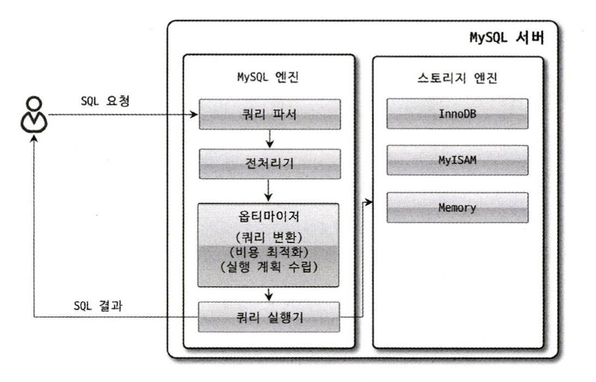

# 아키텍처 (MySQL Engine)

## 쿼리 실행 구조



MySQL이 쿼리를 처리하는 과정을 간략하게 나타낸 그림이다.  
  
SQL 요청이 MySQL 엔진의 쿼리 파서에 들어오는 부분부터  
MySQL 엔진이 핸들러(스토리지 엔진)에게 요청하는 과정까지를 나타낸다.  
  
각 기능은 다음과 같다.

### 쿼리 파서

쿼리 파서는 사용자 요청으로 들어온 `쿼리 문장을 Token으로 분리하여 트리 형태의 구조로 만들어 내는` 작업을 의미한다.  
쿼리 문장의 기본적인 문법 오류는 이 과정에서 발견되고 사용자에게 오류 메시지를 전달하게 된다.  

### 전처리기

파서에서 만들어진 `트리를 바탕으로 쿼리 문장에 구조적인 문제점이 있는지 확인`한다.  
해당 객체의 존재 여부와 객체의 접근 권한 등을 확인하는 과정을 여기서 수행한다.  

### 옵티마이저

DBMS의 두뇌에 해당하며, 사용자의 요청으로 들어온 `쿼리 문장을 저렴한 비용으로 가장 빠르게 처리할지를 결정`하는 역할을 담당한다.  

### 실행 엔진

옵티마이저와 핸들러의 중간에서 관리자의 역할을 수행한다.  
실행 엔진은 만들어진 계획대로 `각 핸들러에게 요청해서 받은 결과를 또 다른 핸들러 요청의 입력으로 연결`하는 역할을 담당한다.  

```
group by를 처리하는 과정의 예시

옵티마이저가 group by를 처리하기 위해 임시 테이블을 사용하기로 결정했다

-> 실행 엔진은 핸들러에게 임시 테이블을 만들라고 요청

-> 이어서 실행 엔진은 where 절에 일치하는 레코드를 읽어오라고 핸들러에게 요청

-> 읽어온 레코드들을 이전에 준비한 임시 테이블에 저장하라고 다시 핸들러에게 요청  

-> 데이터가 저장된 임시 테이블에서 필요한 방식으로 데이터를 읽어오라고 핸들러에게 다시 요청

-> 최종적으로 실행 엔진은 결과를 사용자나 다른 모듈로 전달
```
