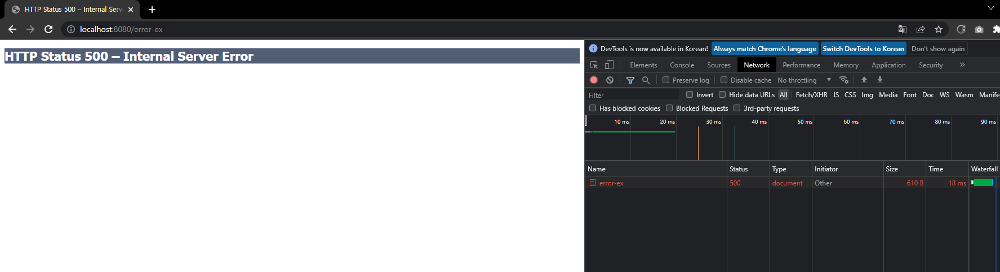
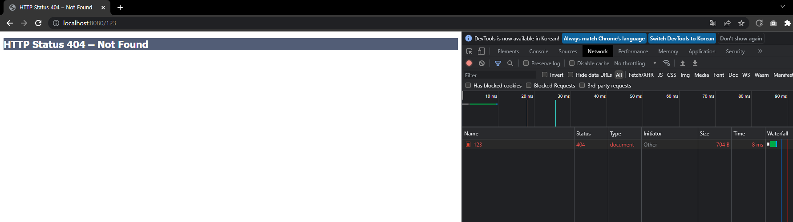
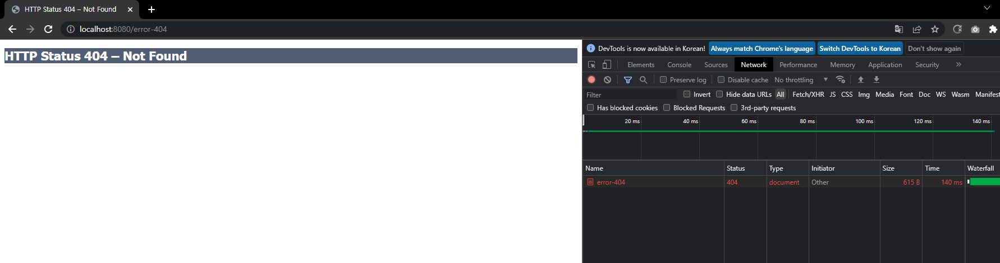
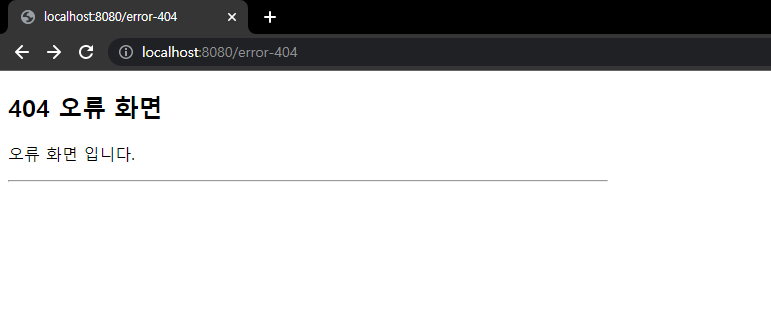
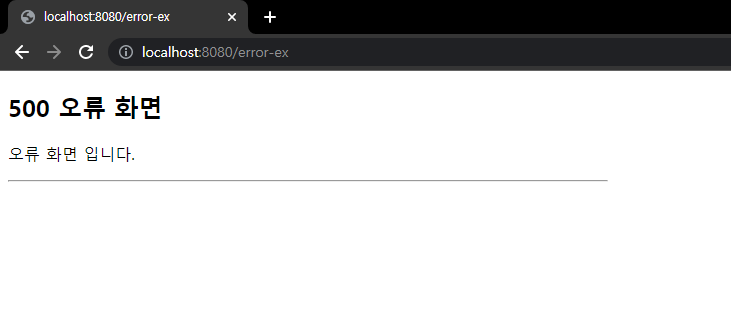

# 13. 예외 처리와 오류 페이지

## 서블릿 예외 처리 - 시작

먼저 스프링이 아닌 순수 서블릿 컨테이너가 예외를 어떻게 처리하는지 알아보자.  
  
서블릿이 지원하는 예외 처리 방식은 2가지가 있다.
- Exception(예외)
- response.sendError(HTTP 상태 코드, 오류 메시지)

### Exception(예외)

- 자바 직접 실행
    - 자바의 메인 메서드를 직접 실행하는 경우 main 이라는 이름의 쓰레드가 실행된다.
    - 실행 도중에 예외를 잡지 못하고 처음 실행한 main() 메서드를 넘어서 예외가 던저지면, 예외 정보를 남기고 해당 쓰레드는 종료된다.
- 웹 어플리케이션
    - 웹 어플리케이션은 사용자 요청별로 별도의 쓰레드가 할당되고, 서블릿 컨테이너 안에서 실행된다.
    - 만약 애플리케이션에서 try-catch로 예외를 잡지 못하고, 서블릿 밖으로 까지 예외가 전달되면 어떻게 동작할까?

```
WAS(여기까지 전파) <- 필터 <- 서블릿 <- 인터셉터 <- 컨트롤러(예외발생)
```

예외를 잡지 못하면 결국 톰캣 같은 WAS 까지 예외가 전달된다.  

#

### applicaiton.properties
```
server.error.whitelabel.enabled=false
```

WAS에서는 예외가 올라오면 어떻게 처리하는지 테스트 해보기위해 스프링 부트가 제공하는 기본 예외 페이지를 잠시 꺼두도록 하자.

### ServletExController - 서블릿 예외 컨트롤러
```java
package hello.exception.servlet;

import lombok.extern.slf4j.Slf4j;
import org.springframework.stereotype.Controller;
import org.springframework.web.bind.annotation.GetMapping;

@Slf4j
@Controller
public class ServletExController {

    @GetMapping("/error-ex")
    public void errorEx() {
        throw new RuntimeException("예외 발생!");
    }
}
```



실행해보면 개발자 모드로 확인해보면 HTTP 상태코드가 500으로 보이고, tomcat이 기본으로 제공하는 오류 화면을 볼 수 있다.  
Exception의 경우 서버 내부에서 처리할 수 없는 오류가 발생한 것으로 생각해서 HTTP 상태 코드 500을 반환한다.



아무 페이지나 호출해보면 톰캣이 기본으로 제공하는 404 오류 화면이 나타난다.

#

### response.sendError(HTTP 상태코드, 오류 메시지)

오류가 발생했을 때 HttpServletResponse가 제공하는 sendError라는 메서드를 사용해도 된다.  
이것을 호출한다고 당장 예외가 발생하는 것은 아니지만, 서블릿 컨테이너에게 오류가 발생했다는 점을 전달할 수 있다.

### ServletExController - 추가
```java
@GetMapping("/error-404")
public void error404(HttpServletResponse response) throws IOException {
    response.sendError(404, "404 오류!");
}

@GetMapping("/error-500")
public void error500(HttpServletResponse response) throws IOException {
    response.sendError(500);
}
```

### sendError 흐름
```
WAS(sendError 호출 기록 확인) <- 필터 <- 서블릿 <- 인터셉터 <- 컨트롤러(response.sendError())
```

response.sendError()를 호출하면 response 내부에는 오류가 발생했다는 상태를 저장해둔다.  
그리고 서블릿 컨테이너는 고객에게 응답 전에 response에 sendError()가 호출되었는지 확인하고  
설정한 오류 코드에 맞추어 기본 오류 페이지를 보여준다.



---

## 서블릿 예외 처리 - 오류 화면 제공

서블릿 컨테이너가 제공하는 기본 예외 처리 화면은 고객 친화적이지 않다.  
스프링 부트를 통해서 서블릿이 제공하는 오류 화면 기능을 사용해보자.

### 서블릿 오류 페이지 등록
```java
package hello.exception;

import org.springframework.boot.web.server.ConfigurableWebServerFactory;
import org.springframework.boot.web.server.ErrorPage;
import org.springframework.boot.web.server.WebServerFactoryCustomizer;
import org.springframework.http.HttpStatus;
import org.springframework.stereotype.Component;

@Component
public class WebServerCustomizer implements WebServerFactoryCustomizer<ConfigurableWebServerFactory> {

    @Override
    public void customize(ConfigurableWebServerFactory factory) {

        ErrorPage errorPage404 = new ErrorPage(HttpStatus.NOT_FOUND, "/error-page.404");
        ErrorPage errorPage500 = new ErrorPage(HttpStatus.INTERNAL_SERVER_ERROR, "/error-page.500");
        ErrorPage errorPageEx = new ErrorPage(RuntimeException.class, "/error-page.500");
        
        factory.addErrorPages(errorPage404, errorPage500, errorPageEx);
    }
}
```

오류 페이지는 예외를 다룰 때 해당 예외와 그 자식 타입의 오류를 함께 처리한다.  
예를 들어 위의 경우 RuntimeException은 물론이고 RuntimeException의 자식도 함께 처리한다.

### 오류 처리 컨트롤러
```java
package hello.exception.servlet;

import lombok.extern.slf4j.Slf4j;
import org.springframework.stereotype.Controller;
import org.springframework.web.bind.annotation.RequestMapping;

import javax.servlet.http.HttpServletRequest;
import javax.servlet.http.HttpServletResponse;

@Slf4j
@Controller
public class ErrorPageController {

    @RequestMapping("/error-page/404")
    public String errorPage404(HttpServletRequest request, HttpServletResponse response) {
        log.info("errorPage 404");
        return "error-page/404";
    }
    
    @RequestMapping("/error-page/500")
    public String errorPage500(HttpServletRequest request, HttpServletResponse response) {
        log.info("errorPage 500");
        return "error-page/500";
    }
}
```

### 오류 처리 View
```html
<!DOCTYPE HTML>
<html xmlns:th="http://www.thymeleaf.org">
<head>
    <meta charset="utf-8">
</head>
<body>
<div class="container" style="max-width: 600px">
    <div class="py-5 text-center">
        <h2>404 오류 화면</h2>
    </div>
    <div>
        <p>오류 화면 입니다.</p>
    </div>
    <hr class="my-4">
</div> <!-- /container -->
</body>
</html>
```

```html
<!DOCTYPE HTML>
<html xmlns:th="http://www.thymeleaf.org">
<head>
    <meta charset="utf-8">
</head>
<body>
<div class="container" style="max-width: 600px">
    <div class="py-5 text-center">
        <h2>500 오류 화면</h2>
    </div>
    <div>
        <p>오류 화면 입니다.</p>
    </div>
    <hr class="my-4">
</div> <!-- /container -->
</body>
</html>
```


### 테스트

  


---

## 서블릿 예외 처리 - 오류 페이지 작동 원리
