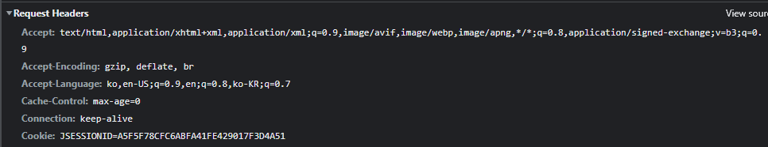

# 12. 로그인 처리 - 세션

## 쿠키와 보안 문제

쿠키를 사용해서 로그인id를 전달해서 로그인을 유지할 수 있었다. 그런데 여기에는 심각한 보안 문제가 있다.

### 보안 문제
- 쿠키 값은 임의로 변경할 수 있다.
    - 클라이언트가 쿠키를 강제로 변경하면 다른 사용자가 된다.
    - 실제 웹브라우저 개발자 모드 -> Application -> Cookie 변경으로 확인
    - Cookie: memberId=1 -> Cookie: memberId=2 (다른 사용자의 이름이 보인다)
- 쿠키에 보관된 정보는 훔쳐갈 수 있다.
    - 만약 쿠키에 개인정보나, 신용카드 정보가 있다면?
    - 이 정보가 웹 브라우저에도 보관되고, 네트워크 요청마다 계속 클라이언트에서 서버로 전달된다.
    - 쿠키의 정보가 나의 로컬 PC에서 털릴 수도 있고, 네트워크 전송 구간에서 털릴 수도 있다.
- 해커가 쿠키를 한 번 훔쳐가면 평생 사용할 수 있다.
    - 해커가 쿠키를 훔쳐가서 그 쿠키로 악의적인 요청을 계속 시도할 수 있다.

### 대안
- 쿠키에 중요한 값을 노출하지 않고, 사용자 별로 예측 불가능한 임의의 토큰을 노출하고, 서버에서 토큰과 id를 매핑해서 인식한다. 그리고 서버에서 토큰을 관리한다.
- 토큰은 해커가 임의의 값을 넣어도 찾을 수 없도록 예상 불가능 해야 한다.
- 해커가 토큰을 털어가도 시간이 지나면 사용할 수 없도록 서버에서 해당 토큰의 만료시간을 짧게 유지한다.
- 해킹이 의심되는 경우 서버에서 해당 토큰을 강제로 제거하면 된다.

---

## 로그인 처리하기 - 세션 동작 방식

- 로그인
    - 사용자가 loginId, password 정보를 전달하면 서버에서 해당 사용자가 맞는지 확인한다.
- 세션 생성
    - 세션 ID를 생성하는데, 추정 불가능해야 한다.
    - UUID를 이용한다. UUID는 추정이 불가능하다.
    - 생성된 세션 ID와 세션에 보관할 값을 서버의 세션 저장소에 보관한다. (sessionId, value)
- 세션ID를 응답 쿠키로 전달
    - 서버는 클라이언트에 mySessionId라는 이름으로 세션 ID만 쿠키에 담아서 전달한다.
    - 클라이언트는 쿠키 저장소에 mySessionId 쿠키를 보관한다.
- 클라이언트의 세션id 쿠키 전달
    - 클라이언트는 요청시 항상 mySessionId 쿠키를 전달한다.
    - 서버에서는 클라이언트가 전달한 mySessionId 쿠키 정보로 세션 저장소를 조회해서 로그인시 보관한 세션 정보를 사용한다.

### 중요
- 중요한 포인트는 회원과 관련된 정보는 전혀 클라이언트에 전달하지 않는다는 점이다.
- 오직 추정 불가능한 세션 ID만 쿠키를 통해 클라이언트에 전달한다.

---

## 로그인 처리하기 - 세션 직접 만들기

- 세션 생성
    - sessionId 생성
    - 세션 저장소에 sessionId와 보관할 값 저장
    - sessionId로 응답 쿠키를 생성해서 클라이언트에 전달
- 세션 조회
    - 클라이언트가 요청한 sessionId 쿠키의 값으로, 세션 저장소에 보관한 값 조회
- 세션 만료
    - 클라이언트가 요청한 sessionId 쿠키의 값으로, 세션 저장소에 보관한 sessionId와 값 제거

### SessionManager - 세션 관리

```java
package hello.login.web.session;

import org.springframework.stereotype.Component;

import javax.servlet.http.Cookie;
import javax.servlet.http.HttpServletRequest;
import javax.servlet.http.HttpServletResponse;
import java.util.Arrays;
import java.util.Map;
import java.util.UUID;
import java.util.concurrent.ConcurrentHashMap;

/**
 * 세션 관리
 */
@Component
public class SessionManager {

    public static final String SESSION_COOKIE_NAME = "mySessionId";

    private Map<String, Object> sessionStore = new ConcurrentHashMap<>();

    /**
     * 세션 생성
     */

    public void createSession(Object value, HttpServletResponse response) {

        //세션 id를 생성하고, 값을 세션에 저장
        String sessionId = UUID.randomUUID().toString();
        sessionStore.put(sessionId, value);

        //쿠키 생성
        Cookie mySessionCookie = new Cookie(SESSION_COOKIE_NAME, sessionId);
        response.addCookie(mySessionCookie);
    }

    /**
     * 세션 조회
     */
    public Object getSession(HttpServletRequest request) {
        Cookie sessionCookie = findCookie(request, SESSION_COOKIE_NAME);
        if (sessionCookie == null) return null;
        return sessionStore.get(sessionCookie.getValue());
    }

    /**
     * 세션 만료
     */
    public void expire(HttpServletRequest request) {
        Cookie sessionCookie = findCookie(request, SESSION_COOKIE_NAME);
        if (sessionCookie != null) {
            sessionStore.remove(sessionCookie.getValue());
        }
    }
    
    
    private Cookie findCookie(HttpServletRequest request, String cookieName) {
        if (request.getCookies() == null) {
            return null;
        }

        return Arrays.stream(request.getCookies())
                .filter(cookie -> cookie.getName().equals(cookieName))
                .findAny()
                .orElse(null);
    }
}
```

#

### SessionManagerTest - 테스트

```java
package hello.login.web.session;

import hello.login.domain.member.Member;
import org.assertj.core.api.Assertions;
import org.junit.jupiter.api.Test;
import org.springframework.mock.web.MockHttpServletRequest;
import org.springframework.mock.web.MockHttpServletResponse;

import static org.assertj.core.api.Assertions.*;

public class SessionManagerTest {

    SessionManager sessionManager = new SessionManager();

    @Test
    void sessionTest() {

        //세션 생성
        MockHttpServletResponse response = new MockHttpServletResponse();
        Member member = new Member();
        sessionManager.createSession(member, response);

        //요청에 응답 쿠키 저장
        MockHttpServletRequest request = new MockHttpServletRequest();
        request.setCookies(response.getCookies());

        //세션 조회
        Object result = sessionManager.getSession(request);
        assertThat(result).isEqualTo(member);

        //세션 만료
        sessionManager.expire(request);
        Object expired = sessionManager.getSession(request);
        assertThat(expired).isNull();
    }
}
```

---

## 로그인 처리하기 - 직접 만든 세션 적용

### LoginController - loginV2()
```java
@PostMapping("/login")
public String loginV2(@Valid @ModelAttribute LoginForm form, BindingResult bindingResult, HttpServletResponse response) {
    if (bindingResult.hasErrors()) {
        return "login/loginForm";
    }

    Member loginMember = loginService.login(form.getLoginId(), form.getPassword());
    log.info("login? {}", loginMember);

    if (loginMember == null) {
        bindingResult.reject("loginFail", "아이디 또는 비밀번호가 맞지 않습니다.");
        return "login/loginForm";
    }

    //로그인 성공 처리
    //세션 관리자를 통해 세션을 생성하고 회원 데이터 보관
    sessionManager.createSession(loginMember, response);

    return "redirect:/";
}
```

#

### LoginController - logoutV2()
```java
@PostMapping("/logout")
public String logoutV2(HttpServletRequest request) {
    sessionManager.expire(request);
    return "redirect:/";
}
```

#

### HomeController - homeLoginV2()
```java
@GetMapping("/")
public String homeLoginV2(HttpServletRequest request, Model model) {

    //세션 관리자에 저장된 회원 정보 조회
    Member member = (Member)sessionManager.getSession(request);
    if (member == null) {
        return "home";
    }

    //로그인
    model.addAttribute("member", member);
    return "loginHome";
}
```

---

## 로그인 처리하기 - 서블릿 HTTP 세션1

세션이라는 개념은 대부분의 웹 애플리케이션에 필요한 것이다.  
서블릿은 세션을 위해 HttpSession 이라는 기능을 제공하는데, 지금까지 나온 문제들을 해결해준다.  

### HttpSession
서블릿이 제공하는 HttpSession도 위에서 직접 만든 SessionManager와 같은 방식으로 동작한다.  
서블릿을 통해 HttpSession을 생성하면 다음과 같은 쿠키를 생성한다. 쿠키 이름이 JSESSIONID이고, 값은 추정 불가능한 랜덤 값이다.
```
Cookie: JSESSIONID=5B78E23B513F50164D6FDD8C97B0AD05
```

#

### SessionConst
```java
package hello.login.web;

public class SessionConst {
    public static final String LOGIN_MEMBER = "loginMember";
}
```
HttpSessiom에 데이터를 보관하고 조회할 때 필요한 상수를 정의

### LoginController - loginV3()
```java
@PostMapping("/login")
public String loginV3(@Valid @ModelAttribute LoginForm form, BindingResult bindingResult, HttpServletRequest request) {
    if (bindingResult.hasErrors()) {
        return "login/loginForm";
    }

    Member loginMember = loginService.login(form.getLoginId(), form.getPassword());
    log.info("login? {}", loginMember);

    if (loginMember == null) {
        bindingResult.reject("loginFail", "아이디 또는 비밀번호가 맞지 않습니다.");
        return "login/loginForm";
    }

    //로그인 성공 처리
        
    //세션이 있으면 있는 세션 반환, 없으면 신규 세선 생성
    HttpSession session = request.getSession();
    //세션에 로그인 회원 정보 보관
    session.setAttribute(SessionConst.LOGIN_MEMBER, loginMember);
        
    return "redirect:/";
}
```

#

### 세션 생성과 조회
세션을 생성하려면 request.getSession(true)를 사용하면 된다.
- request.getSession(true)
    - 세션이 있으면 기존 세션을 반환한다.
    - 세션이 없으면 새로운 세션을 생성해서 반환한다.
- request.getSession(false)
    - 세션이 있으면 기존 세션을 반환한다.
    - 세션이 없으면 새로운 세션을 생성하지 않는다. null을 반환한다.
- request.getSession() = request.getSession(true)


### LoginController - logoutV3()
```java
@PostMapping("/logout")
public String logoutV3(HttpServletRequest request) {
    //세션을 삭제
    HttpSession session = request.getSession(false);
    
    if (session != null) {
        session.invalidate(); //세션을 제거
    }
    return "redirect:/";
}
```

#

### HomeController - homeLoginV3()
```java
@GetMapping("/")
public String homeLoginV3(HttpServletRequest request, Model model) {

    HttpSession session = request.getSession(false);
    //세션이 없으면 home
    if (session == null) {
        return "home";
    }

    Member loginMember = (Member) session.getAttribute(SessionConst.LOGIN_MEMBER);
    //세션에 회원 데이터가 없으면 home
    if (loginMember == null) {
        return "home";
    }

    //세션이 유지되면 로그인으로 이동
    model.addAttribute("member", loginMember);
    return "loginHome";
}
```

request.getSession(false): request.getSession()를 사용하면 로그인 하지 않을 사용자도 의미없는 세션이 만들어진다.  
따라서 세션을 찾아서 사용하는 시점에는 create: false 옵션을 사용해서 세션을 생성하지 않아야 한다.  
  
session.getAttribute(SessionConst.LOGIN_MEMBER): 로그인 시점에 세션에 보관한 회원 객체를 찾는다.  



---

## 로그인 처리하기 - 서블릿 HTTP 세션2

### @SessionAttribute
스프링은 세션을 더 편리하게 사용할 수 있도록 @SessionAttribute를 지원한다.  
이미 로그인 된 사용자를 찾을 때는 다음과 같이 사용하면 된다. 이 기능은 세션을 생성하지 않는다
```
@SessionAttribute(name = "loginMember", required = false) Member loginMember
```

### HomeController - homeLoginV3Spring()
```java
@GetMapping("/")
public String homeLoginV3Spring(
    @SessionAttribute(name = SessionConst.LOGIN_MEMBER, required = false) 
    Member loginMember, Model model) {
        
    //세션에 회원 데이터가 없으면 home
    if (loginMember == null) {
        return "home";
    }

    //세션이 유지되면 로그인으로 이동
    model.addAttribute("member", loginMember);
    return "loginHome";
}
```

#

### TrackingModes

로그인을 처음 시도하면 URL이 다음과 같이 jsessionid를 포함한다.

이것은 웹 브라우저가 쿠키를 지원하지 않을 때 쿠키 대신 URL을 통해서 세션을 유지하는 방법이다.  
URL 전달 방식을 끄고 항상 쿠키를 통해서만 세션을 유지하고 싶으면 다음 옵션을 추가하면 된다.  
이렇게 하면 URL에 jsessionid가 노출되지 않는다

```
server.servlet.session.tracking-modes=cookie
```
