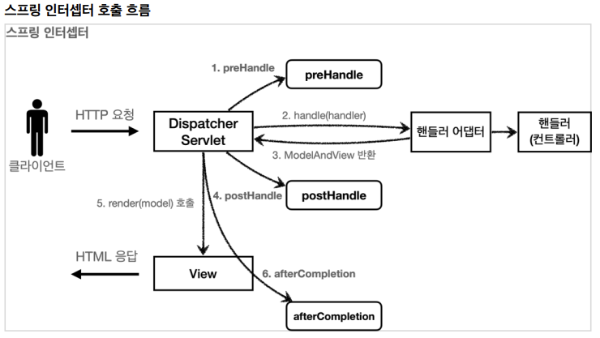

# 12. 로그인 처리 - 인터셉터

## 스프링 인터셉터 - 소개

스프링 인터셉터도 서블릿 필터와 같이 웹과 관련된 공통 관심 사항을 효과적으로 해결할 수 있는 기술이다.  
서블릿 필터가 서블릿이 제공하는 기술이라면, 스프링 인터셉터는 스프링 MVC가 제공하는 기술이다.  
둘다 웹과 관련된 공통 관심 사항을 처리하지만, 적용되는 순서와 범위, 그리고 사용방법이 다르다.

### 스프링 인터셉터 흐름
```
HTTP 요청 -> WAS -> 필터 -> 서블릿 -> 스프링 인터셉터 -> 컨트롤러
```

- 스프링 인터셉터는 디스패처 서블릿과 컨트롤러 사이에서 컨트롤러 호출 직전에 호출된다.
- 스프링 인터셉터는 스프링 MVC가 제공하는 기능이기 때문에 결국 디스패처 서블릿 이후에 등장하게 된다.

### 스프링 인터셉터 제한
```
HTTP 요청 -> WAS -> 필터 -> 서블릿 -> 스프링 인터셉터 -> 컨트롤러 // 로그인 사용자
HTTP 요청 -> WAS -> 필터 -> 서블릿 -> 스프링 인터셉터(적절하기 않은 요청이라 판단, 컨트롤러 호출X) // 비 로그인 사용자
```

### 스프링 인터셉터 체인
```
HTTP 요청 -> WAS -> 필터 -> 서블릿 -> 인터셉터1, 인터셉터2 -> 컨트롤러
```

중간에 인터셉터를 자유롭게 추가해서 로그를 남기는 인터셉터를 먼저 적용하고, 그 다음에 로그인 여부를 체크하는 인터셉터를 만들 수 있다.

#

### 스프링 인터셉터 인터페이스
```java
public interface HandlerInterceptor {

    default boolean preHandle(HttpServletRequest request, HttpServletResponse response, 
                            Object handler) throws Exception {}

    default void postHandle(HttpServletRequest request, HttpServletResponse response,
                            Object handler, @Nullable ModelAndView modelAndView) throws Exception {}

    default void afterCompletion(HttpServletRequest request, HttpServletResponse response,
                            Object handler, @Nullable Exception ex) throws Exception {}
}
```

- 서블릿 필터의 경우 단순히 doFilter() 하나만 제공된다.
- 인터셉터는 컨트롤러 호출 전(preHandle), 호출 후(postHandle), 요청 완료 이후(afterCompletion)와 같이 단계적으로 세분화 되어 있다.
- 서블릿 필터의 경우 request, response만 제공했지만, 인터셉터는 어떤 컨트롤러(handler)가 호출되는지 호출 정보도 받을 수 있다.
- 어떤 ModelAndView가 반환되는지 응답 정보도 받을 수 있다.

### 스프링 인터셉터 호출 흐름


### 정상 흐름
- preHandle: 컨트롤러 호출 전에 호출된다 (핸들러 어댑터 호출 전에 호출)
    - preHandle의 응답 값이 true면 다음으로 진행하고, false면 더 진행하지 않는다.
    - false인 경우 나머지 인터셉터는 물론이고, 핸들러 어댑터도 호출되지 않는다. 1번에서 끝이 나버린다.
- postHandle: 컨트롤러 호출 후에 호출된다 (핸들러 어댑터 호출 후에 호출)
- afterCompletion: 뷰가 렌더링 된 이후에 호출된다.

### 예외 발생시
- preHandle: 컨트롤러 호출 전에 호출된다.
- postHandle: 컨트롤러에서 예외가 발생하면 postHandle은 호출되지 않는다.
- afterCompletion: afterCompletion은 항상 호출된다. 이 경우 예외를 파라미터로 받아서 어떤 예외가 발생했는지 로그로 출력할 수 있다.
    - 예외가 발생하면 postHandle은 호출되지 않으므로 예외와 무관하게 공통처리를 하려면 afterCompletion을 사용해야 한다..

인터셉터는 스프링 MVC 구조에 특화된 필터 기능을 제공한다고 이해하면 된다.  
스프링 MVC를 사용하고, 특별히 필터를 꼭 사용해야 하는 상황이 아니라면 인터셉터를 사용하는 것이 더 편리하다.

---

## 스프링 인터셉터 - 요청 로그
```java
package hello.login.web.interceptor;

import lombok.extern.slf4j.Slf4j;
import org.springframework.web.method.HandlerMethod;
import org.springframework.web.servlet.HandlerInterceptor;
import org.springframework.web.servlet.ModelAndView;

import javax.servlet.http.HttpServletRequest;
import javax.servlet.http.HttpServletResponse;
import java.util.UUID;

@Slf4j
public class LogInterceptor implements HandlerInterceptor {

    public static final String LOG_ID = "logId";

    @Override
    public boolean preHandle(HttpServletRequest request, HttpServletResponse response, Object handler) throws Exception {

        String requestURI = request.getRequestURI();

        String uuid = UUID.randomUUID().toString();
        request.setAttribute(LOG_ID, uuid);

        //@RequestMapping: HandlerMethod
        //정적 리소스: ResourceHttpRequestsHandler
        if (handler instanceof HandlerMethod) {
            HandlerMethod hm = (HandlerMethod) handler; //호출할 컨트롤러 메서드의 모든 정보가 포함되어 있다.
        }

        log.info("REQUEST [{}][{}][{}]", uuid, requestURI, handler);
        return true; //false 진행X
    }

    @Override
    public void postHandle(HttpServletRequest request, HttpServletResponse response, Object handler, ModelAndView modelAndView) throws Exception {
        log.info("postHandle [{}]", modelAndView);
    }

    @Override
    public void afterCompletion(HttpServletRequest request, HttpServletResponse response, Object handler, Exception ex) throws Exception {
        String requestURI = request.getRequestURI();
        String logId = (String) request.getAttribute(LOG_ID);
        log.info("RESPONSE [{}][{}]", logId, requestURI);
        if (ex != null) {
            log.error("afterCompletion error!!", ex);
        }
    }
}
```

- request.setAttribute(LOG_ID, uuid)
    - 서블릿 필터의 경우 지역변수로 해결이 가능하지만, 스프링 인터셉터는 호출 시점이 완전히 분리되어있다.
    - preHandle에서 지정한 값을 postHandle, afterCompletion에서 함께 사용하려면 어딘가에 담아두어야 한다.
    - LogInterceptor도 싱글톤 처럼 사용되기 때문에 멤버변수를 사용하면 위험하다. 따라서 request에 담아두었다.
    - 이 값은 afterCompletion에서 request.getAttribute(LOG_ID)로 찾아서 사용한다.
- return true
    - true면 정상 호출이다. 다음 인터셉터나 컨트롤러가 호출된다.


