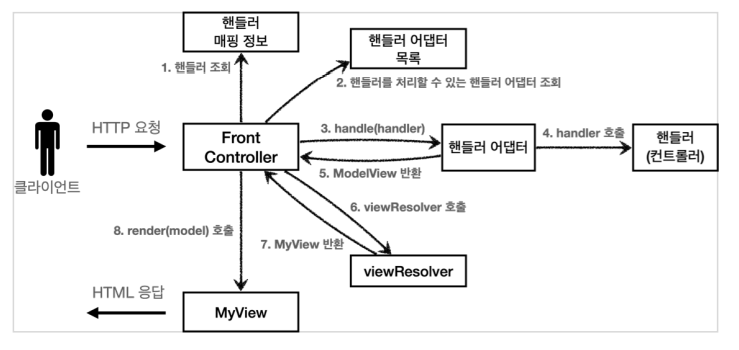

# 4. MVC 프레임워크 만들기

## 유연한 컨트롤러1 - v5

만약 어떤 개발자는 ControllerV3 방식으로 개발하고 싶고, 어떤 개발자는 ControllerV4 방식으로 개발하고 싶다면?  

```java
public interface ControllerV3 {

    ModelView process(Map<String, String> paramMap);
}
```

```java
public interface ControllerV4 {

    String process(Map<String, String> paramMap, Map<String, Object> model);
}
```

지금까지 우리가 개발한 프론트 컨트롤러는 한가지 방식의 컨트롤러 인터페이스만 사용할 수 있다.  
ControllerV3, ControllerV4는 완전히 다른 인터페이스이다. 따라서 호환이 불가능하다.  

#

### 어댑터 패턴

어댑터 패턴을 이용해서 프론트 컨트롤러가 다양한 방식의 컨트롤러를 처리할 수 있도록 변경해보자.

**V5 구조**  


- **핸들러 어댑터**
  - 중간에 어댑터 역할을 하는 어댑터가 추가되었는데 이름이 핸들러 어댑터이다.
  - 중간에서 어댑터 역할을 해주는 덕분에 다양한 종류의 컨트롤러를 호출할 수 있다.
- **핸들러**
  - 컨트롤러의 이름을 더 넓은 범위인 핸들러로 변경했다.
  - 이제 어댑터가 있기 때문에 꼭 컨트롤러의 개념 뿐만 아니라 어떠한 것이든 해당하는 종류의 어댑터만 있으면 다 처리할 수 있기 때문이다

