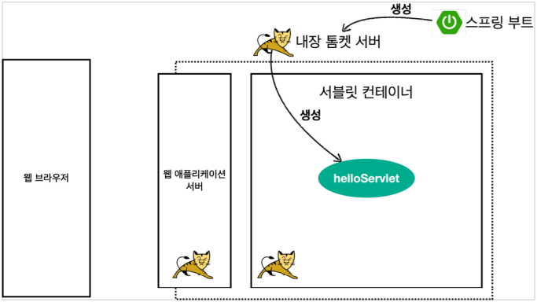
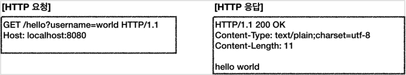
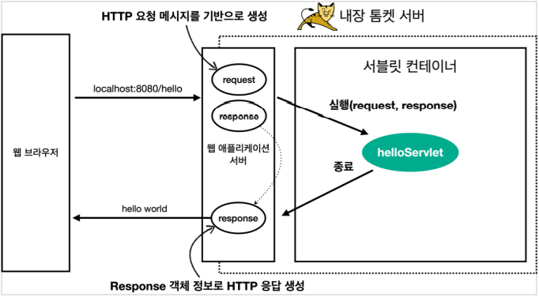
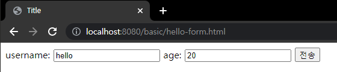

# 서블릿

## Hello 서블릿

- 톰켓 서버를 직접 설치해서 서블릿을 실행하는 과정은 매우 번거롭고 복잡하다.
- 서블릿을 공부하는데에 집중하기 위해, 톰켓 서버를 내장하고 있는 스프링 부트를 활용하여 서블릿 코드를 실행시켜보고 공부해보자.

### 스프링 부트 서블릿 환경 구성

- 스프링 부트는 서블릿을 직접 등록해서 사용할 수 있도록 @ServletComponenetScan을 지원한다.

``` java
@ServletComponentScan //서블릿 자동 등록
@SpringBootApplication
public class ServletApplication {

	public static void main(String[] args) {
		SpringApplication.run(ServletApplication.class, args);
	}

}
```
#

### 서블릿 등록하기

- @WebServlet 서블릿 애노테이션
  - name: 서블릿 이름
  - urlPartterns: URL 매핑

```java
@WebServlet(name = "helloServlet", urlPatterns = "/hello")
public class HelloServlet extends HttpServlet {

    @Override
    protected void service(HttpServletRequest request, HttpServletResponse response) throws ServletException, IOException {
    ...
    }
}
```
- HTTP 요청을 통해 매핑된 URL이 호출되면 서블릿 컨테이너는 service 메소드를 실행한다.

#

### 서블릿 컨테이너 동작 방식 설명

#### 내장 톰켓 서버 생성


- 스프링 부트가 실행하면서 내장 톰켓 서버를 생성해준다.
- 톰켓 서버는 내부에 서블릿 컨테이너 기능을 내장하고 있어, 컨테이너 안에 서블릿들을 자동으로 생성시켜준다.

#### HTTP요청, HTTP응답 메시지


- http://localhost:8080/hello?username=world 
- url이 요청으로 들어오면 웹 브라우저가 HTTP요청 메시지를 만들어서 서버로 넘겨주게된다.

#### 웹 어플리케이션 서버의 요청 응답 구조


- WAS 서버는 HTTP 요청이 오면, requset response 객체를 만들어서 싱클톤으로 생성되어있는 helloServlet을 호출한다.
- helloServlet 안에 있는 service 메소드를 실행시키고, 개발자가 response 데이터에 Content-Type 정보나 hello world와 같은 메시지를 넣는다.
- helloServlet이 종료되면 WAS 서버가 response 정보를 가지고 HTTP 응답 메시지를 만들어서 반환시킨다.
---

## HttpServletRequest

### HttpServletRequest 역할

- HTTP요청 메시지를 개발자가 직접 파싱해서 사용해도 되지만 매우 불편하다.
- 서블릿은 개발자가 요청 메시지를 편하게 사용할 수 있도록 개발자 대신 HTTP요청 메시지를 파싱한다.
- 그 결과를 HttpServletRequest객체에 담아서 제공한다.

#

### HTTP 요청 메시지

```http
POST /save HTTP/1.1
Host: localhost:8080
Content-Type: application/x-www-form-urlencoded


username=kim&age=20
```

- START LINE
	- HTTP 메소드
	- URL
	- 쿼리 스트링
	- 스키마, 프로토콜
- 헤더
	- 헤더 조회
- 바디
	- form 파라미터 형식 조회
	- message body 데이터 직접 조회

HttpServletRequest 객체는 추가로 여러가지 부가기능도 함께 제공한다.
- 해당 HTTP 요청이 시작부터 끝날 때 까지 유지되는 임시 저장소 기능
	- 저장: ```request.setAttribute(name, value)```
	- 조회: ```request.getAttribute(name)```
- 세션 관리 기능
	- ```request.getSession(create: true)```
---

### HTTP 요청 데이터 - 개요

HTTP 요청 메시지를 통해 클라이언트에서 서버로 데이터를 전달하는 방법 3가지

- GET - 쿼리 파라미터
	- /url?username=hello&age=20
	- 메시지 바디 없이, URL의 쿼리 파라미터에 데이터를 포함해서 전달
	- 검색, 필터, 페이징등에서 많이 사용하는 방식
- POST - HTML Form
	- content-type: application/x-www-form-urlencoded
	- 메시지 바디에 쿼리 파라미터 형식으로 전달 username=hello&age=20
	- 회원 가입, 상품 주문, HTML Form 사용
- HTTP message body에 데이터를 직접 담아서 요청
	- HTTP API에서 주로 사용, JSON, XML, TEXT
	- POST, PUT, PATCH
---

### HTTP 요청 데이터 - GET 쿼리 파라미터

메시지 바디 없이 URL의 쿼리 파라미터를 사용해서 데이터를 전달 할 때  
- http://localhost:8080/request-param?username=hello&age=20  
- http://localhost:8080/request-param?username=hello&username=kim&age=20

서버에서는 HttpServletRequest가 제공하는 다음 메서드를 통해 쿼리 파라미터를 편리하게 조회할 수 있다.

```java
String username = request.getParameter("username") //단일 파라미터 조회
Enumeration<String> parameterNames = request.getParameterNames(); //파라미터 이름들 모두 조회
Map<String, String[]> parameterMap = request.getParameterMap(); //파라미터를 Map으로 모두 조회
String[] usernames = request.getParameterValues("username"); //복수 파라미터 조회
```

- request.getParameter()는 하나의 파라미터 이름에 대해서 단 하나의 값만 있을 때 사용해야 한다.
- username=hello&username=kim과 같이 값이 중복일 때는 request.getParameterValues()를 사용해야 한다.
- 중복일 때 request.getParameter()를 사용하면 request.getParameterValues()의 첫 번째 값을 반환한다.

#

### HTTP 요청 데이터 - POST HTML Form

HTML의 Form을 사용해서 클라이언트에서 서버로 데이터를 전송 할 때
주로 회원가입, 상품 주문 등에서 사용하는 방식이다.

- content-type: application/x-www-form-urlencoded
- **메시지 바디에 쿼리 파라미터 형식**으로 데이터를 전달한다. username=hello&age=20

```java
<form action="/request-param" method="post">
```


POST의 HTML Form을 전송하면 웹 브라우저는 다음 형식으로 HTTP 메시지를 만든다.
- 요청 URL: http://localhost:8080/request-param
- content-type: applicaion/x-www-form-urlencoded
- message body: username=hello&age=20

applicaion/x-www-form-urlencoded 형식은 앞서 GET에서 살펴본 쿼리 파라미터 형식과 같다.  
따라서 **쿼리파라미터 조회 메서드를 그대로 사용**하면 된다.

클라이언트(웹 브라우저) 입장에서는 두 방식에 차이가 있지만, **서버 입장에서는 둘의 형식이 동일**하므로,  
request.getParameter()로 편리하게 구분없이 조회할 수 있다.

- content-type은 HTTP 메시지 바디의 데이터 형식을 지정한다.
- GET URL 쿼리 파라미터 형식으로 클라이언트에서 서버로 데이터를 전달할 때는  
 HTTP 메시지 바디를 사용하지 않기 때문에 content-type이 없다.
 
 #
 
 ### HTTP 요청 데이터 - API 메시지 바디 - 단순 텍스트
 
 - **HTTP message body**에 데이터를 직접 담아서 요청
 - HTTP API에서 주로 사용. JSON, XML, TEXT
 - 데이터 형식은 주로 JSON 사용
 - POST, PUT, PATCH

```java
@Override
 protected void service(HttpServletRequest request, HttpServletResponse response) throws ServletException, IOException {
 
 ServletInputStream inputStream = request.getInputStream();
 String messageBody = StreamUtils.copyToString(inputStream, StandardCharsets.UTF_8);

}
```

### HTTP 요청 데이터 - API 메시지 바디 - JSON

```java
@Getter @Setter
public class HelloData {
	private String username;
	private int age;
}
```

```java
/**
 * http://localhost:8080/request-body-json
 *
 * JSON 형식 전송
 * content-type: application/json
 * message body: {"username": "hello", "age": 20}
 *
 */
 
 private ObjectMapper objectMapper = new ObjectMapper();
 
 ServletInputStream inputStream = request.getInputStream();
 String messageBody = StreamUtils.copyToString(inputStream, StandardCharsets.UTF_8);
 
 System.out.println("messageBody = " + messageBody);
 
 HelloData helloData = objectMapper.readValue(messageBody, HelloData.class);
 
 System.out.println("helloData.username = " + helloData.getUsername());
 System.out.println("helloData.age = " + helloData.getAge());
 ```
 
 JSON 결과를 파싱해서 사용할 수 있는 자바 객체로 변환하려면, Jackson, Gson 같은 JSON 변환 라이브러리를 추가해서 사용해야 한다.  
 스프링 부트로 Spring MVC를 선택하면 기본으로 Jackson 라이브러리 (ObjectMapper)를 함께 제공한다.
 
 
 


