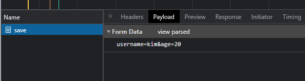

# 3. 서블릿, JSP, MVC패턴

지금까지 공부했던 서블릿 지식을 바탕으로 정말 간단한 회원관리 웹 애플리케이션을 만들어보자.  
서블릿으로 핵심 비지니스 로직을 만들어 본 후 JSP, MVC 패턴으로 점점 발전 시켜보면서 그 과정에서 얻을 수 있는 점이 무엇인지 알아본다.


## 회원 관리 웹 애플리케이션 요구 사항

#### 회원정보
이름 : username  
나이 : age

#### 기능 요구사항
회원 저장  
회원 목록 조회
#

### 회원 도메인 모델 코드


```java
@Getter @Setter //lombok
public class Member {

    private Long id; //회원 id
    private String username; //회원 이름
    private int age; //회원 나이

    public Member() {}

    public Member(String username, int age) {
        this.username = username;
        this.age = age;
    }
}
```

### 회원 저장소 코드

```java
/*
    동시성 문제가 고려되어 있지 않음, 실무에서는 ConcurrentHashMap, AtomicLong 사용 고려
 */
 
public class MemberRepository {

    private static Map<Long, Member> store = new HashMap<>(); //key = id, value = member
    private static long sequence = 0L; //id가 하나씩 증가하는 수열

    private static final MemberRepository instance = new MemberRepository(); //싱글톤 패턴 적용. 스프링 없이 순수 서블릿 만으로 구현하는것이 목적

    public static MemberRepository getInstance() {
        return instance;
    }

    private MemberRepository() {} //단 하나의 객체만 생성, 공유하기 위해 생성자를 private 접근자로 막아둠

    public Member save(Member member) { //회원 저장 로직
        member.setId(++sequence);
        store.put(member.getId(), member);
        return member;
    }

    public Member findById(Long id) { //단일 조회 로직
        return store.get(id);
    }

    public List<Member> findAll() { //전체 조회 로직
        return new ArrayList<>(store.values());
    }

    public void clearStore() { //저장소 초기화
        store.clear();
    }

}
```

회원 저장소는 싱글톤 패턴을 적용해서 설계한다. 현재는 스프링 없이 순수 서블릿으로 설계하는 것이 목표이다.  
객체를 단 하나만 생성해서 공유해야 하기 때문에 생성자를 private 접근자로 막아둔다.

### 회원 저장소 테스트 
```java
class MemberRepositoryTest {

    //스프링을 사용하면 싱글톤을 자체 보장하기 때문에 굳이 안 써도 되지만 현재는 순수 서블릿을 공부하는 것이 목적
    MemberRepository memberRepository = MemberRepository.getInstance(); 

    @AfterEach //테스트 하나가 종료되면 다음 테스트에 영향을 주는 것을 막기 위해 저장소를 초기화. 필수
    void afterEach() {
        memberRepository.clearStore();
    }

    @Test
    void save() { //저장이 잘 되었는지 테스트
        //given 
        Member member = new Member("hello", 20);

        //when
        Member savedMember = memberRepository.save(member);

        //then
        Member findMember = memberRepository.findById(savedMember.getId());
        assertThat(findMember).isEqualTo(savedMember);
    }

    @Test
    void findAll() { //전체 조회 테스트
        //given
        Member member1 = new Member("member1", 20);
        Member member2 = new Member("member2", 30);

        memberRepository.save(member1);
        memberRepository.save(member2);

        //when
        List<Member> result = memberRepository.findAll();

        //then
        assertThat(result.size()).isEqualTo(2);
        assertThat(result).contains(member1, member2);
    }
}
```
---

## 회원 관리 웹 애플리케이션 - 서블릿

### 회원 등록 폼
```java
package hello.servlet.web.servlet;

import hello.servlet.domain.member.MemberRepository;

import javax.servlet.ServletException;
import javax.servlet.annotation.WebServlet;
import javax.servlet.http.HttpServlet;
import javax.servlet.http.HttpServletRequest;
import javax.servlet.http.HttpServletResponse;
import java.io.IOException;
import java.io.PrintWriter;

@WebServlet(name = "memberFormServlet", urlPatterns = "/servlet/members/new-form")
public class MemberFormServlet extends HttpServlet {

    private MemberRepository memberRepository = MemberRepository.getInstance();

    @Override
    protected void service(HttpServletRequest request, HttpServletResponse response) throws ServletException, IOException {

        response.setContentType("text/html");
        response.setCharacterEncoding("utf-8");

        PrintWriter w = response.getWriter();
        w.write("<!DOCTYPE html>\n" +
                "<html>\n" +
                "<head>\n" +
                " <meta charset=\"UTF-8\">\n" +
                " <title>Title</title>\n" +
                "</head>\n" +
                "<body>\n" +
                "<form action=\"/servlet/members/save\" method=\"post\">\n" +
                " username: <input type=\"text\" name=\"username\" />\n" +
                " age: <input type=\"text\" name=\"age\" />\n" +
                " <button type=\"submit\">전송</button>\n" +
                "</form>\n" +
                "</body>\n" +
                "</html>\n");

    }
}
```


- 저장 버튼을 누르면 action 경로인 servlet/members/save 경로로 메소드 post 요청을 보내게 설계했다.
- html 코드를 짜 봤는데 서블릿, 순수 자바로 코드를 짜려니까 너무 불편하다.



- 저번에 학습했던 내용대로 Form 형식으로 데이터를 보내도 마치 쿼리 파라미터처럼 데이터가 넘어가는 것을 확인할 수 있다.


