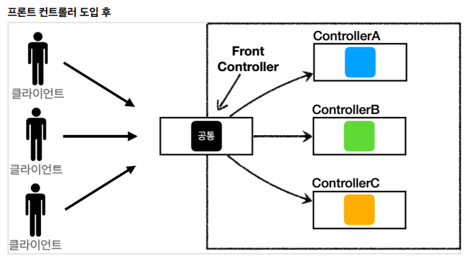
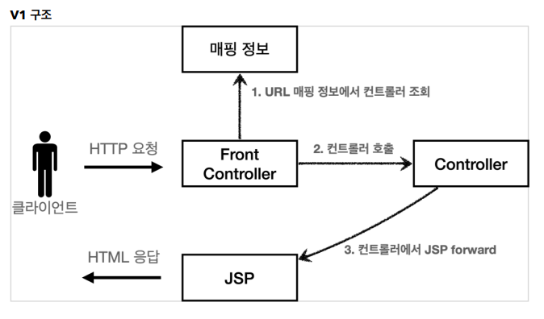
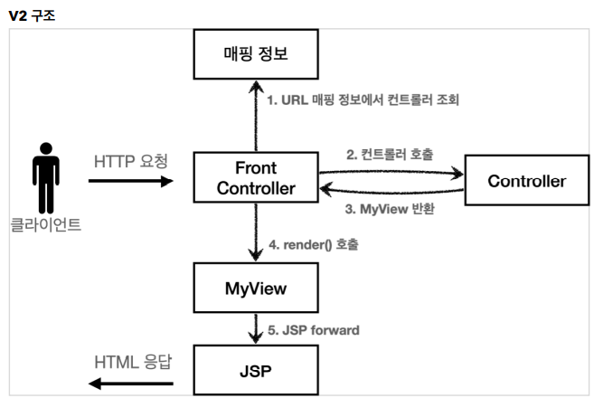
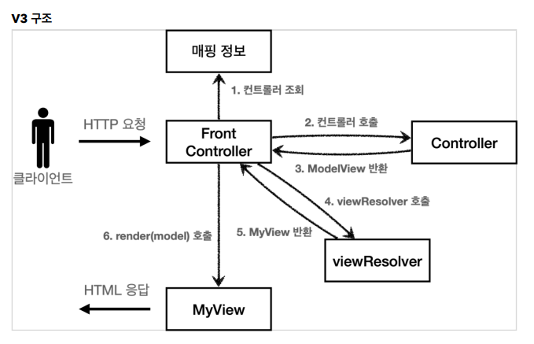

# 4. MVC 프레임워크 만들기

## 프론트 컨트롤러 패턴

-  **Front Controller 패턴 특징**
  - 프론트 컨트롤러 서블릿 하나로 클라이언트의 요청을 받음
  - 프론트 컨트롤러가 요청의 맞는 컨트롤러를 찾아서 호출
  - 입구를 하나로!
  - 공통 처리 가능
  - 프론트 컨트롤러를 제외한 나머지 컨트롤러는 서블릿을 사용하지 않아도 된다.



스프링 웹 MVC의 핵심도 바로 **FrontController**  
스프링 웹 MVC의 **DispatcherServlet**이 프론트 컨트롤러 패턴으로 구현되어 있다.

---

## 프론트 컨트롤러 도입 - v1

프론트 컨트롤러를 단계적으로 도입해보자.  
목표는 기존 코드를 최대한 유지하면서, 프론트 컨트롤러를 도입하는 것이다.
먼저 구조를 맞추어두고 점진적으로 리팩터링 해보자.

**V1의 구조**  


**ControllerV1**
```java
package hello.servlet.web.frontcontroller.v1;

import javax.servlet.ServletException;
import javax.servlet.http.HttpServletRequest;
import javax.servlet.http.HttpServletResponse;
import java.io.IOException;

public interface ControllerV1 {
    void process(HttpServletRequest request, HttpServletResponse response) throws ServletException, IOException;
}
```

- 서블릿과 비슷한 모양의 컨트롤러 인터페이스를 도입, 각 컨트롤러들은 이 인터페이스를 구현하면 된다.  
- 기존 로직을 최대한 유지하면서 인터페이스를 구현한 컨트롤러를 만들어보고 한 번 기능을 살펴보자.  

**MemberSaveControllerV1 - 회원 저장 컨트롤러**
```java
package hello.servlet.web.frontcontroller.v1.controller;

import hello.servlet.domain.member.Member;
import hello.servlet.domain.member.MemberRepository;
import hello.servlet.web.frontcontroller.v1.ControllerV1;

import javax.servlet.RequestDispatcher;
import javax.servlet.ServletException;
import javax.servlet.http.HttpServletRequest;
import javax.servlet.http.HttpServletResponse;
import java.io.IOException;

public class MemberSaveControllerV1 implements ControllerV1 {

    private MemberRepository memberRepository = MemberRepository.getInstance();

    @Override
    public void process(HttpServletRequest request, HttpServletResponse response) throws ServletException, IOException {
        String username = request.getParameter("username");
        int age = Integer.parseInt(request.getParameter("age"));

        Member member = new Member(username, age);
        memberRepository.save(member);

        //Model에 데이터를 보관한다.
        request.setAttribute("member", member);

        String viewPath = "/WEB-INF/views/save-result.jsp";
        RequestDispatcher dispatcher = request.getRequestDispatcher(viewPath);
        dispatcher.forward(request, response);
    }
}
```

#

**FrontControllerServletV1 - 프론트 컨트롤러**
```java
package hello.servlet.web.frontcontroller.v1;

import hello.servlet.web.frontcontroller.v1.controller.MemberFormControllerV1;
import hello.servlet.web.frontcontroller.v1.controller.MemberListControllerV1;
import hello.servlet.web.frontcontroller.v1.controller.MemberSaveControllerV1;

import javax.servlet.ServletException;
import javax.servlet.annotation.WebServlet;
import javax.servlet.http.HttpServlet;
import javax.servlet.http.HttpServletRequest;
import javax.servlet.http.HttpServletResponse;
import java.io.IOException;
import java.util.HashMap;
import java.util.Map;

@WebServlet(name = "frontControllerServletV1", urlPatterns = "/front-controller/v1/*")
public class FrontControllerServletV1 extends HttpServlet {

    private Map<String, ControllerV1> controllerMap = new HashMap<>();

    public FrontControllerServletV1() {
        controllerMap.put("/front-controller/v1/members/new-form", new MemberFormControllerV1());
        controllerMap.put("/front-controller/v1/members/save", new MemberSaveControllerV1());
        controllerMap.put("/front-controller/v1/members", new MemberListControllerV1());
    }

    @Override
    protected void service(HttpServletRequest request, HttpServletResponse response) throws ServletException, IOException {
        System.out.println("FrontControllerServletV1.service");

        String requestURI = request.getRequestURI();

        ControllerV1 controller = controllerMap.get(requestURI);
        if(controller == null) {
            response.setStatus(HttpServletResponse.SC_NOT_FOUND);
            return;
        }

        controller.process(request, response);
    }
}
```

- **urlPatterns**
    - urlPatterns = "/front-controller/v1/\*": /front-controller/v1를 포함한 하위 모든 요청은 이 서블릿에서 받아들인다.
    - 예) /front-controller/v1, /front-controller/v1/a, /front-controller/v1/a/b
- **controllerMap**
    - key: 매핑 URL
    - value: 호출될 컨트롤러
- **service()**
    - 먼저 requestURI를 조회해서 실제 호출할 컨트롤러를 controllerMap에서 찾는다
    - 없다면 404(SC_NOT_FOUND) 상태 코드를 반환한다
    - 컨트롤러를 찾고 controller.process(request, response)를 호출해서 해당 컨트롤러를 실행한다
- JSP
    - JSP는 이전 MVC에서 사용했던 것을 그대로 사용한다.

---

## View 분리 - v2

모든 컨트롤러에서 뷰로 이동하는 부분에 중복이 있고, 깔끔하지 않다

```java
String viewPath = "/WEB-INF/views/new-form.jsp";
RequestDispatcher dispatcher = request.getRequestDispatcher(viewPath);
dispatcher.forward(request, response);
```

이 부분을 깔끔하게 분리하기 위해 별도로 뷰를 처리하는 객체가 필요하다.

**V2 구조**  


#

**MyView 도입**
```java
package hello.servlet.web.frontcontroller;

import javax.servlet.RequestDispatcher;
import javax.servlet.ServletException;
import javax.servlet.http.HttpServletRequest;
import javax.servlet.http.HttpServletResponse;
import java.io.IOException;

public class MyView {
    private String viewPath;

    public MyView(String viewPath) {
        this.viewPath = viewPath;
    }

    public void render(HttpServletRequest request, HttpServletResponse response) throws ServletException, IOException {
        RequestDispatcher dispatcher = request.getRequestDispatcher(viewPath);
        dispatcher.forward(request, response);
    }
}
```

#

다음 버전의 컨트롤러 인터페이스도 만들어보자. 컨트롤러가 뷰를 반환하는 특징이 있다.

**ControllerV2**
```java
package hello.servlet.web.frontcontroller.v2;

import hello.servlet.web.frontcontroller.MyView;

import javax.servlet.ServletException;
import javax.servlet.http.HttpServletRequest;
import javax.servlet.http.HttpServletResponse;
import java.io.IOException;

public interface ControllerV2 {
    MyView process(HttpServletRequest request, HttpServletResponse response) throws ServletException, IOException;
}
```

**MemberSaveControllerV2 - 회원 저장**
```java
package hello.servlet.web.frontcontroller.v2.controller;

import hello.servlet.domain.member.Member;
import hello.servlet.domain.member.MemberRepository;
import hello.servlet.web.frontcontroller.MyView;
import hello.servlet.web.frontcontroller.v2.ControllerV2;

import javax.servlet.ServletException;
import javax.servlet.http.HttpServletRequest;
import javax.servlet.http.HttpServletResponse;
import java.io.IOException;

public class MemberSaveControllerV2 implements ControllerV2 {

    private MemberRepository memberRepository = MemberRepository.getInstance();

    @Override
    public MyView process(HttpServletRequest request, HttpServletResponse response) throws ServletException, IOException {
        String username = request.getParameter("username");
        int age = Integer.parseInt(request.getParameter("age"));

        Member member = new Member(username, age);
        memberRepository.save(member);

        //Model에 데이터를 보관한다.
        request.setAttribute("member", member);

        return new MyView("/WEB-INF/views/save-result.jsp");
    }
}
```

별도로 View를 처리해주는 객체 MyView를 도입한 이후로 각 컨트롤러는 복잡한 dispatcher.forward()를 직접 생성 호출하지 않아도 된다.  
단순히 MyView 객체를 생성하고 거기에 뷰 이름만 넣고 반환하면 된다.  
회원 저장 컨트롤러의 V1 버전과 V2 버전을 비교해보면 코드가 좀 더 간결해지고 중복이 확실히 제거된 것을 확인할 수 있다.

#

**프론트 컨트롤러 V2**
```java
package hello.servlet.web.frontcontroller.v2;

import hello.servlet.web.frontcontroller.MyView;
import hello.servlet.web.frontcontroller.v1.ControllerV1;
import hello.servlet.web.frontcontroller.v2.controller.MemberFormControllerV2;
import hello.servlet.web.frontcontroller.v2.controller.MemberListControllerV2;
import hello.servlet.web.frontcontroller.v2.controller.MemberSaveControllerV2;

import javax.servlet.ServletException;
import javax.servlet.annotation.WebServlet;
import javax.servlet.http.HttpServlet;
import javax.servlet.http.HttpServletRequest;
import javax.servlet.http.HttpServletResponse;
import java.io.IOException;
import java.util.HashMap;
import java.util.Map;

@WebServlet(name = "frontControllerServletV2", urlPatterns = "/front-controller/v2/*")
public class FrontControllerServletV2 extends HttpServlet {

    private Map<String, ControllerV2> controllerMap = new HashMap<>();

    public FrontControllerServletV2() {
        controllerMap.put("/front-controller/v2/members/new-form", new MemberFormControllerV2());
        controllerMap.put("/front-controller/v2/members/save", new MemberSaveControllerV2());
        controllerMap.put("/front-controller/v2/members", new MemberListControllerV2());
    }

    @Override
    protected void service(HttpServletRequest request, HttpServletResponse response) throws ServletException, IOException {
        String requestURI = request.getRequestURI();

        ControllerV2 controller = controllerMap.get(requestURI);
        if(controller == null) {
            response.setStatus(HttpServletResponse.SC_NOT_FOUND);
            return;
        }

        MyView view = controller.process(request, response);
        view.render(request, response);
    }
}
```

프론트 컨트롤러는 호출 결과로 MyView를 반환 받고, view.render()를 호출해서 중복 제거했던 forward 로직을 수행시켜 JSP를 실행한다. 
  
프론트 컨트롤러의 도입으로 MyView 객체의 render()를 호출하는 부분을 모두 일관되게 처리할 수 있다.  
각각의 컨트롤러는 MyView 객체를 생성만 해서 반환하면 된다.

---

## Model추가 - v3

### 서블릿 종속성 제거
컨트롤러의 입장에서 HttpServeltRequest, HttpServletResponse가 필요 없도록 변경해보자.  
요청 파라미터의 정보는 자바의 Map으로 대신 넘기도록 하면 지금 구조에서는 컨트롤러가 서블릿 기술을 몰라도 동작할 수 있다.
그리고 request객체를 Model로 사용하는 대신에 별도의 Model객체를 만들어서 반환하면 된다.  

### 뷰 이름 중복 제거
컨트롤러에서 지정하는 뷰 이름에 중복이 있는 것을 확인할 수 있다.  
컨트롤러는 뷰의 논리 이름을 반환하고, 실제 물리 위치의 이름은 프론트 컨트롤러에서 처리하도록 단순화 하자.

- WEB-INF/views/new-form.jsp -> **new-form**
- WEB-INF/views/save-result.jsp -> **save-result**
- WEB-INF/views/members.jsp -> **members**

**V3 구조**  


#

지금까지 컨트롤러에서 서블릿에 종속적인 HttpServletRequest를 사용했다.  
그리고 Model도 request.setAttribute()를 통해 데이터를 저장하고 뷰에 전달했다.  
  
서블릿의 종속성을 제거하기 위해 Model을 직접 만들고, 추가로 View 이름까지 전달하는 객체를 만들어보자.

**ModelView**
```java
package hello.servlet.web.frontcontroller;

import java.util.HashMap;
import java.util.Map;

public class ModelView {
    private String viewName;
    private Map<String, Object> model = new HashMap<>();

    public ModelView(String viewName) {
        this.viewName = viewName;
    }

    public String getViewName() {
        return viewName;
    }

    public void setViewName(String viewName) {
        this.viewName = viewName;
    }

    public Map<String, Object> getModel() {
        return model;
    }

    public void setModel(Map<String, Object> model) {
        this.model = model;
    }
}
```

뷰의 이름과 뷰를 렌더링할 때 필요한 model 객체를 가지고 있다.

#

**ControllerV3**
```java
package hello.servlet.web.frontcontroller.v3;

import hello.servlet.web.frontcontroller.ModelView;

import java.util.Map;

public interface ControllerV3 {

    ModelView process(Map<String, String> paramMap);
}
```

이 컨트롤러는 V1, V2와 달리 이제 서블릿 기술을 전혀 사용하지 않는다.  
HttpServletRequest가 제공하는 파라미터는 프론트 컨트롤러가 paramMap에 담아서 호출해주면 된다.  
응답 결과로 뷰 이름과 뷰에 전달할 Model 데이터를 포함하는 ModelView 객체를 반환하면 된다.

**MemberSaveControllerV3 - 회원 저장**
```java
package hello.servlet.web.frontcontroller.v3.controller;

import hello.servlet.domain.member.Member;
import hello.servlet.domain.member.MemberRepository;
import hello.servlet.web.frontcontroller.ModelView;
import hello.servlet.web.frontcontroller.v3.ControllerV3;

import java.util.Map;

public class MemberSaveControllerV3 implements ControllerV3 {

    private MemberRepository memberRepository = MemberRepository.getInstance();

    @Override
    public ModelView process(Map<String, String> paramMap) {
        String username = paramMap.get("username");
        int age = Integer.parseInt(paramMap.get("age"));

        Member member = new Member(username, age);
        memberRepository.save(member);

        ModelView mv = new ModelView("save-result");
        mv.getModel().put("member", member);
        return mv;

    }
}
```
- ModelView mv = new ModelView("save-result");
    - ModelView를 생성할 때 save-result라는 view의 논리적인 이름을 지정한다.
    - 실제 물리적인 이름은 프론트 컨트롤러에서 처리한다.
- paramMap.get("username");
    - 파라미터 정보는 map에 담겨있다. map에서 필요한 요청 파라미터를 조회하면 된다.
- mv.getModel().put("member", member);
    - 모델은 단순한 map이므로 모델과 뷰에서 필요한 member 객체를 담고 반환한다.

#

**FrontControllerServletV3**
```java
package hello.servlet.web.frontcontroller.v3;

import hello.servlet.web.frontcontroller.ModelView;
import hello.servlet.web.frontcontroller.MyView;
import hello.servlet.web.frontcontroller.v3.controller.MemberFormControllerV3;
import hello.servlet.web.frontcontroller.v3.controller.MemberListControllerV3;
import hello.servlet.web.frontcontroller.v3.controller.MemberSaveControllerV3;

import javax.servlet.ServletException;
import javax.servlet.annotation.WebServlet;
import javax.servlet.http.HttpServlet;
import javax.servlet.http.HttpServletRequest;
import javax.servlet.http.HttpServletResponse;
import java.io.IOException;
import java.util.HashMap;
import java.util.Map;

@WebServlet(name = "frontControllerServletV3", urlPatterns = "/front-controller/v3/*")
public class FrontControllerServletV3 extends HttpServlet {

    private Map<String, ControllerV3> controllerMap = new HashMap<>();

    public FrontControllerServletV3() {
        controllerMap.put("/front-controller/v3/members/new-form", new MemberFormControllerV3());
        controllerMap.put("/front-controller/v3/members/save", new MemberSaveControllerV3());
        controllerMap.put("/front-controller/v3/members", new MemberListControllerV3());
    }

    @Override
    protected void service(HttpServletRequest request, HttpServletResponse response) throws ServletException, IOException {
        String requestURI = request.getRequestURI();

        ControllerV3 controller = controllerMap.get(requestURI);
        if(controller == null) {
            response.setStatus(HttpServletResponse.SC_NOT_FOUND);
            return;
        }

        //paramMap
        Map<String, String> paramMap = createParamMap(request);
        ModelView mv = controller.process(paramMap);

        String viewName = mv.getViewName();
        MyView view = viewResolver(viewName);

        view.render(mv.getModel(), request, response);
    }

    private MyView viewResolver(String viewName) {
        return new MyView("/WEB-INF/views/" + viewName + ".jsp");
    }

    private Map<String, String> createParamMap(HttpServletRequest request) {
        Map<String, String> paramMap = new HashMap<>();
        request.getParameterNames().asIterator()
                .forEachRemaining(paramName -> paramMap.put(paramName, request.getParameter(paramName)));
        return paramMap;
    }
}
```

- createParamMap()
    - HttpServletRequest에서 파라미터 정보를 꺼내서 Map으로 변환한다.
    - 해당 Map(paramMap)을 컨트롤러에 전달하면서 호출한다.

### 뷰 리졸버

```java
MyView view = viewResolver(viewName)
```
컨트롤러가 반환한 논리 뷰 이름을 실제 물리 뷰 경로로 변경한다.

- 논리 뷰 이름: members, save-result, new-form 등
- 물리 뷰 경로: /WEB-INF/views/xxx.jsp

```java
view.render(mv.getModel(), request, response)
```
- 뷰 객체를 통해서 HTML 화면을 렌더링 한다.
- 뷰 객체의 render()는 모델 정보도 함께 받는다.
- JSP는 request.getAttribute()로 데이터를 조회하기 때문에, 모델의 데이터를 꺼내서 request.setAttribute()로 담아둔다.
- JSP로 포워드 해서 JSP를 렌더링한다.

**MyView**
```java
package hello.servlet.web.frontcontroller;

import javax.servlet.RequestDispatcher;
import javax.servlet.ServletException;
import javax.servlet.http.HttpServletRequest;
import javax.servlet.http.HttpServletResponse;
import java.io.IOException;
import java.util.Map;

public class MyView {
    private String viewPath;

    public MyView(String viewPath) {
        this.viewPath = viewPath;
    }

    public void render(HttpServletRequest request, HttpServletResponse response) throws ServletException, IOException {
        RequestDispatcher dispatcher = request.getRequestDispatcher(viewPath);
        dispatcher.forward(request, response);
    }

    public void render(Map<String, Object> model, HttpServletRequest request, HttpServletResponse response) throws ServletException, IOException {
        modelToRequestArrtibute(model, request);
        RequestDispatcher dispatcher = request.getRequestDispatcher(viewPath);
        dispatcher.forward(request, response);
    }

    private void modelToRequestArrtibute(Map<String, Object> model, HttpServletRequest request) {
        model.forEach((key, value) -> request.setAttribute(key, value));
    }
}
```

---

## 단순하고 실용적인 컨트롤러 - v4

서블릿 종속성을 제거하고 뷰 경로의 중복도 제거하는 등 v3 컨트롤러를 만들어봤는데, 잘 설계한것 같지만 아직도 번거로운 부분들이 남아있다.  
  
실제 컨트롤러 인터페이스를 구현하는 개발자 입장에서 보면, 항상 ModelView객체를 생성하고 반환해야 하는 부분이 조금은 번거롭다.  
좋은 프레임워크는 아키텍처도 중요하지만, 그와 더불어 실제 개발하는 개발자가 단순하고 편리하게 사용할 수 있어야 한다.  
  
이번에는 v3를 조금 변경해서 실제 구현하는 개발자들이 매우 편리하게 개발할 수 있는 v4버전을 개발해보자.

**V4 구조**  

- 기본적인 구조는 V3과 같다. 대신 컨트롤러가 ModelView를 반환하지 않고, ViewName만 반환한다.

#

**ContollerV4**
```java
package hello.servlet.web.frontcontroller.v4;

import java.util.Map;

public interface ControllerV4 {

    /**
     * @param paramMap
     * @param model
     * @return
     */
    String process(Map<String, String> paramMap, Map<String, Object> model);
}
```

이번 버전은 인터페이스에 ModelView가 없다.  
model 객체는 파라미터로 전달되기 때문에 그냥 사용하면 되고, 결과로 뷰의 이름만 반환해주면 된다.

**MemberSaveControllerV4**
```java
package hello.servlet.web.frontcontroller.v4.controller;

import hello.servlet.domain.member.Member;
import hello.servlet.domain.member.MemberRepository;
import hello.servlet.web.frontcontroller.v4.ControllerV4;

import java.util.Map;

public class MemberSaveControllerV4 implements ControllerV4 {

    private MemberRepository memberRepository = MemberRepository.getInstance();

    @Override
    public String process(Map<String, String> paramMap, Map<String, Object> model) {
        String username = paramMap.get("username");
        int age = Integer.parseInt(paramMap.get("age"));

        Member member = new Member(username, age);
        memberRepository.save(member);

        model.put("member", member);
        return "save-result";
    }
}
```

- model.put("member", member)
    - 모델이 파라미터로 전달되기 때문에, 모델을 직접 생성하지 않아도 된다.
- 정말 단순하게 save-result 라는 뷰의 논리 이름만 반환하면 된다.
#

**FrontControllerServletV4**
```java
package hello.servlet.web.frontcontroller.v4;

import hello.servlet.web.frontcontroller.MyView;
import hello.servlet.web.frontcontroller.v4.controller.MemberFormControllerV4;
import hello.servlet.web.frontcontroller.v4.controller.MemberListControllerV4;
import hello.servlet.web.frontcontroller.v4.controller.MemberSaveControllerV4;

import javax.servlet.ServletException;
import javax.servlet.annotation.WebServlet;
import javax.servlet.http.HttpServlet;
import javax.servlet.http.HttpServletRequest;
import javax.servlet.http.HttpServletResponse;
import java.io.IOException;
import java.util.HashMap;
import java.util.Map;

@WebServlet(name = "frontControllerServletV4", urlPatterns = "/front-controller/v4/*")
public class FrontControllerServletV4 extends HttpServlet {

    private Map<String, ControllerV4> controllerMap = new HashMap<>();

    public FrontControllerServletV4() {
        controllerMap.put("/front-controller/v4/members/new-form", new MemberFormControllerV4());
        controllerMap.put("/front-controller/v4/members/save", new MemberSaveControllerV4());
        controllerMap.put("/front-controller/v4/members", new MemberListControllerV4());
    }

    @Override
    protected void service(HttpServletRequest request, HttpServletResponse response) throws ServletException, IOException {
        String requestURI = request.getRequestURI();

        ControllerV4 controller = controllerMap.get(requestURI);
        if(controller == null) {
            response.setStatus(HttpServletResponse.SC_NOT_FOUND);
            return;
        }

        //paramMap
        Map<String, String> paramMap = createParamMap(request);
        Map<String, Object> model = new HashMap<>(); //추가
        String viewName = controller.process(paramMap, model);

        MyView view = viewResolver(viewName);
        view.render(model, request, response);
    }

    private MyView viewResolver(String viewName) {
        return new MyView("/WEB-INF/views/" + viewName + ".jsp");
    }

    private Map<String, String> createParamMap(HttpServletRequest request) {
        Map<String, String> paramMap = new HashMap<>();
        request.getParameterNames().asIterator()
                .forEachRemaining(paramName -> paramMap.put(paramName, request.getParameter(paramName)));
        return paramMap;
    }
}
```

### 모델 객체 전달
```java
Map<String, Object> model = new HashMap<>()
```
- 모델 객체를 프론트 컨트롤러에서 생성해서 넘겨준다.
- 컨트롤러에서 모델 객체에 값을 담으면 여기에 그대로 담겨있게 된다.

### 뷰의 논리 이름을 직접 반환
```java
String viewName = controller.process(paramMap, model);
MyView view = viewResolver(viewName);
```
- 컨트롤러가 직접 뷰의 논리 이름을 반환하므로 이 값을 사용해서 실제 물리 뷰를 찾을 수 있다.

이번 버전의 컨트롤러는 매우 단순하고 실용적이다.  
기존 구조에서 모델을 파라미터로 넘기고, 뷰의 논리 이름을 반환한다는 작은 아이디어를 적용했을 뿐이다.  
그런데 컨트롤러를 구현하는 개발자 입장에서 보면 이제 군더더기 없는 코드를 작성할 수 있게 되었다.  
  
중요한 사실은 여기까지 한 번에 온 것이 아니라는 점이다.  
프레임워크가 점진적으로 발전하는 과정속에서 이런 방법을 찾을 수 있었다.  

---

## 정리

- 요청들의 입구를 하나로 통일하기 위한 프론트 컨트롤러 패턴을 도입해보았다.
- 그 덕분에 프론트 컨트롤러를 제외한 나머지 컨트롤러들은 서블릿 기술을 사용하지 않아도 되게 되었다.  
#
- 먼저 V1 버전에서는 기존 로직을 최대한 유지한채 프론트 컨트롤러를 도입하도록 노력했다.
- 프론트 컨트롤러에서 urlPattern을 이용하여 모든 요청은 프론트 컨트롤러로 들어오게 변경했다.
- controllerMap을 만들어서 컨트롤러들을 보관하고, requestURI를 조회해서 실제 호출할 컨트롤러를 contorllerMap에서 찾도록 하였다.
#
- 수문장 역할을 하는 프론트 컨트롤러를 도입해서, 어느정도 교통정리를 한 것 같았지만 
- 아직 컨트롤러에서 뷰로 이동하는 부분에 중복이 있고 코드가 깔끔하지 않았다.
- 
- V2 버전에서는 이 부분들을 해결하기위해 별도의 뷰를 처리하는 MyView 객체를 도입하였다.
- MyView 객체를 도입해서 이제 각각의 컨트롤러에서 복잡한 dispatcher.forward()를 직접 생성, 실행을 하지 않아도 되었다.
- 컨트롤러는 단지 MyView 객체를 생성해서 원하는 뷰 이름만 객체에 넣어서 반환해주면 된다.
- 프론트 컨트롤러는 반환 받은 Myview 객체를 이용하여 컨트롤러 대신 render()를 호출한다.
- 프론트 컨트롤러가 다른 컨트롤러들 대신 할 일이 많아지고 바빠지는 현상은 좋은 신호이다.
- 프로젝트의 규모가 커져서 컨트롤러의 개수가 매우 많아졌을 때를 생각하면 많은 양의 중복된 코드들을 제거할 수 있게 된다.
#
- 컨트롤러의 입장에서 아직까지 파라미터로 받고있는 HttpServletRequest, HttpServletResponse가 꼭 필요한지 의문이 들었다.
- 그리고 컨트롤러에서 지정하는 뷰 이름에도 중복이 있는 것을 확인할 수 있었다.
- 
- V3 버전에서는 컨트롤러가 서블릿 기술을 전혀 사용하지 않도록 변경하고, 뷰의 논리 이름을 반환하도록 변경해본다.
- 컨트롤러에서 서블릿의 종속성을 제거하기 위해 Model을 직접 만들고 추가로 View 이름까지 전달하는 객체 ModelView를 도입한다.
- V3 컨트롤러 인터페이스는 서블릿 기술을 전혀 사용하지 않는다.
- 기존 HttpServletRequest가 제공하던 파라미터는 프론트 컨트롤러가 paramMap에 담아서 컨트롤러에 넘겨 호출해주면 된다.
- 각 컨트롤러는 응답 결과로 논리적인 뷰 이름과 뷰에 전달할 Model 데이터를 포함하는 ModelView 객체를 생성해서 반환한다.
- 프론트 컨트롤러에서는 받은 논리적인 뷰 이름을 실제 물리 뷰 경로로 변환시킨다. 그리고 실제 물리 경로가 있는 MyView 객체를 생성한다.
- 그 다음 Myview 객체의 render()에 ModelView, HttpServletRequest, HttpServletResponse를 넘겨서 JSP로 포워드한다.
#
- 앞서 만든 V3 컨트롤러는 서블릿 종속성을 제거하고 뷰 경로의 중복을 제거하는 등, 잘 설계된 컨트롤러이다.
- 그런데 실제 각 컨트롤러를 구현하는 개발자 입장에서 보면 항상 ModelView객체를 생성 반환해야 하는 부분이 조금 번거롭다.
- V4 에서는 좀 더 개발자들이 편리하게 개발할 수 있도록 바꿔보았다.
-
- 기본적인 구조는 V3와 같은 대신, 컨트롤러가 ModelView를 반환하지 않고 ViewName만 반환하도록 변경한다.
- 이제 V4 컨트롤러 인터페이스에서는 ModelView를 생성하지 않는다. 
- model 객체는 프론트 컨트롤러에서 생성해서 파라미터로 컨트롤러에 전달해주고, 컨트롤러는 그 결과로 뷰의 이름(new-form, save-result, members등등)만 반환하도록 한다.
- 각 컨트롤러에서 모델 객체에 값을 담으면 그대로 담겨있어 프론트 컨트롤러에서 사용할 수 있게 된다.
- 이번 버전에서는 단순하게 기존 구조에서 모델을 파라미터로 넘기고, 뷰의 논리 이름만 반환하는 정말 작은 아이디어를 적용했을 뿐인데, 개발자 입장에서는 좀 더 편리하게 개발을 할 수 있게 되었다.
- 
- 이번 챕터를 공부하면서 내가 점진적으로 프레임워크, 패턴을 발전시켜보니까 프레임워크나 공통 기능이 수고로워야 사용하는 개발자가 편리해진다는 점을 많이 깨닫을수 있었다.

---

### Reference
- [스프링 MVC 1편 - 백엔드 웹 개발 핵심 기술](https://www.inflearn.com/course/%EC%8A%A4%ED%94%84%EB%A7%81-mvc-1/dashboard)
