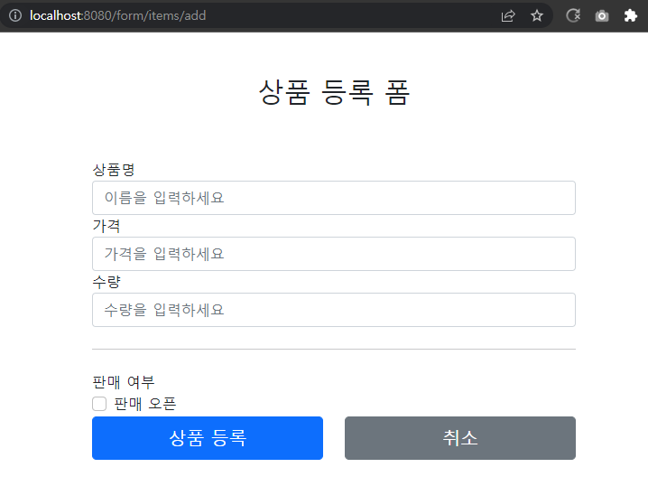
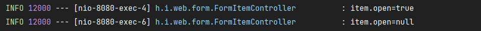
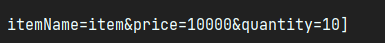
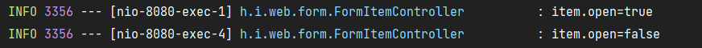
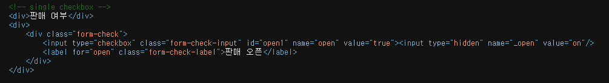
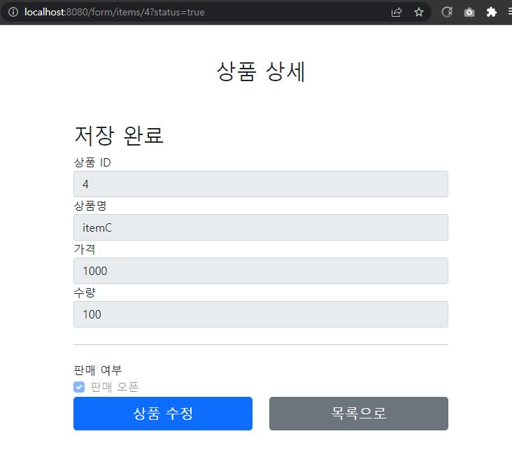
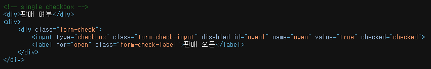
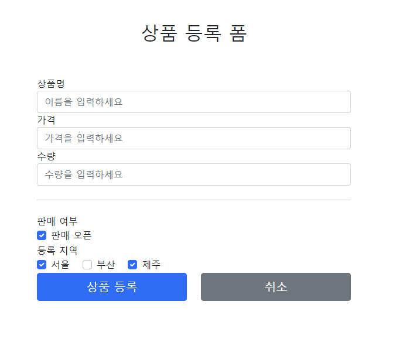
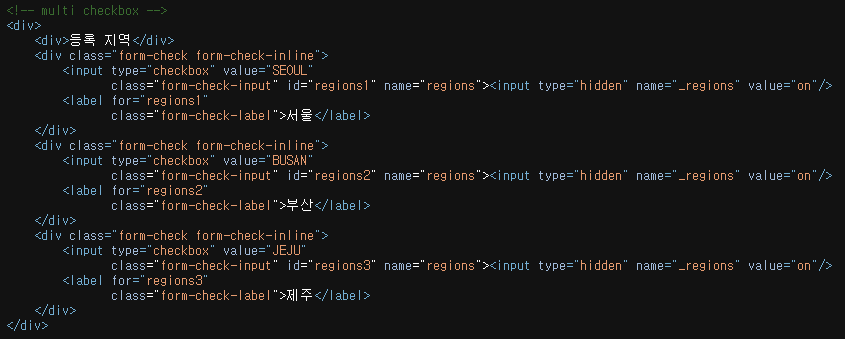
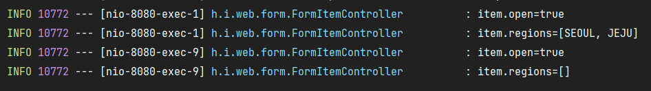

# 8. 타임리프 - 스프링 통합과 폼

## 입력 폼 처리

타임리프가 제공하는 입력 폼 기능을 적용해서, 기존 MVC 1편에서 사용하던 프로젝트의 폼 코드를  
타임리프가 지원하는 기능을 이용하여 효율적으로 개선해보자.

- th:object: 커맨드 객체를 지정한다.
- \*{...}: 선택 변수 식이라고 한다. th:object에서 선택한 객체에 접근한다.
- th:field
  - HTML 태그의 id, name, value 속성을 자동으로 처리해준다.

**렌더링 전**  
```html
<input type="text" th:field="*{itemName}" />
```

**렌더링 후**  
```html
<input type="text" id="itemName" name="itemName" th:value="*{itemName}" />
```

#

### 등록 폼
th:object를 적용하려면 먼저 해당 오브젝트 정보를 넘겨주어야 한다.  
등록 폼이기 때문에 데이터가 비어있는 빈 오브젝트를 만들어서 뷰에 전달하자.

```java
@GetMapping("/add")
public String addForm(Model model) {
    model.addAttribute("item", new Item());
    return "form/addForm";
}
```

타임리프 등폭 폼 변경

```html
<form action="item.html" th:action th:object="${item}" method="post">
        <div>
            <label for="itemName">상품명</label>
            <input type="text" id="itemName" th:field="*{itemName}" class="form-control" placeholder="이름을 입력하세요">
        </div>
        <div>
            <label for="price">가격</label>
            <input type="text" id="price" th:field="*{price}" class="form-control" placeholder="가격을 입력하세요">
        </div>
        <div>
            <label for="quantity">수량</label>
            <input type="text" id="quantity" th:field="*{quantity}" class="form-control" placeholder="수량을 입력하세요">
        </div>
```

- th:object="${item}": \<form>에서 사용할 객체를 지정한다. 선택 변수 식(\*{...})을 적용할 수 있다.
- th:field="\*{itemName}"
  - \*{itemName}는 선택 변수 식을 사용했는데, ${item.itemName}과 같다.
  - 앞서 th:object로 item을 선택했기 때문에 선택 변수 식을 적용할 수 있다.
  - th:field는 id, name, value 속성을 모두 자동으로 만들어준다.

해당 예제에서 id 속성을 제거해도 th:field가 자동으로 만들어주기 때문에 상관없다.
  
#

### 수정 폼

```java
@GetMapping("/{itemId}/edit")
public String editForm(@PathVariable Long itemId, Model model) {
    Item item = itemRepository.findById(itemId);
    model.addAttribute("item", item);
    return "form/editForm";
}
```

```html
<form action="item.html" th:action th:object="${item}" method="post">
        <div>
            <label for="id">상품 ID</label>
            <input type="text" id="id" name="id" class="form-control" th:field="*{id}" readonly>
        </div>
        <div>
            <label for="itemName">상품명</label>
            <input type="text" id="itemName" name="itemName" class="form-control" th:field="*{itemName}">
        </div>
        <div>
            <label for="price">가격</label>
            <input type="text" id="price" name="price" class="form-control" th:field="*{price}">
        </div>
        <div>
            <label for="quantity">수량</label>
            <input type="text" id="quantity" name="quantity" class="form-control" th:field="*{quantity}">
        </div>
```

---

## 요구사항 추가

타임리프를 사용해서 폼에서 체크박스, 라디오 버튼, 셀렉트 박스를 편리하게 사용하는 방법을 학습해보자.

- 판매 여부
  - 판매 오픈 여부
  - 체크 박스로 선택할 수 있다.
- 등록 지역
  - 서울, 부산, 제주
  - 체크 박스로 다중 선택할 수 있다.
- 상품 종류
  - 도서, 식품, 기타
  - 라디오 버튼으로 하나만 선택할 수 있다.
- 배송 방식
  - 빠른 배송
  - 일반 배송
  - 느린 배송
  - 셀렉트 박스로 하나만 선택할 수 있다.

#

### 상품 종류, 배송 방식, 상품 추가

**상품 종류**
```java
package hello.itemservice.domain.item;

public enum ItemType {

    BOOK("도서"), FOOD("음식"), ETC("기타");

    private final String description;

    ItemType(String description) {
        this.description = description;
    }
}
```

**배송 방식**
```java
package hello.itemservice.domain.item;

import lombok.AllArgsConstructor;
import lombok.Data;

/**
 * FAST: 빠른 배송
 * NORMAL: 일반 배송
 * SLOW: 느린 배송
 */
@Data
@AllArgsConstructor
public class DeliveryCode {

    private String code;
    private String displayName;
}
```
code는 \[FAST]같은 시스템에서 전달하는 값이고, displayName은 \[빠른 배송]같은 고객에게 보여주는 값이다.


**상품**  
```java
package hello.itemservice.domain.item;

import lombok.Data;

import java.util.List;

@Data
public class Item {

    private Long id;
    private String itemName;
    private Integer price;
    private Integer quantity;

    private Boolean open; //판매 여부
    private List<String> regions; //등록 지역
    private ItemType itemType; //상품 종류
    private String deliveryCode; //배송 방식

    public Item() {
    }

    public Item(String itemName, Integer price, Integer quantity) {
        this.itemName = itemName;
        this.price = price;
        this.quantity = quantity;
    }
}
```    
ENUM, 클래스, String같은 다양한 상황을 준비했다.  
각각의 상황에 어떻게 폼의 데이터를 받을 수 있는지 하나씩 알아보자

---

## 체크박스 - 단일1

### 단순 HTML 체크 박스

**addForm.html에 추가**
```html
<hr class="my-4">

<!-- single checkbox -->
<div>판매 여부</div>
<div>
    <div class="form-check">
        <input type="checkbox" id="open" name="open" class="form-check-input">
        <label for="open" class="form-check-label">판매 오픈</label>
    </div>
</div>
```


상품이 등록되는 곳에 다음과 같이 로그를 남겨서 값이 잘 넘어오는지 확인해본다.

```java
@PostMapping("/add")
public String addItem(@ModelAttribute Item item, RedirectAttributes redirectAttributes) {
    log.info("item.open={}", item.getOpen());
    Item savedItem = itemRepository.save(item);
    redirectAttributes.addAttribute("itemId", savedItem.getId());
    redirectAttributes.addAttribute("status", true);
    return "redirect:/form/items/{itemId}";
}
```



체크 박스를 체크하면 HTML Form에서 open=on 이라는 값이 넘어간다.  
스프링은 on이라는 문자를 true타입으로 변환해준다.  
만약 HTML에서 체크박스를 선택하지 않고 폼을 전송하면 open이라는 필드 자체가 서버로 전송되지 않는다.

#

### HTTP 요청 메시지 로깅

HTTP 요청 메시지를 서버에서 보고 싶으면 application.properties에 다음 설정을 추가한다.  
```
logging.level.org.apache.coyote.http11=debug
```

HTTP 메시지 바디를 보면 체크 박스를 선택하지 않을 때 open의 이름도 전송이 되지 않는 것을 확인할 수 있다.  
그리고 서버에서 Booelean 타입을 찍어보면 결과가 null인 것도 확인할 수 있었다.  


#

HTML cheackbox는 선택이 안되면 클라이언트에서 서버로 값 자체를 보내지 않는 것을 확인했다.  
수정의 경우에는 상황에 따라서 이 방식이 문제가 될 수 있다.  
사용자가 의도적으로 체크되어 있던 값을 체크를 해제하고 저장할 시 아무 값도 서버로 넘어가지 않기 때문에,  
서버 구현에 따라서 값이 오지 않은 것으로 판단하고 값이 변경되지 않을 수 있다.  
  
이런 문제를 해결하기 위해서 스프링MVC는 약간의 트릭을 사용하는데, 히든 필드를 하나 만들어서,  
\_open처럼 기존 체크 박스 이름 앞에 언더스코어를 붙여서 전송하면 체크를 해제했다고 인식할 수 있다.  
히든필드는 항상 전송되고, 체크를 해제한 경우 open은 전송되지 않고 \_open만 전송되는데  
이 경우 스프링 MVC는 체크를 해제했다고 판단한다.

#

체크 해제를 인식하기 위한 히든 필드
```html
<input type="hidden" name="_open" value="on"/>
```

기존 코드에 히든 필드를 추가
```html
 <!-- single checkbox -->
<div>판매 여부</div>
<div>
    <div class="form-check">
        <input type="checkbox" id="open" name="open" class="form-check-input">
        <input type="hidden" name="_open" value="on"/> <!-- 히든 필드 추가 -->
        <label for="open" class="form-check-label">판매 오픈</label>
    </div>
</div>
```

실행 로그  



체크박스를 체크하면 스프링MVC가 open에 값이 있는 것을 확인하고 사용한다. 이 때 \_oepn은 무시한다.  
체크 박스를 체크하지 않았을 때에는 스프링MVC가 \_open만 있는 것을 확인하고 open의 값이 체크되지 않았다고 인식한다.  
이 경우 서버에서 확인을 해 보면 null이 아니라 Boolean타입으로 false가 나오는 것을 확인할 수 있다.

---

## 체크박스 - 단일2

### 타임리프

개발할 때 마다 이렇게 히든 필드를 추가하는 것은 상당히 번거롭다.  
타임리프가 제공하는 폼 기능을 사용하면 이런 부분을 자동으로 처리할 수 있다.

```html
<!-- single checkbox -->
<div>판매 여부</div>
<div>
    <div class="form-check">
        <input type="checkbox" th:field="*{open}" class="form-check-input">
        <label for="open" class="form-check-label">판매 오픈</label>
    </div>
</div>
```
체크 박스의 기존 코드 대신 타임리프가 제공하는 체크 박스 코드로 변경하고 HTML에서 소스를 확인해보자.



타임리프를 사용하면 체크 박스의 히든 필드와 관련된 부분도 함께 해결해준다.  
HTML 생성 결과를 보면 히든 필드 부분이 자동으로 생성되어 있다  
\<input type="hidden" name="_open" value="on"/>

#

**item.html에 추가**
```html
<!-- single checkbox -->
<div>판매 여부</div>
<div>
    <div class="form-check">
        <input type="checkbox" th:field="${item.open}" class="form-check-input" disabled>
        <label for="open" class="form-check-label">판매 오픈</label>
    </div>
</div>
```

상품 상세에도 등록과 마찬가지로 판매 여부를 추가시켜준다.  
다만 상품 상세 페이지이기 때문에 disabled를 사용해서 체크 박스를 수정하지 못하도록 막는다.  
  
item.html에는 th:object를 사용하지 않았기 때문에, th:field부분에 \${item.open}으로 적어줘야 한다.  




타임리프의 th:field를 사용하면. 값이 true인 경우 checked도 자동으로 처리해준다.

#

**editForm.html에 추가**

```html
<!-- single checkbox -->
<div>판매 여부</div>
    <div>
        <div class="form-check">
        <input type="checkbox" id="open" th:field="*{open}" class="form-check-input">
        <label for="open" class="form-check-label">판매 오픈</label>
    </div>
</div>
```

상품 수정 html에도 판매 여부를 추가한다.  
그리고 ItemRepository의 update()코드에 setOpen도 추가 해줘야 한다.

```java
public void update(Long itemId, Item updateParam) {
    Item findItem = findById(itemId);
    findItem.setItemName(updateParam.getItemName());
    findItem.setPrice(updateParam.getPrice());
    findItem.setQuantity(updateParam.getQuantity());
    findItem.setOpen(updateParam.getOpen());
}
```

---

## 체크 박스 - 멀티

체크 박스를 멀티로 사용해서, 하나 이상을 체크할 수 있도록 해보자

- 등록지역
    - 서울, 부산, 제주
    - 체크 박스로 다중 선택할 수 있다.


```java
@ModelAttribute("regions")
public Map<String, String> regions() {
    Map<String, String> regions = new LinkedHashMap<>();
    regions.put("SEOUL", "서울");
    regions.put("BUSAN", "부산");
    regions.put("JEJU", "제주");
    return regions;
}
```

#### @ModelAttribute의 특별한 사용법
등록 폼, 상세화면, 수정 폼에서 모두 서울, 부산, 제주라는 체크 박스를 반복해서 보어주어야 한다.  
그러려면 각각의 컨트롤러에서 model.addAttribute를 사용해서 체크박스를 구성하는 데이터를 반복해서 넣어주어야 하는데,  
이럴 때 @ModelAttribute를 사용하면 이렇게 컨트롤러에 있는 별도의 메서드에 적용할 수 있다.  
  
이렇게하면 해당 컨트롤러를 요청할 때 regions에서 반환한 값이 자동으로 모델에 담기게 된다.

#

**addForm.html - 추가**
```html
<!-- multi checkbox -->
<div>
    <div>등록 지역</div>
        <div th:each="region : ${regions}" class="form-check form-check-inline">
        <input type="checkbox" th:field="*{regions}" th:value="${region.key}" class="form-check-input">
        <label th:for="${#ids.prev('regions')}" th:text="${region.value}" class="form-check-label">서울</label>
    /div>
</div>
```

타임리프는 같은 이름의 여러 체크박스를 생성해야 할 때 HTML 태그 속성에서 id가 모두 다를 수 있도록하는 기능을 지원한다.  
th:for="${#ids.prev('regions')}" 을 사용하면 타임리프가 체크박스를 each 루프 안에서 반복해서 만들 때  
임의로 1, 2, 3 숫자를 뒤에 붙여준다  




\<label for="id 값">에 지정돈 id가 checkbox에서 동적으로 생성된 regions1, regions2, regions3에 맞추어  
순서대로 입력된 것을 확인할 수 있다.



\_regions를 이용하여 웹 브라우저에서 체크를 하나도 하지 않았을 때, 클라이언트가 서버에 아무런 데이터를 보내지 않는 것을 방지한다.  
\_regions가 체크박스 숫자만큼 생성될 필요는 없지만, 타임리프가 생성되는 옵션 수 만큼 생성해서 그런것이니 무시하자.

#

