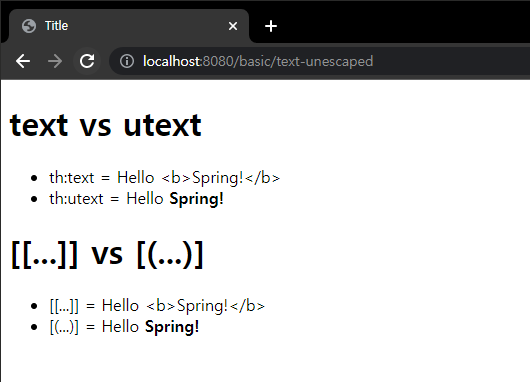
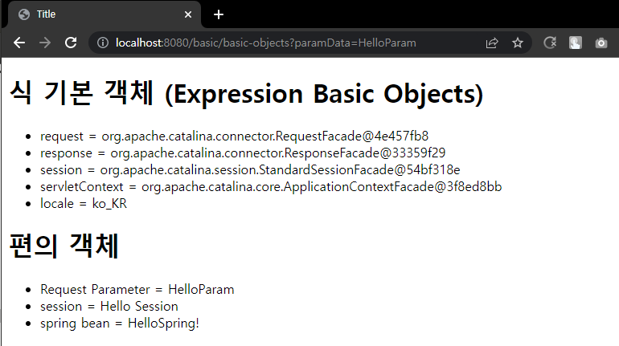

# 7. 타임리프

좋은 백엔드 개발자가 되려면, JSP든 타임리프든 SSR 렌더링 기술 중 한 가지 정도는 능숙하게 다룰 수 있어야 한다.  
  
그 중에서도 스프링과 통합하여 다양한 기능을 편리하게 지원하는 View 템플릿 타임리프의 개념을 간단히 알아보고, 실제 동작하는 기능 위주로 공부해보자.

## 타임리프 소개
- 공식 사이트: [https://www.thymeleaf.org/](https://www.thymeleaf.org/)
- 공식 메뉴얼 - 기본기능: [https://www.thymeleaf.org/doc/tutorials/3.0/usingthymeleaf.html](https://www.thymeleaf.org/doc/tutorials/3.0/usingthymeleaf.html)
- 공식 메뉴얼 - 스프링 통합: [https://www.thymeleaf.org/doc/tutorials/3.0/thymeleafspring.html](https://www.thymeleaf.org/doc/tutorials/3.0/thymeleafspring.html)


### 타임리프 특징
- 서버 사이드 HTML 렌더링 (SSR)
- 네츄럴 템플릿
- 스프링 통합 지원
#

#### 서버 사이드 HTML 렌더링

타임리프는 백엔드 서버에서 HTML을 동적으로 렌더링 하는 용도로 사용된다

#

#### 네츄럴 템플릿

타임리프는 순수 HTML을 최대한 유지하는 특징이 있다.  
  
타임리프로 작성한 파일은 HTML을 유지하기 때문에 웹 브라우저에서 파일을 직접 열어도 내용을 확인할 수 있고, 뷰 템플릿을 거치면 동적으로 변경된 결과를 확인할 수 있다.  
  
JSP를 포함한 다른 뷰 템플릿들은 해당 파일을 열면, JSP 파일 자체를 웹 브라우저에서 그대로 열어보면 JSP 소스코드와 HTML이 뒤죽박죽 섞여 웹 브라우저에서 정상적인 HTML 결과를 확인할 수 없다.
오직 서버를 통해서 JSP가 렌더링 되고 HTML 응답 결과를 받아야 화면을 확인할 수 있다.  
  
  
반면에 타임리프로 작성된 파일은 해당 파일을 그대로 웹 브라우저에서 열어도 정상적인 HTML 결과를 확인할 수 있다.
물론 이 경우 동적으로 결과가 렌더링 되지는 않지만, 파일만 열어도 HTML 마크업 결과가 어떻게 되는지 바로 확인할 수 있다.  
  

이렇게 ***순수 HTML을 그대로 유지하면서 뷰 템플릿도 사용할 수 있는 타임리프의 특징을 네츄럴 템플릿***(natural templates)이라 한다.

#

#### 스프링 통합 지원

타임리프는 스프링과 자연스럽게 통합되고, 스프링의 다양한 기능을 편리하게 사용할 수 있게 지원한다.

---

### 타임리프 기본 기능

- 타임리프를 사용하려면 다음 선언을 추가한다.

```html
<html xmlns:th ="http://www.thymeleaf.org">
```

기본 표현식: [https://www.thymeleaf.org/doc/tutorials/3.0/usingthymeleaf.html#standard-expression-syntax](https://www.thymeleaf.org/doc/tutorials/3.0/usingthymeleaf.html#standard-expression-syntax)

---

## 텍스트 - text, utext

타임리프의 가장 기본 기능인 텍스트를 출력하는 기능이다.  
  
타임리프는 기본적으로 HTML 태그의 속성에 기능을 정의해서 동작한다.  
HTML의 콘텐츠에 데이터를 출력할 때는 다음과 같이 th:text를 사용하면 된다.
```html
<span th:text="${data}">
```  

HTML 태그의 속성이 아니라 HTML 콘텐츠 영역안에서 직접 데이터를 출력하고 싶으면 다음과 같이 [[...]]를 사용하면 된다.

```java
package hello.thymeleaf.basic;

import org.springframework.stereotype.Controller;
import org.springframework.ui.Model;
import org.springframework.web.bind.annotation.GetMapping;
import org.springframework.web.bind.annotation.RequestMapping;

@Controller
@RequestMapping("/basic")
public class BasicController {

    @GetMapping("text-basic")
    public String textBasic(Model model) {
        model.addAttribute("data", "Hello Spring!");
        return "basic/text-basic";
    }
}
```

```html
<!DOCTYPE html>
<html xmlns:th="http://www.thymeleaf.org">
<head>
    <meta charset="UTF-8">
    <title>Title</title>
</head>
<body>
<h1>컨텐츠에 데이터 출력하기</h1>
<ul>
    <li>th:text 사용 <span th:text="${data}"></span></li>
    <li>컨텐츠 안에서 직접 출력하기 = [[${data}]]</li>
</ul>
</body>
</html>
```


간단하게 Hello Spring 문장을 thymeleaf를 이용해서 출력시켜보았다.

#

### Escape

HTML 문서는 <,> 같은 특수 문자를 기반으로 정의된다.  
따라서 뷰 템플릿으로 HTML 화면을 생성할 때는 출력하는 데이터에 이러한 특수 문자가 있는 것을 주의해서 사용해야 한다.

```java
model.addAttribute("data", "Hello <b>Spring!</b>");
```

위 Hello Spring! 문장 중 태그를 사용해서 Spring! 이라는 단어가 진하게 나오도록 코드를 수정해보았다.


내가 기대했던 결과는 Spring! 단어가 진하게 나오는 것이었지만, 태그가 그대로 브라우저에서 보이는 소스코드도 이상한 문자들이 섞여있는 것을 볼 수 있었다.

#

### HTML 엔티티

- 웹 브라우저는 < 를 HTML 태그의 시작으로 인식한다.  
- 따라서 < 를 태그의 시작이 아니라 문자로 표현할 수 있는 방법이 필요한데 이 것을 HTML 엔티티라 한다.  
- 그리고 이렇게 HTML에서 사용하는 특수문자를 HTML 엔티티로 변경하는 것을 이스케이프(escape)라 한다.  
- 그리고 타임리프가 제공하는 th:text, [[...]] 는 기본적으로 이스케이프(escape)를 제공한다.  
- < -> &lt
- < -> &gt
- 기타 수 많은 HTML 엔티티가 있다.

#

### Unescape

타임리프는 기본적으로 이스케이프를 제공하기 때문에 기능을 원하지 않을때는
- th:text   ->    th:utext
- [[...]]   ->    [(...)]  

로 바꿔주면 된다.

```html
<!DOCTYPE html>
<html xmlns:th="http://www.thymeleaf.org">
<head>
  <meta charset="UTF-8">
  <title>Title</title>
</head>
<body>
<h1>text vs utext</h1>
<ul>
  <li>th:text = <span th:text="${data}"></span></li>
  <li>th:utext = <span th:utext="${data}"></span></li>
</ul>
<h1><span th:inline="none">[[...]] vs [(...)]</span></h1>
<ul>
  <li><span th:inline="none">[[...]] = </span>[[${data}]]</li>
  <li><span th:inline="none">[(...)] = </span>[(${data})]</li>
</ul>
</body>
</html>
```



- 실제 서비스를 개발하다 보면 escape를 사용하지 않아서 HTML이 정상 렌더링 되지 않는 수많은 문제가 발생한다.
- escape를 기본으로 하고, 꼭 필요할 때만 unescape를 사용하자!

---

## 변수 - SpringEL

타임리프에서 변수를 사용할 때는 변수 표현식을 사용한다.

- 변수 표현식: ${...}

이 변수 표현식에는 스프링 EL이라는 스프링이 제공하는 표현식을 사용할 수 있다.

```html
<!DOCTYPE html>
<html xmlns:th="http://www.thymeleaf.org">
<head>
    <meta charset="UTF-8">
    <title>Title</title>
</head>
<body>
<h1>SpringEL 표현식</h1>
<ul>Object
    <li>${user.username} = <span th:text="${user.username}"></span></li>
    <li>${user['username']} = <span th:text="${user['username']}"></span></li>
    <li>${user.getUsername()} = <span th:text="${user.getUsername()}"></span></li>
</ul>
<ul>List
    <li>${users[0].username} = <span th:text="${users[0].username}"></span></li>
    <li>${users[0]['username']} = <span th:text="${users[0]['username']}"></span></li>
    <li>${users[0].getUsername()} = <span th:text="${users[0].getUsername()}"></span></li>
</ul>
<ul>Map
    <li>${userMap['userA'].username} = <span th:text="${userMap['userA'].username}"></span></li>
    <li>${userMap['userA']['username']} = <span th:text="${userMap['userA']['username']}"></span></li>
    <li>${userMap['userA'].getUsername()} = <span th:text="${userMap['userA'].getUsername()}"></span></li>
</ul>
</body>
</html>
```

#

### 지역 변수 선언

th:with를 사용하면 지역 변수를 선언해서 사용할 수 있다. 지역 변수는 선언한 태그 안에서만 사용가능하다.

```html
<h1>지역 변수 - (th:with)</h1>
<div th:with="first=${users[0]}">
    <p>처음 사람의 이름은 <span th:text="${first.username}"></span></p>
</div>
```

---

## 기본 객체들

타임 리프는 기본 객체들을 제공한다.
- ${#request}
- ${#response}
- ${#session}
- ${#servletContext}
- ${#locale}

그런데 #request는 HttpServletRequest 객체가 그대로 제공되기 때문에 데이터를 조회하려면  
request.getParameter("data")처럼 불편하게 접근해야 한다.  
  
이런 점을 해결하기 위해 편의 객체도 제공한다.

-HTTP 요청 파라미터 접근: param
  -ex) ${param.paramData}
-HTTP 세션 접근: session
  -ex) ${session.sessionData}
-스프링 빈 접근: @
  -ex) ${@helloBean.hello('Spring!')}
  
```java
@GetMapping("/basic-objects")
    public String basicObjects(HttpSession session) {
        session.setAttribute("sessionData", "Hello Session");
        return "basic/basic-objects";
    }

    @Component("helloBean")
    static class HelloBean {
        public String hello(String data) {
            return "Hello" + data;
        }
    }
```

```html
<body>
<h1>식 기본 객체 (Expression Basic Objects)</h1>
<ul>
    <li>request = <span th:text="${#request}"></span></li>
    <li>response = <span th:text="${#response}"></span></li>
    <li>session = <span th:text="${#session}"></span></li>
    <li>servletContext = <span th:text="${#servletContext}"></span></li>
    <li>locale = <span th:text="${#locale}"></span></li>
</ul>
<h1>편의 객체</h1>
<ul>
    <li>Request Parameter = <span th:text="${param.paramData}"></span></li>
    <li>session = <span th:text="${session.sessionData}"></span></li>
    <li>spring bean = <span th:text="${@helloBean.hello('Spring!')}"></span></
    li>
</ul>
</body>
```



---

## 유틸리티 객체와 날짜

타임리프는 문자, 숫자, 날짜 URI등을 편리하게 다루는 다양한 유틸리티 객체들을 제공한다.

타임리프 유틸리티 객체들
- #message : 메시지, 국제화 처리
- #uris : URI 이스케이프 지원
- #dates : java.util.Date 서식 지원
- #calendars : java.util.Calendar 서식 지원
- #temporals : 자바8 날짜 서식 지원
- #numbers : 숫자 서식 지원
- #strings : 문자 관련 편의 기능
- #objects : 객체 관련 기능 제공
- #bools : boolean 관련 기능 제공
- #arrays : 배열 관련 기능 제공
- #lists , #sets , #maps : 컬렉션 관련 기능 제공
- #ids : 아이디 처리 관련 기능 제공, 뒤에서 설명

#
  
타임리프 유틸리티 객체
- [https://www.thymeleaf.org/doc/tutorials/3.0/usingthymeleaf.html#expression-utility-objects](https://www.thymeleaf.org/doc/tutorials/3.0/usingthymeleaf.html#expression-utility-objects)

유틸리티 객체 예시
- [https://www.thymeleaf.org/doc/tutorials/3.0/usingthymeleaf.html#appendix-b-expression-utility-objects](https://www.thymeleaf.org/doc/tutorials/3.0/usingthymeleaf.html#appendix-b-expression-utility-objects)

이런 유틸리티 객체들은 대략 이런 것이 있다 알아두고, 필요할 때 찾아서 사용하자!

#

### 자바8 날짜

타임리프에서 자바8 날짜인 LocalDate, LocalDateTime, Instant를 사용하려면 추가 라이브러리가 필요한데,  
스프링 부트 타임리프를 사용하면 해당 라이브러리가 자동으로 추가되고 통합된다.  
  
타임리프 자바8 날짜 지원 라이브러리  
thymeleaf-extras-java8time
 
자바8 날짜용 유틸리티 객체  
#temporals

```java
@GetMapping("/date")
    public String data(Model model) {
        model.addAttribute("localDateTime", LocalDateTime.now());
        return "basic/date";
    }
```
```html
<span th:text="${#temporals.format(localDateTime, 'yyyy-MM-dd HH:mm:ss')}"></span>
```

---

## URL 링크

타임리프에서 URL을 생성할 때는 @{...} 문법을 사용하면 된다.

```java
@GetMapping("/link")
    public String link(Model model) {
        model.addAttribute("param1", "data1");
        model.addAttribute("param2", "data2");
        return "basic/link";
    }
```

### 단순한 URL

```html
<li><a th:href="@{/hello}">basic url</a></li> 
<!--http://localhost:8080/hello-->
```
#
### 쿼리 파라미터
```html
<li><a th:href="@{/hello(param1=${param1}, param2=${param2})}">hello query param</a></li> 
<!--http://localhost:8080/hello?param1=data1&param2=data2-->
```
#
### 경로 변수
```html
<li><a th:href="@{/hello/{param1}/{param2}(param1=${param1}, param2=${param2})}">path variable</a></li>
<!--http://localhost:8080/hello/data1/data2-->
```
#
### 경로 변수 + 쿼리 파라미터
```html
<li><a th:href="@{/hello/{param1}(param1=${param1}, param2=${param2})}">path variable + query parameter</a></li>
<!--http://localhost:8080/hello/data1?param2=data2-->
```

---

## 리터럴

### Literals

리터럴은 소스 코드상에 고정된 값을 말하는 용어이다.  
  
타임리프는 다음과 같은 리터럴이 있다.

- 문자: 'hello'
- 숫자: 10
- 불린: true, false
- null: null

타임리프에서 문자 리터럴은 항상 작은 따옴표로 감싸야 한다.  
  
그런데 문자를 항상 '로 감싸는 것은 너무 귀찮은 일이다.  
공백 없이 쭉 이어진다면 하나의 의미있는 토큰으로 인지해서 다음과 같이 작은 따옴표를 생략할 수 있다.  
룰: A-Z, a-z, 0-9, [], ., -, _

**오류**
```html
<span th:text="hello world!"></span>
```
문자 리터럴은 원칙상 '로 감싸야 한다. 중간에 공백이 있어서 하나의 토큰으로도 인식되지 않는다.  
  
**수정**
```html
<span th:text="'hello world!'"></span>
```

```html
<li>'hello' + ' world!' = <span th:text="'hello' + ' world!'"></span></li> <!--hello world!-->
<li>'hello world!' = <span th:text="'hello world!'"></span></li> <!--hello world!-->
<li>'hello ' + ${data} = <span th:text="'hello ' + ${data}"></span></li> <!--hello Spring-->
```

### 리터럴 대체(Literal substitutions)
```html
<span th:text="|hello $(data)|"> <!--hello Spring-->
```

---

## 연산

타임리프 연산은 자바와 크게 다르지 않다. HTML 안에서 사용하기 때문에 HTML 엔티티를 사용하는 부분만 주의하자

- 비교연산: HTML 엔티티를 사용해야 하는 부분을 주의하자,
  - \> (gt), < (lt), >= (ge), <= (le), ! (not), == (eq), != (neq, ne)
```html
<li>1 > 10 = <span th:text="1 &gt; 10"></span></li>
<li>1 gt 10 = <span th:text="1 gt 10"></span></li>
<li>1 >= 10 = <span th:text="1 >= 10"></span></li>
<li>1 ge 10 = <span th:text="1 ge 10"></span></li>
<li>1 == 10 = <span th:text="1 == 10"></span></li>
<li>1 != 10 = <span th:text="1 != 10"></span></li>
```
#
- 조건식: 자바의 조건식고 유사하다.
```html
<li>(10 % 2 == 0)? '짝수':'홀수' = <span th:text="(10 % 2 == 0)? '짝수':'홀수'"></span></li>
```
#
- Elvis 연산자: 조건식의 편의 버전
```html
<li>${data}?: '데이터가 없습니다.' = <span th:text="${data}?: '데이터가없습니다.'"></span></li> <!--Spring -->
<li>${nullData}?: '데이터가 없습니다.' = <span th:text="${nullData}?: '데이터가 없습니다.'"></span></li> <!--데이터가 없습니다-->
```
#
- No- Operation: \_ 인 경우 마치 타임리프가 실행되지 않는 것 처럼 동작한다.

이 것을 잘 사용하면 HTML의 내용 그대로 활용할 수 있다. 마지막 예를 보면 데이터가 없습니다. 부분이 그대로 출력된다.

```html
<li>${data}?: _ = <span th:text="${data}?: _">데이터가 없습니다.</span></li> <!--Spring-->
<li>${nullData}?: _ = <span th:text="${nullData}?: _">데이터가 없습니다.</span></li> <!--데이터가 없습니다-->
```

---

## 반복

타임리프에서 반복은 th:each를 사용한다.

```java
@GetMapping("/each")
    public String each(Model model) {
        addUsers(model);
        return "basic/each";

    }
    
private void addUsers(Model model) {
        List<User> list = new ArrayList<>();
        list.add(new User("userA", 10));
        list.add(new User("userB", 20));
        list.add(new User("userC", 30));

        model.addAttribute("users", list);
    }
```

#

```html
<h1>기본 테이블</h1>
<table border="1">
    <tr>
        <th>username</th>
        <th>age</th>
    </tr>
    <tr th:each="user : ${users}">
        <td th:text="${user.username}">username</td>
        <td th:text="${user.age}">0</td>
    </tr>
</table>
```


#

### 반복 상태 유지

```html
<tr th:each="user, userStat : ${user}">
```
반복의 두번째 파라미터를 설정해서 반복의 상태를 확인 할 수 있다.  
두 번째 파라미터는 생략 가능한데, 생략하면 지정한 변수명 (user) + Stat이 된다.  
  
```html
<h1>반복 상태 유지</h1>
<table border="1">
    <tr>
        <th>count</th>
        <th>username</th>
        <th>age</th>
        <th>etc</th>
    </tr>
    <tr th:each="user, userStat : ${users}">
        <td th:text="${userStat.count}">username</td>
        <td th:text="${user.username}">username</td>
        <td th:text="${user.age}">0</td>
        <td>
            index = <span th:text="${userStat.index}"></span>
            count = <span th:text="${userStat.count}"></span>
            size = <span th:text="${userStat.size}"></span>
            even? = <span th:text="${userStat.even}"></span>
            odd? = <span th:text="${userStat.odd}"></span>
            first? = <span th:text="${userStat.first}"></span>
            last? = <span th:text="${userStat.last}"></span>
            current = <span th:text="${userStat.current}"></span>
        </td>
    </tr>
</table>
```


---

## 조건부 평가

타임리프의 조건식 if, unless

### if, unless

타임리프는 해당 조건이 맞지 않으면 태그 자체를 렌더링하지 않는다.

```html
<h1>if, unless</h1>
<table border="1">
  <tr>
    <th>count</th>
    <th>username</th>
    <th>age</th>
  </tr>
  <tr th:each="user, userStat : ${users}">
    <td th:text="${userStat.count}">1</td>
    <td th:text="${user.username}">username</td>
    <td>
      <span th:text="${user.age}">0</span>
      <span th:text="'미성년자'" th:if="${user.age lt 20}"></span>
      <span th:text="'미성년자'" th:unless="${user.age ge 20}"></span>
    </td>
  </tr>
</table>
```


#

### switch

\* 은 만족하는 조건이 없을 때 사용하는 디폴트이다.

```html
<h1>switch</h1>
<table border="1">
  <tr>
    <th>count</th>
    <th>username</th>
    <th>age</th>
  </tr>
  <tr th:each="user, userStat : ${users}">
    <td th:text="${userStat.count}">1</td>
    <td th:text="${user.username}">username</td>
    <td th:switch="${user.age}">
      <span th:case="10">10살</span>
      <span th:case="20">20살</span>
      <span th:case="*">기타</span>
    </td>
  </tr>
</table>
```


---

## 주석

```java
@GetMapping("/comments")
    public String comments(Model model) {
        model.addAttribute("data", "Spring!");
        return "basic/comments";
    }
```

```html
<h1>예시</h1>
<span th:text="${data}">html data</span>
<h1>1. 표준 HTML 주석</h1>
<!--
<span th:text="${data}">html data</span>
-->
<h1>2. 타임리프 파서 주석</h1>
<!--/* [[${data}]] */-->
<!--/*-->
<span th:text="${data}">html data</span>
<!--*/-->
<h1>3. 타임리프 프로토타입 주석</h1>
<!--/*/
<span th:text="${data}">html data</span>
/*/-->
```

**1. 표준 HTML 주석**  
자바스크립트의 표준 HTML 주석은 타임리프가 렌더링 하지 않고, 그대로 남겨둔다.  
  
**2. 타임리프 파서 주석**  
타임리프 파서 주석은 타임리프의 진짜 주석이다. 렌더링에서 주석 부분을 제거한다.  
  
**3. 타임리프 프로토타입 주석**  
타임리프 프로토타입은 약간 특이한데, HTML 주석에 약간의 구문을 더했다.  
HTML 파일을 웹 브라우저에서 그대로 열어보면 HTML 주석이기 때문에 이 부분이 웹 브라우저가 렌더링 하지 않는다.  
타임리프 렌더링을 거치면 이 부분이 정상 렌더링 된다.  
쉽게 이야기해서 HTML 파일을 그대로 열어보면 주석처리가 되지만, 타임리프를 렌더링 한 경우에만 보이는 기능이다.


#

### 타임리프 렌더링 결과


### HTML 파일


---

## 블록

<th:block>은 HTML 태그가 아닌 타임리프의 유일한 자체 태그다.

```html
<th:block th:each="user : ${users}">
  <div>
    사용자 이름1 <span th:text="${user.username}"></span>
    사용나 나이1 <span th:text="${user.age}"></span>
  </div>
  <div>
    요약 <span th:text="${user.username} + ' / ' + ${user.age}"></span>
  </div>
</th:block>
```

---

## 자바스크립트 인라인

타임리프는 자바스크립트에서 타임리프를 편리하게 사용할 수 있는 자바스크립트 인라인 기능을 제공한다  
```html  
<script th:inline="javascript">
```
#

```java
@GetMapping("/javascript")
public String javascript(Model model) {
 model.addAttribute("user", new User("userA", 10));
 addUsers(model);
 return "basic/javascript";
}
```

```html
<!-- 자바스크립트 인라인 사용 전 -->
<script>
    var username = [[${user.username}]];
    var age = [[${user.age}]];
    //자바스크립트 내추럴 템플릿
    var username2 = /*[[${user.username}]]*/ "test username";
    //객체
    var user = [[${user}]];
</script>

<!-- 자바스크립트 인라인 사용 후 -->
<script th:inline="javascript">
    var username = [[${user.username}]];
    var age = [[${user.age}]];
    //자바스크립트 내추럴 템플릿
    var username2 = /*[[${user.username}]]*/ "test username";
    //객체
    var user = [[${user}]];
</script>
```


결과  

#
자바스크립트 인라인을 사용하지 않은 경우 어떤 문제들이 있는지 알아보고  
인라인을 사용하면 해당 문제들이 어떻게 해결되는지 확인해보자.

### 텍스트 렌더링

- var username = [[${user.username}]];
  - 인라인 사용 전 -> var username = userA;
  - 인라인 사용 후 -> var username = "userA";

인라인 사용 전 렌더링 결과를 보면 자바스크립트 오류가 발생하고, "userA" 대신 userA 라는 변수 이름이 그대로 남아있다.  
다음 으로 나오는 숫자 age의 경우에는 "가 필요 없기때문에 정상 렌더링 된다.  
  
인라인 사용 후 렌더링 결과를 보면 문자 타입인 경우 " 를 포함해준다.  
추가로 자바스크립트에서 문제가 될 수 있는 문자가 포함되어 있으면 이스케이프 처리도 해준다.

#

### 자바스크립트 내추럴 템플릿

타임리프는 HTML 파일을 직접 열어도 동작하는 내추럴 템플릿 기능을 제공한다.  
자바스크립트 기능을 사용하면 주석을 활용해서 이 기능을 사용할 수 있다.

- var username2 = /\*[[${user.username}]]\*/ "test username";
  - 인라인 사용 전 -> var username2 = /\*userA\*/ "test username";
  - 인라인 사용 후 -> var username2 = "userA";

인라인 사용 전 결과를 보면 정말 그대로 출력한 것을 볼 수 있다.  
인라인을 사용하면 주석 부분은 제거되고, 기대했던대로 "userA"만 정확히 출력된 것을 볼 수 있다.

#

### 객체

타임리프의 자바스크립트 인라인 기능을 사용하면 객체를 JSON으로 자동으로 변환해준다.

- var user = [[${user}]];
  - 인라인 사용 전 -> var user = BasicController.User(username=userA, age=10);
  - 인라인 사용 후 -> var user = {"username":"userA", "age":10};

인라인 사용 전은 객체의 toString()이 호출된 값이다.  
인라인 사용 후는 객체를 JSON으로 변환 해준다.

---

## 템플릿 조각

웹 페이지를 개발할 때는 공통 영역이 많이 있다. 이런 영역들을 코드를 복사해서 사용한다면 변경시 여러 페이지를  
다 수정해야 하므로 상당히 비효율 적이다. 타임리프는 이런 문제를 해결하기 위해 템플릿 조각과 레이아웃 기능을 지원한다.

```java
@Controller
@RequestMapping("/template")
public class TemplateController {

    @GetMapping("/fragment")
    public String template() {
        return "template/fragment/fragmentMain";
    }

}
```

### footer.html
```html
<!DOCTYPE html>
<html xmlns:th="http://www.thymeleaf.org">
<body>
<footer th:fragment="copy">
    푸터 자리 입니다.
</footer>
<footer th:fragment="copyParam (param1, param2)">
    <p>파라미터 자리 입니다.</p>
    <p th:text="${param1}"></p>
    <p th:text="${param2}"></p>
</footer>
</body>
</html>
```

### fragment.html
```html
<!DOCTYPE html>
<html xmlns:th="http://www.thymeleaf.org">
<head>
    <meta charset="UTF-8">
    <title>Title</title>
</head>
<body>
<h1>부분 포함</h1>
<h2>부분 포함 insert</h2>
<div th:insert="~{template/fragment/footer :: copy}"></div>

<h2>부분 포함 replace</h2>
<div th:replace="~{template/fragment/footer :: copy}"></div>

<h2>부분 포함 단순 표현식</h2>
<div th:replace="template/fragment/footer :: copy"></div>

<h1>파라미터 사용</h1>
<div th:replace="~{template/fragment/footer :: copyParam ('데이터1', '데이터2')}"></div>
</body>
</html>
```

템플릿 조각은 무엇보다도 직접 실행을 해봐야 어떻게 되는건지 이해가 된다.


우선 GetMapping의 리턴은 fragmentMain.html로 시켜주고,  
  
footer.html 템플릿에 있는 th:fragment="copy" 부분이  
fragment.html ~{template/fragment/footer :: copy} 로 이동한 것을 볼 수 있다.  
  
그 중에서도 th:insert 를 사용한 부분은 현재 태그인 div 내부에 footer 태그를 추가하였고.  
th:replace를 사용하면 현재 태그인 div를 대체한다.  
  
~{...}를 사용하는 것이 원칙이지만 템플릿 조각을 사용하는 코드가 단순하면 이 부분을 생략 할 수도 있다.  
  
그리고 당연히 파라미터도 동적으로 조각을 렌더링 할 수 있다.

---

## 템플릿 레이아웃

코드 조각을 레이아웃에 넘겨서 사용하는 방법을 알아보자.

예를 들어 <head>에 공통으로 사용하는 css, javascript 같은 정보들이 있는데,  
이런 공통 정보들을 한 곳에 모아두고, 공통으로 사용하지만  
각 페이지마다 필요한 정보를 더 추가해서 사용하고 싶다면 다음과 같이 사용하면 된다.

```java
@GetMapping("layout")
public String layout() {
    return "template/layout/layoutMain";
}
```

### base.html
```html
<html xmlns:th="http://www.thymeleaf.org">
<head th:fragment="common_header(title,links)">

<title th:replace="${title}">레이아웃 타이틀</title>

<!-- 공통 -->
<link rel="stylesheet" type="text/css" media="all" th:href="@{/css/awesomeapp.css}">
<link rel="shortcut icon" th:href="@{/images/favicon.ico}">
<script type="text/javascript" th:src="@{/sh/scripts/codebase.js}"></script>

<!-- 추가 -->
<th:block th:replace="${links}" />
</head>
```

